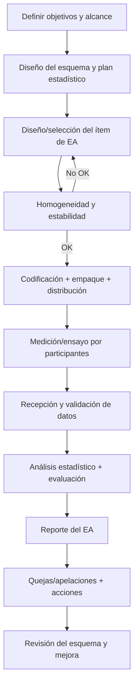
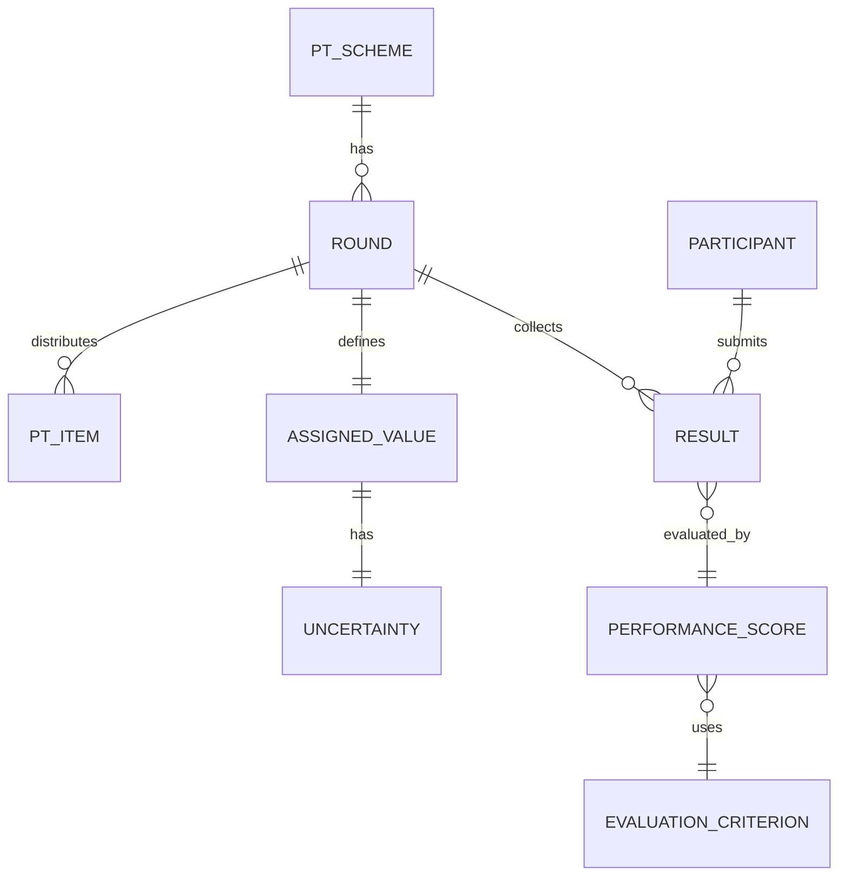

# La planificación de un ensayo de aptitud según ISO/IEC 17043

## Resumen ejecutivo

ISO/IEC 17043:2023 establece requisitos generales para la **competencia e imparcialidad** de los proveedores de ensayos de aptitud (EA) y para la **operación consistente** de los esquemas/programas de EA. citeturn0search0turn1view0 En la práctica, *planificar* un EA “conforme a 17043” significa convertir los requisitos de la norma en un sistema de decisiones documentadas: qué se quiere evaluar, con qué tipo de esquema, con qué ítems de ensayo, cómo se asignará el valor de referencia, qué criterios estadísticos se usarán, cómo se controlarán los riesgos (técnicos, de imparcialidad, de datos) y cómo se reportará de forma útil y defendible ante acreditación.

La estructura de ISO/IEC 17043:2023 concentra los aspectos críticos de planificación en: **imparcialidad y confidencialidad** (cl. 4.1–4.2), **recursos** (cl. 6), y sobre todo **requisitos de proceso** (cl. 7), incluyendo: definición/contratación de objetivos (7.1), diseño estadístico y asignación de valores (7.2.2–7.2.3), producción/distribución de ítems con evaluación de **homogeneidad y estabilidad** (7.3.2) e instrucciones al participante (7.3.5), evaluación y reporte (7.4), y control del proceso y datos (7.5.1–7.5.4). citeturn2view1 El sistema de gestión (cl. 8) exige, además, control documental/registros, acciones sobre riesgos y oportunidades, auditorías internas y revisión por la dirección, entre otros. citeturn2view1

En estadística, ISO 17043 remite a la necesidad de un diseño y evaluación adecuados, y **ISO 13528:2022** es la referencia central para métodos estadísticos de EA por comparación interlaboratorio, incluyendo diseño, determinación de valor asignado e incertidumbre, y estadísticos de desempeño (z, z’, ζ, En, entre otros). citeturn19view1turn2view2 Una buena planificación integra ambos niveles: ISO/IEC 17043 como marco de requisitos de competencia y operación; ISO 13528 como caja de herramientas estadística y criterios defendibles. citeturn20search27turn19view1

**Pasos prácticos (visión de extremo a extremo)**  
Defina objetivos y alcance → seleccione tipo de esquema (cuantitativo/cualitativo; simultáneo/secuencial; etc.) → diseñe ítems (material, niveles, logística) → plan de homogeneidad/estabilidad y trazabilidad → plan estadístico (asignación de valor, σ\_pt, incertidumbres, tratamiento de atípicos) → paquete de comunicación/instrucciones → ejecución (distribución y ventana) → análisis y reporte → cierre (no conformidades, quejas/apelaciones, lecciones aprendidas). citeturn2view1turn8view0turn19view1

**Checklist mínimo del organizador**  
Verificación de imparcialidad y conflictos de interés; plan de confidencialidad y codificación; diseño y planificación documentados; evidencia de homogeneidad/estabilidad; método de asignación de valor y su incertidumbre; criterios de evaluación; control de datos; plan de quejas/apelaciones; y control de registros. citeturn2view1

**Responsabilidades típicas**  
Organizador: liderazgo del diseño, producción/distribución, análisis y reporte. Evaluador (estadístico/técnico): validación de diseño estadístico, revisión de datos y consistencia. Laboratorio participante: ejecución según instrucciones, reporte correcto y revisión de desempeño/correcciones. citeturn2view1turn11view2turn5view0

## Objetivos y alcance típicos de un ensayo de aptitud

Un EA busca evaluar el desempeño del participante frente a criterios preestablecidos mediante comparaciones interlaboratorio (concepto alineado con la política ILAC y el lenguaje de ISO 13528). citeturn5view0turn19view1turn8view0 En la práctica, los objetivos más frecuentes son: demostrar competencia técnica, detectar sesgos/tendencias, activar acciones correctivas, y fortalecer el aseguramiento de la validez de resultados (lo cual es relevante para organismos acreditados). citeturn10view0turn5view0turn6view0

**Alcance** (lo que el EA “cubre”) debe expresarse con suficiente precisión como para que el diseño estadístico y logístico sea coherente. ISO 13528 recuerda que la evaluación se basa en comparar la desviación del participante respecto a un valor asignado y un criterio numérico de evaluación: por eso, *la definición de alcance condiciona todo*. citeturn8view0turn21view0 Además, el “ítem de EA” puede ser una muestra/material, un patrón, un artefacto, un conjunto de datos u otra información. citeturn8view0turn2view1

**Campos típicos de alcance** (recomendación práctica):
- Mensurando(s) / característica(s) a evaluar (incluya unidades, intervalos, límites, o criterios cualitativos).
- Matriz/material (agua, suelo, alimento, artefacto de calibración, datos, imágenes, etc.).
- Ronda (fechas de envío, ventana de medición, fecha límite de reporte).
- Tipo de esquema y propósito (desempeño, validación, armonización, etc.).
- Reglas de método (método libre vs método prescrito vs métodos permitidos).
- Reglas de reporte (valor único, replicados, incertidumbre, LOQ/“<”, etc.).
- Criterio de evaluación (z, z’, ζ, En, etc.) y significado del “éxito” (p. ej., aceptable/alerta/acción). citeturn2view1turn21view0turn19view1

**Pasos prácticos**
1) Redacte una “declaración de objetivo” medible: qué error desea poder detectar (p. ej., sesgo relativo > X%).  
2) Defina alcance técnico (mensurando + matriz + método/condiciones + forma de reporte).  
3) Verifique coherencia: objetivo ↔ tipo de esquema ↔ elección de σ\_pt ↔ logística (estabilidad/transporte). citeturn8view0turn6view0turn11view2

**Checklist (organizador)**
- Objetivo expresado como criterio de desempeño (p. ej., “evaluar capacidad de reportar dentro de ±… con 95% de confianza”). citeturn21view0  
- Alcance con mensurando, matriz, método(s) y forma de reporte.  
- Justificación del tipo de esquema seleccionado. citeturn2view1turn8view0

**Responsabilidades típicas**
- Organizador: definir alcance y traducirlo a criterios estadísticos y de ítem.  
- Participante: confirmar que su método rutinario es aplicable y reportar según el formato. citeturn11view2  
- Evaluador: cuestionar supuestos (¿σ\_pt coherente?, ¿valor asignado trazable?, ¿incertidumbre significativa?). citeturn21view0turn8view0

## Requisitos normativos clave de ISO/IEC 17043 para la planificación

### Estructura útil de la norma para “convertir requisitos en plan”
ISO/IEC 17043:2023 reemplaza la versión 2010 y, según ENAC, se alinea con la estructura de la serie ISO 17000 e incorpora elementos comunes de ISO/CASCO, con requisitos de sistema de gestión y similitudes con ISO/IEC 17025 en aspectos compartidos. citeturn22view1turn10view1turn0search0 La tabla de contenidos del estándar (muestra oficial) permite mapear claramente “qué planificar” por cláusula. citeturn2view1turn2view2

**Mapa de cláusulas ISO/IEC 17043:2023 y su traducción a entregables de planificación** (síntesis)
- **4 Requisitos generales**: 4.1 Imparcialidad; 4.2 Confidencialidad → política de imparcialidad, identificación de conflictos, codificación de participantes, controles de acceso a datos. citeturn2view1  
- **5 Requisitos estructurales** → estructura organizacional, roles, autoridad para decisiones técnicas/estadísticas. citeturn2view1  
- **6 Requisitos de recursos**: 6.2 Personal; 6.3 Instalaciones/condiciones ambientales; 6.4 Productos/servicios externos → plan de competencia, subcontratación, control de transporte, laboratorios de caracterización. citeturn2view1  
- **7 Requisitos de proceso** (núcleo del plan):  
  - 7.1 Establecer/contratar/comunicar objetivos (incluye revisión de solicitudes y comunicación del esquema). citeturn2view1  
  - 7.2 Diseño y planificación (incluye diseño estadístico 7.2.2 y determinación de valores asignados 7.2.3). citeturn2view1  
  - 7.3 Producción y distribución de ítems (incluye evaluación de homogeneidad y estabilidad 7.3.2 e instrucciones 7.3.5). citeturn2view1  
  - 7.4 Evaluación y reporte (análisis de datos, evaluación de desempeño, reportes). citeturn2view1  
  - 7.5 Control del proceso del esquema (registros técnicos, control de datos/gestión de información, vigilancia de procesos, trabajo no conforme). citeturn2view1  
  - 7.6 Quejas; 7.7 Apelaciones. citeturn2view1turn11view1  
- **8 Requisitos del sistema de gestión**: documentación, control documental, control de registros, acciones para riesgos y oportunidades (8.5), mejora, acciones correctivas, auditorías internas, revisión por la dirección. citeturn2view1  
- **Anexo A** (informativo): tipos de esquemas de EA. **Anexo B** (informativo): métodos estadísticos para EA. citeturn2view1turn2view2

**Referencias normativas incluidas por ISO/IEC 17043:2023** (impacto en planificación)  
El estándar referencia, entre otras, ISO/IEC 17000 (vocabulario de evaluación de la conformidad), ISO/IEC 17025 (laboratorios), ISO 17034 (productores de materiales de referencia) y el VIM (ISO/IEC Guide 99). citeturn1view0turn17search3turn3search3 Esto es importante porque la planificación del EA suele requerir: vocabulario común (qué es “trazabilidad”), condiciones de validez de resultados, y uso de materiales de referencia (RM/CRM) cuando estén disponibles.

**Complementos regulatorios y de acreditación que suelen “entrar” a la planificación**
- **ILAC P9:01/2024**: política para el uso de EA y comparaciones interlaboratorio distintas de EA en acreditación; enfatiza que estas alternativas deben considerarse solo cuando EA no son disponibles o adecuados, y que la participación se planifica considerando riesgos y oportunidades. citeturn5view0turn6view0  
- **EA-4/18 (rev. 2021)**: guía para nivel y frecuencia de participación (en contexto de ISO/IEC 17025), con enfoque basado en riesgos y reconocimiento de esquemas con pocos participantes (“small ILC”). citeturn6view0

**Pasos prácticos**
1) Arme una **matriz de cumplimiento**: cláusula ISO/IEC 17043 → procedimiento/registro → evidencia.  
2) Integre ISO 13528 como “norma técnica estadística” dentro de 7.2.2, 7.2.3 y 7.4. citeturn2view1turn19view1  
3) Defina desde el inicio el mecanismo para quejas y apelaciones (7.6–7.7) y cómo se conservarán registros (7.5.1, 8.4). citeturn2view1turn11view1

**Checklist**
- Matriz de cláusulas (4–8) y anexos aplicables. citeturn2view1turn2view2  
- Procedimiento de control de datos e información (7.5.2) y confidencialidad (4.2). citeturn2view1  
- Procedimiento de riesgos y oportunidades (8.5) aplicado al EA. citeturn2view1turn6view0

**Responsabilidades típicas**
- Organizador: dueño del sistema y del cumplimiento.  
- Evaluador: revisar que el diseño estadístico y el reporte estén alineados con cláusulas 7.2–7.4. citeturn2view1turn19view1  
- Participante: cumplir instrucciones (7.3.5), reportar en tiempo, y gestionar acciones si hay señales de alerta/acción. citeturn11view2turn21view0

## Diseño del programa y aseguramiento de la calidad del ítem de ensayo

### Alternativas de diseño del esquema

ISO 13528 describe “proficiency testing” en sentido amplio e incluye distintas modalidades: cuantitativo/cualitativo, secuencial/simultáneo, ejercicio único/esquema continuo, inclusión de muestreo y esquemas de interpretación de datos. citeturn8view0turn19view1 ISO/IEC 17043:2023, además, incorpora un **Anexo A** con tipos de esquemas de EA, útil como taxonomía para justificar el diseño. citeturn2view1

**Tabla comparativa de alternativas de diseño (resumen para decisiones de planificación)**  
*(Úsela para “defender” el diseño ante acreditación; adapte criterios a su sector.)*

| Alternativa | ¿Qué evalúa realmente? | Ventajas | Riesgos/limitaciones | Implicaciones estadísticas típicas |
|---|---|---|---|---|
| Interlaboratorio simultáneo (material distribuido a todos) | Capacidad del laboratorio bajo condiciones comparables | Logística estándar; fácil comparar | Estabilidad en transporte/tiempo; matrices perecederas | z / z’ / ζ; robustos si hay muchos participantes citeturn21view0turn8view0 |
| Secuencial/circulante (artefacto pasa de uno a otro) | Comparabilidad temporal + control del artefacto | Útil para calibración/artefactos | Deriva del ítem; efecto de orden | Requiere control de estabilidad durante la ronda; puede favorecer En o enfoques con incertidumbre citeturn8view0turn21view0 |
| Cuantitativo | Mensurando numérico | Métricas estandarizadas | Sensible a heterogeneidad y sesgos | Definir x\_pt, u(x\_pt), σ\_pt; z vs z’ si u(x\_pt) significativo citeturn21view0turn19view1 |
| Cualitativo (presencia/ausencia; ordinal) | Clasificación/identificación | Crítico en microbiología, diagnóstico | Estadística distinta; control de falsos positivos/negativos | ISO 13528 incluye diseño y análisis de esquemas cualitativos (sección 11) citeturn19view1 |
| “Anónimo” (codificación fuerte) | Mismo que EA, pero reduce sesgos sociales | Mitiga colusión y presión entre pares | Requiere buen control de datos y llaves | La confidencialidad es requisito (4.2) y el control de datos (7.5.2) es crítico citeturn2view1turn13view0 |
| Esquema de interpretación de datos (dataset) | Competencia en cálculo/interpretación | Evita logística de muestras | No evalúa muestreo/preparación | Definir valor asignado/criterios para resultados derivados citeturn8view0turn19view1 |

### Selección, preparación y control del ítem de EA (material de prueba)

ISO/IEC 17043 exige controlar la producción y distribución del ítem (7.3), con evaluación documentada de **homogeneidad y estabilidad** (7.3.2), control de manipulación/almacenamiento (7.3.3), y empaque/etiquetado/distribución (7.3.4). citeturn2view1turn11view2 En paralelo, ISO 13528 contiene guía específica sobre homogeneidad y estabilidad y la vincula explícitamente con la implementación de ISO/IEC 17043. citeturn19view1turn20search27

Ejemplo latinoamericano práctico: el protocolo del Instituto de Salud Pública de Chile (PEEC) documenta que los ítems pueden adquirirse a terceros o producirse internamente; deben ser **representativos, homogéneos y estables**; se distribuyen simultáneamente con un periodo definido; y se entregan instrucciones detalladas de manipulación, seguridad, preparación y reporte. citeturn11view2

**Criterios de homogeneidad y estabilidad: enfoque defendible**
- **Regla general**: la variabilidad por heterogeneidad/instabilidad no debe invalidar la interpretación del desempeño frente al criterio elegido (σ\_pt o equivalente). ISO 13528 incluye anexos específicos sobre homogeneidad y estabilidad (Anexo B) y métodos robustos (Anexo C). citeturn19view1turn8view0  
- **Si hay heterogeneidad o inestabilidad significativa**, un enfoque habitual es incorporarla en la incertidumbre del valor asignado y usar un estadístico que la incluya (p. ej., z’). Un ejemplo explícito es IBMETRO, que indica que, si esos efectos son considerables respecto al criterio, se considerarán usando z’-score conforme a ISO 13528, incorporando un término de incertidumbre del valor asignado por caracterización/homogeneidad/inestabilidad. citeturn11view1turn21view0  
- Para diseño y evaluación de homogeneidad/estabilidad en materiales (cuando el ítem se aproxima a un RM), es buena práctica apoyarse en los estándares de referencia material: ISO 17034 (productores de RM) citeturn17search3 y el estándar técnico que reemplaza la guía histórica (ISO 33405:2024, ex ISO Guide 35), que cubre homogeneidad, estabilidad, asignación de valores, incertidumbre y trazabilidad. citeturn18search0turn17search0

**Tamaño de muestra y muestreo (dos planos distintos)**
- **Número de unidades a producir**: planee “participantes + reposición + ensayos de homogeneidad + ensayos de estabilidad + caracterización + retención” (retención para investigaciones). Esta arquitectura se deriva de la obligación de evaluar homogeneidad/estabilidad (7.3.2) y mantener registros técnicos (7.5.1). citeturn2view1turn11view2  
- **Muestreo para homogeneidad/estabilidad**: el estándar estadístico de EA contempla homogeneidad y estabilidad como parte del diseño (ISO 13528, 6.1 y anexos). citeturn8view0turn19view1 Para ítems que se tratan como RM, ISO 33405/ISO Guide 35 son las referencias más específicas para muestreo y evaluación. citeturn18search0turn17search0

**Pasos prácticos**
1) Defina el **modelo logístico**: distribución simultánea vs secuencial; condiciones de transporte (temperatura, tiempos). citeturn11view2turn8view0  
2) Diseñe el “lote” con **trazabilidad interna**: codificación de unidades, registro de producción, cadena de custodia. citeturn2view1turn13view0  
3) Ejecute homogeneidad y estabilidad antes del envío (o con puntos durante la ronda si aplica) y documente criterios de aceptación y acciones si falla. citeturn2view1turn8view0turn11view1  
4) Redacte instrucciones al participante que cubran: manipulación, seguridad, preparación, condiciones ambientales, método, formato de reporte y contacto. citeturn2view1turn11view2

**Checklist**
- Especificación del ítem (matriz, nivel, preservación, vida útil, peligros y ficha de seguridad si aplica). citeturn11view2  
- Plan y resultados de homogeneidad/estabilidad, con criterio de aceptación ligado a σ\_pt o u(x\_pt). citeturn21view0turn11view1  
- Evidencia de condiciones ambientales controladas y/o requisitos de transporte (6.3; 7.3.3–7.3.4). citeturn2view1turn11view2

**Responsabilidades típicas**
- Organizador: selección/producción del ítem, subcontratación (6.4), pruebas de homogeneidad/estabilidad y distribución. citeturn2view1turn11view2  
- Participante: recepción y validación del estado del ítem en el tiempo definido; análisis como muestra de rutina salvo indicación; cumplimiento de seguridad. citeturn11view2  
- Evaluador: revisar que el plan de homogeneidad/estabilidad sea coherente con el criterio de desempeño (z vs z’, etc.). citeturn21view0turn11view1

## Trazabilidad metrológica, asignación de valores e incertidumbre

### Trazabilidad metrológica: qué debe quedar “cerrado” en planificación

Una debilidad frecuente en EA es tratar la trazabilidad como implícita. ILAC P10 define la **trazabilidad metrológica** como una propiedad del resultado que puede relacionarse con una referencia mediante una cadena documentada e ininterrumpida de calibraciones, cada una contribuyendo a la incertidumbre. citeturn7view0 Esto afecta directamente tres componentes del EA:

1) **Trazabilidad del valor asignado (x\_pt)**: cómo se obtuvo el “valor de referencia” o valor asignado (medición por laboratorio de referencia, CRM, formulación, consenso experto, etc.). citeturn8view0turn21view0  
2) **Trazabilidad de la caracterización del ítem** (medios, instrumentos, calibraciones). ILAC P10 indica que, cuando se requiere trazabilidad, el equipo debe ser calibrado por un NMI cubierto por CIPM MRA (verificable vía KCDB) o por un laboratorio de calibración acreditado con alcance adecuado bajo ILAC MRA/arreglos regionales reconocidos. citeturn7view0  
3) **Trazabilidad declarada por los participantes**: si se solicita incertidumbre, debe quedar claro qué se espera (u estándar vs U expandida; k). citeturn21view0turn11view1

### Métodos de asignación de valores y su incertidumbre

ISO/IEC 17043 exige, en el diseño, la **determinación de valores asignados** (7.2.3) como parte del proceso del esquema. citeturn2view1 ISO 13528 dedica una cláusula completa a la “determinación del valor asignado y su incertidumbre estándar” (cl. 7), contemplando alternativas como formulación, CRM, resultados de un laboratorio, consenso de expertos, consenso de participantes y comparación con un valor independiente. citeturn8view0turn19view1 Eurachem refuerza que el diseño debe reflejar si el valor asignado será independiente de resultados de participantes o derivado de ellos, y que el proveedor es responsable de definir el valor asignado considerando trazabilidad e incertidumbre. citeturn21view0turn8view0

**Incertidumbre del valor asignado (u(x\_pt))**  
- ISO 13528 contempla múltiples vías de estimación y permite reportarla como incertidumbre estándar u(x\_pt) o expandida U(x\_pt)=k·u(x\_pt). citeturn21view0turn8view0  
- Cuando la incertidumbre del valor asignado es “significativa” respecto a la dispersión objetivo del esquema, puede requerirse z’ en lugar de z (ver sección de estadística). citeturn21view0turn11view1  
- Caso IBMETRO: declara explícitamente una incertidumbre del valor asignado u\_pt “debido a caracterización, homogeneidad e inestabilidad”. citeturn11view1

### Definición de criterios de desempeño: σ\_pt y “fitness for purpose”

La elección del criterio de evaluación (por ejemplo, la desviación estándar para evaluación de aptitud σ\_pt) es crítica porque materializa el objetivo del esquema. ISO 13528 define la “standard deviation for proficiency assessment” como una medida de dispersión usada en la evaluación de resultados. citeturn19view1turn19view3 Eurachem indica que ISO 13528 propone varias posibilidades para definir σ\_pt y que la elección debe cumplir los objetivos del esquema. citeturn21view0

**Pasos prácticos**
1) Seleccione el método de valor asignado (independiente vs consenso) y documente su justificación (ventajas/desventajas). citeturn8view0turn21view0  
2) Construya el presupuesto de incertidumbre de x\_pt: caracterización + homogeneidad + estabilidad + (si aplica) contribuciones de medición. citeturn11view1turn18search0turn7view0  
3) Defina σ\_pt (o criterio equivalente) alineado con el “uso final” y el nivel de riesgo del sector (en EA-4/18, los factores de riesgo incluyen complejidad del método, impacto del dato, robustez de trazabilidad, etc.). citeturn6view0

**Checklist**
- Declaración de trazabilidad del valor asignado (qué referencias y cadena metrológica aplican). citeturn7view0turn21view0  
- Método de asignación de valor y estimación de u(x\_pt) documentados. citeturn8view0turn21view0  
- Criterio de evaluación (σ\_pt / límites) justificado por “fitness for purpose” y riesgos. citeturn6view0turn21view0

**Responsabilidades típicas**
- Organizador: define x\_pt, u(x\_pt) y σ\_pt; asegura trazabilidad y coherencia. citeturn21view0turn7view0  
- Participante: reporta x\_i y, si aplica, u(x\_i)/U(x\_i) conforme lo solicitado. citeturn21view0turn13view0  
- Evaluador: revisa si el valor asignado y su incertidumbre son defendibles (especialmente si derivan de participantes). citeturn8view0turn21view0

## Evaluación estadística del desempeño y tratamiento de datos

### Estadísticos recomendados y cuándo usarlos

ISO 13528 define varios estadísticos de desempeño (z, z’, ζ, En) y discute su aplicación y diseño. citeturn19view1turn19view3 Eurachem resume su interpretación convencional y criterios típicos. citeturn21view0

**Tabla comparativa de estadísticos de evaluación (uso práctico)**

| Estadístico | Se recomienda cuando… | Normalización | “Señales” típicas (convencionales) |
|---|---|---|---|
| **z** | No se usa (o no se valida) incertidumbre del participante; σ\_pt representa el objetivo del esquema | σ\_pt | \|z\| ≤ 2 aceptable; 2<\|z\|<3 alerta; \|z\|≥3 acción citeturn21view0turn11view1turn19view3 |
| **z’** | u(x\_pt) es relevante: Eurachem sugiere z’ cuando u(x\_pt) > 0.3·σ\_pt | √(σ\_pt² + u(x\_pt)²) | Se interpreta como z (mismos umbrales) citeturn21view0turn11view1turn19view3 |
| **ζ (zeta)** | Se quiere evaluar consistencia “resultado vs valor asignado dentro de incertidumbres estándar” | √(u(x\_i)² + u(x\_pt)²) | Umbrales convencionales como z/z’ según ISO 13528 (Eurachem cita 9.4.2) citeturn21view0turn21view2turn19view3 |
| **En** | Comparaciones metrológicas (calibración) o cuando se usan **incertidumbres expandidas** | √(U(x\_i)² + U(x\_pt)²) | \|En\|<1 aceptable (convencional) citeturn21view0turn21view1 |

### Fórmulas operativas (con coherencia estándar/expandida)

- **z-score**: z = (x − x\_pt) / σ\_pt (base de ISO 13528; ampliamente usada). citeturn20search29turn11view1  
- **z’-score**: una forma práctica (ejemplo IBMETRO) es z’ = (x\_i − x\_pt) / √(σ\_pt² + u\_pt²), incorporando la incertidumbre del valor asignado debida a caracterización/homogeneidad/estabilidad. citeturn11view1turn21view0  
- **ζ-score** (NIST): ζ = (x − x\_ref) / √(u(x)² + u(x\_ref)²), usando **incertidumbres estándar**. citeturn21view2  
- **En-score** (NIST): En = (x − x\_ref) / √(u(x)² + u(ref)²) si u(.) se ingresa como *expandida*; NIST explica explícitamente la diferencia entre ζ (estándar) y En (expandida) y la equivalencia de umbrales bajo k=2. citeturn21view1turn21view2  

### Métodos robustos, desviación estándar robusta y atípicos

ISO 13528 incluye secciones explícitas sobre **métodos estadísticos robustos** y técnicas para revisión visual y manejo de “blunders”/atípicos. citeturn8view0turn19view1 También define “outlier” y advierte que, aunque algunas prácticas llaman “outlier” a un resultado con señal de acción, ese no es el uso pretendido del término. citeturn19view3 Esto es clave en planificación: el tratamiento de atípicos debe estar definido *antes* de ver los resultados (7.2.2 diseño estadístico; 7.4.1 análisis de datos). citeturn2view1

Un ejemplo de reporte estructurado con roles definidos (coordinador, experto técnico, experto estadístico) y confidencialidad con códigos aleatorios se observa en el informe de EA del INTI (Argentina), que además referencia ISO 13528 para las metodologías estadísticas. citeturn13view0

**Pasos prácticos**
1) Escriba un **Plan Estadístico del EA (PEA-Stats)** antes de abrir resultados: método para x\_pt, u(x\_pt), σ\_pt, manejo de censurados (“<”), replicados, y reglas de exclusión (si aplica). citeturn2view1turn8view0turn21view0  
2) Integre una revisión en dos capas: (a) control de calidad de datos (unidades, formato, coherencia), (b) análisis estadístico y diagnóstico (gráficos; robustos; consistencia con incertidumbres). citeturn2view1turn8view0turn21view0  
3) Defina acciones post-EA: para resultados con \|score\|≥3, solicite investigación y acciones correctivas; esto es consistente con la noción de “action signal” en ISO 13528. citeturn19view3turn21view0

**Checklist**
- Plan estadístico aprobado y controlado documentalmente (7.2.2; 8.3). citeturn2view1  
- Regla explícita para usar z o z’ (por ejemplo, por criterio u(x\_pt)). citeturn21view0turn11view1  
- Reporte con interpretación (aceptable/alerta/acción) y recomendaciones al participante. citeturn2view1turn21view0turn13view0

**Responsabilidades típicas**
- Organizador: custodia de datos, ejecución del plan estadístico, emisión del reporte (7.4.3). citeturn2view1  
- Evaluador: independencia técnica/estadística (apoya imparcialidad) y validación del análisis. citeturn2view1turn13view0  
- Participante: interpretación y acciones (investigación y corrección) ante señales de alerta/acción. citeturn21view0turn6view0

## Gestión del sistema, riesgos, documentación, competencia y comunicación

### Control de calidad del organizador y control del proceso

ISO/IEC 17043 incorpora explícitamente el **control del proceso del esquema** (7.5), incluyendo registros técnicos (7.5.1), control de datos y gestión de información (7.5.2), vigilancia de procesos (7.5.3) y tratamiento del trabajo no conforme (7.5.4). citeturn2view1 ENAC resalta que la versión 2023 incorpora aspectos de seguimiento del control del proceso y alinea símbolos/terminología estadística con ISO 13528:2022. citeturn22view1

### Gestión de riesgos

ISO/IEC 17043 exige acciones para abordar riesgos y oportunidades (8.5). citeturn2view1 En el ecosistema de acreditación, la guía EA-4/18 recomienda un enfoque basado en riesgos al definir estrategia de participación (para laboratorios), considerando factores como complejidad del método, impacto del dato, rotación de personal, y robustez de la trazabilidad. citeturn6view0 En términos de integridad del EA, documentos de organismos de acreditación en la región (p. ej., SAE Ecuador) contemplan riesgos como **colusión y falsificación de resultados**, subrayando que deben existir criterios y registros para hacer defendible el uso de EA en acreditación. citeturn14view2

**Riesgos típicos y controles recomendados (ejemplos)**
- **Colusión** (intercambio de resultados entre participantes): codificación fuerte, ventanas cortas, revisión de patrones sospechosos, trazabilidad de comunicaciones. (Conectar con confidencialidad 4.2 y control de datos 7.5.2). citeturn2view1turn14view2  
- **Conflicto de interés del proveedor**: declaraciones de imparcialidad, separación de roles, revisión independiente de análisis. citeturn2view1turn13view0  
- **Pérdida de estabilidad del ítem durante transporte**: monitoreo de temperatura, empaques validados, puntos de control, uso de z’ si corresponde, o rediseño del ítem. citeturn11view2turn11view1turn21view0  
- **Errores de datos** (unidades, formatos, transcripción): validaciones automáticas, doble revisión, registros técnicos (7.5.1) y control de datos (7.5.2). citeturn2view1turn13view0

### Competencia del personal y subcontratación

ISO/IEC 17043 incluye requisitos de **personal** (6.2) y de productos/servicios provistos externamente (6.4). citeturn2view1 El informe del INTI muestra una práctica alineada con estos principios: identifica roles técnicos/estadísticos y declara que el personal firma compromisos de confidencialidad e imparcialidad. citeturn13view0

### Comunicación con participantes e instrucciones

La norma exige comunicación del esquema (7.1.2) e instrucciones a participantes (7.3.5). citeturn2view1 El protocolo del ISP Chile es un ejemplo claro de “qué debe incluir una instrucción”, enumerando: tratar el ítem como muestra de rutina, condiciones de almacenamiento, preparación, seguridad, condiciones ambientales, método, devolución si aplica y contacto, además de mecanismos de validación de recepción. citeturn11view2

### Confidencialidad y seguridad de datos

ISO/IEC 17043 trata confidencialidad (4.2) y control de datos/gestión de información (7.5.2). citeturn2view1 Un ejemplo aplicado aparece en INTI: codificación aleatoria conocida solo por el participante y tratamiento del informe por código. citeturn13view0 En planificación, esto se traduce en controles de acceso (roles), retención, respaldos, trazabilidad de cambios y protección de la “llave” de correspondencia código ↔ identidad.

**Pasos prácticos**
1) Haga un análisis de riesgos específico del EA (técnicos + imparcialidad + datos) y vincúlelo a acciones (8.5). citeturn2view1turn6view0turn14view2  
2) Diseñe el paquete de comunicación: convocatoria, contrato/condiciones, instrucciones, canales, y Q&A. citeturn2view1turn11view2  
3) Defina el flujo de no conformidades, quejas y apelaciones (7.5.4, 7.6, 7.7) y cómo se cerrarán con acciones correctivas (8.7). citeturn2view1turn11view1

**Checklist**
- Política de imparcialidad + registro de conflictos (4.1). citeturn2view1turn13view0  
- Procedimiento de confidencialidad + codificación + custodia de llave (4.2). citeturn2view1turn13view0  
- Procedimiento de control de datos (7.5.2) y registros (7.5.1; 8.4). citeturn2view1turn13view0  
- Competencia del personal (6.2) y control de proveedores externos (6.4). citeturn2view1turn11view2

**Responsabilidades típicas**
- Organizador: dueño del sistema; garantiza integridad del EA. citeturn2view1turn22view1  
- Participante: cumplimiento de instrucciones; comunicación de incidencias (recepción/daños); acciones ante señales. citeturn11view2turn21view0  
- Evaluador: revisión independiente y soporte técnico ante disputas (apelaciones). citeturn11view1turn13view0

## Acreditación y anexos prácticos: tablas, matrices, cronograma, plantillas y mermaid

### Proceso de acreditación del proveedor de EA (visión práctica)

La acreditación de un proveedor de ensayos de aptitud se basa en ISO/IEC 17043 (esquema específico del proveedor) y ocurre bajo un organismo de acreditación competente, cuyo marco general está definido por ISO/IEC 17011 (requisitos para organismos de acreditación). citeturn15search2turn10view0 ENAC documenta un plan de transición hacia ISO/IEC 17043:2023 y confirma un plazo de transición con fecha límite 31 de mayo de 2026. citeturn10view1turn22view1 ILAC P9 también reconoce la coexistencia temporal de ISO/IEC 17043:2010 hasta mayo de 2026 (en contexto de política ILAC). citeturn5view0

**Ruta típica de acreditación (hitos)**
- **Definición del alcance de acreditación** (qué tipos de EA y en qué campos) y selección del OA (organismo de acreditación). Ejemplo: ONAC describe el esquema PEA y que la acreditación evalúa requisitos propios del proveedor para desarrollar y operar programas de EA. citeturn10view0  
- **Diseño/implementación del sistema** conforme a ISO/IEC 17043 (cl. 4–8) y demostración con al menos un esquema operado o listo para operar (según práctica del OA). citeturn2view1turn22view1  
- **Evaluación** (revisión documental + evaluación in situ/observación). Un manual de proceso (ej. ema México) describe un enfoque operativo: solicitud, listas de verificación y seguimiento hasta dictaminación; aunque basado en 17043:2010, ilustra el tipo de evidencias y formalidades típicas. citeturn14view0  
- **Mantenimiento**: auditorías de seguimiento, acciones correctivas, re-evaluación periódica (ejemplo ema menciona reevaluación no mayor a 4 años para su esquema). citeturn14view0

**Checklist para prepararse a evaluación**
- Evidencia de esquemas planificados y operados: diseño (7.2), ítems (7.3), evaluación/reporte (7.4). citeturn2view1turn13view0  
- Evidencia del sistema (8): control documental, registros, riesgos, auditorías internas, revisión por dirección. citeturn2view1turn22view1  
- Evidencia de imparcialidad/confidencialidad (4.1–4.2) y control de datos (7.5.2). citeturn2view1turn13view0  

### Matriz de responsabilidades típica (RACI)

| Actividad clave | Organizador (Proveedor EA) | Evaluador técnico/estadístico | Laboratorio participante |
|---|---|---|
| Definir objetivos, alcance y requisitos de participación (7.1) | **R/A** | C | I |
| Diseñar estadística, definir x\_pt, u(x\_pt), σ\_pt (7.2.2–7.2.3) | **R/A** | **C/R** | I |
| Producir ítems; homogeneidad/estabilidad; logística (7.3) | **R/A** | C | I |
| Instrucciones y comunicación (7.1.2; 7.3.5) | **R/A** | C | **R** (leer/confirmar) |
| Medición/ensayo y reporte de resultados | I | I | **R/A** |
| Análisis de datos, evaluación del desempeño y reporte (7.4) | **R/A** | **C/R** | I |
| Manejo de quejas/apelaciones (7.6–7.7) | **R/A** | C | R |
| Acciones correctivas y mejora (8.7–8.6) | **R/A** | C | R (sobre su propio sistema) |

*(R=Responsible, A=Accountable, C=Consulted, I=Informed; coherente con la segregación de roles que apoya imparcialidad y control del proceso.) citeturn2view1turn13view0

### Cronograma típico con hitos (ejemplo orientativo)

| Fase | Hito verificable | Duración típica (referencial) | Evidencia clave |
|---|---|---:|---|
| Diseño | Plan del esquema aprobado (objetivo, alcance, estadística, riesgos) | 2–6 semanas | Plan + control documental citeturn2view1turn21view0 |
| Producción del ítem | Lote producido y codificado | 1–4 semanas | Registros técnicos citeturn2view1 |
| Validación | Homogeneidad y estabilidad aceptables (o acciones) | 1–3 semanas | Informe hom/est; decisión z vs z’ citeturn11view1turn19view1 |
| Convocatoria | Participantes inscritos y codificados | 2–8 semanas | Lista + contratos/condiciones citeturn2view1turn13view0 |
| Ejecución | Envío y ventana de medición | 1–4 semanas | Registro de envíos y recepción citeturn11view2 |
| Cierre de datos | Fecha límite y depuración | 1–2 semanas | Control de datos (7.5.2) citeturn2view1 |
| Análisis y reporte | Reporte emitido | 2–6 semanas | Reporte 7.4.3 + anexos estadísticos citeturn2view1turn13view0 |
| Post-reporte | Gestión de quejas/apelaciones y lecciones aprendidas | 2–8 semanas | Registros 7.6–7.7 + mejora 8.6 citeturn2view1turn11view1 |

### Diagramas Mermaid sugeridos





### Plantillas y ejemplos de protocolos (esqueletos reutilizables)

**Plantilla de “Programa/Plan de Ensayo de Aptitud” (PT Scheme Plan)**

```text
1. Identificación
   - Nombre del esquema / código / versión / ronda
   - Organizador (proveedor) y contactos técnicos
   - Confidencialidad: método de codificación y custodia de la llave

2. Objetivos y alcance
   - Mensurando(s), matriz/artefacto/dataset, unidades, niveles
   - Tipo de esquema (cuantitativo/cualitativo; simultáneo/secuencial; etc.)
   - Reglas de método (libre/prescrito) y condiciones permitidas

3. Diseño técnico del ítem
   - Origen del material, preparación, trazabilidad interna del lote
   - Condiciones de almacenamiento/transporte
   - Seguridad (FDS) y requisitos regulatorios de envío

4. Homogeneidad y estabilidad
   - Plan de muestreo y ensayos
   - Criterios de aceptación
   - Acciones si el criterio no se cumple (incluye decisión z vs z’)

5. Asignación de valor y trazabilidad
   - Método de x_pt (CRM / formulación / laboratorio(s) experto(s) / consenso)
   - Trazabilidad metrológica (referencias, calibraciones, etc.)

6. Plan estadístico
   - Estadístico(s) de desempeño: z, z’, ζ, En, etc.
   - Definición de σ_pt o criterio equivalente
   - Estimación de u(x_pt) y condición para usar z’
   - Tratamiento de replicados y datos censurados (“<”, “>”)
   - Reglas para revisión de datos y manejo de atípicos (sin “a posteriori”)

7. Operación
   - Fechas/hitos: envío, ventana, fecha límite de reporte
   - Canal y formato de reporte (plantilla)
   - Soporte a participantes

8. Reporte
   - Contenido mínimo del informe, anexos, gráficos, interpretaciones
   - Gestión de quejas y apelaciones

9. Registros y retención
   - Lista de registros técnicos, control de versiones, retención
```

**Plantilla de “Instrucciones para participantes” (alineada con buenas prácticas observadas en protocolos públicos)**

```text
- Identificación del participante (solo código)
- Qué recibió (ítem, cantidad, estado esperado)
- Validación de recepción (cómo y en cuánto tiempo)
- Almacenamiento inmediato (temperatura, luz, preservación)
- Preparación del ítem antes del ensayo (pasos permitidos/prohibidos)
- Método: usar método rutinario (o método prescrito) + condiciones ambientales
- Seguridad: EPP, manipulación, desecho (si aplica)
- Qué reportar:
  * Resultado (unidad), fecha de medición
  * Replicados (si aplica)
  * Incertidumbre (u o U, k) si aplica + cómo se estimó
  * Observaciones (desviaciones, incidentes)
- Formato y canal de envío de resultados + fecha límite
- Contacto del organizador para consultas
```

*(Este contenido es consistente con los elementos que un protocolo público del ISP Chile incluye como “instrucciones detalladas” para manejo, seguridad, condiciones, método, reporte y contacto.) citeturn11view2

**Plantilla de “Informe de resultados del EA” (estructura defendible ante acreditación)**

```text
1. Resumen ejecutivo de la ronda
   - objetivo, alcance, nº de participantes, fechas

2. Confidencialidad
   - explicación de codificación y protección de identidades

3. Descripción del ítem y logística
   - preparación, distribución, condiciones, incidencias

4. Homogeneidad y estabilidad
   - método, resultados, impacto en evaluación (p.ej., uso de z’)

5. Asignación de valor (x_pt) e incertidumbre u(x_pt)
   - método, trazabilidad, cálculo/resumen

6. Criterio de evaluación (σ_pt u otro) y justificación

7. Resultados y evaluación
   - tabla de resultados (por código)
   - scores (z / z’ / ζ / En), clasificación (aceptable/alerta/acción)
   - gráficos (histogramas, Youden, tendencias en rondas si aplica)

8. Discusión
   - patrones, posibles causas (sin “culpar”), recomendaciones generales

9. Conclusiones y acciones sugeridas
   - orientaciones para investigación y mejora

10. Quejas/apelaciones
   - procedimiento y plazos

Anexos
   - plan estadístico detallado
   - listas de verificación de datos
   - registros esenciales (resumen)
```

*(Un informe público del INTI muestra buenas prácticas como: declaración explícita de confidencialidad por código, identificación de roles (incl. experto estadístico) y referencia a normas aplicables.) citeturn13view0

### Referencias clave y enlaces oficiales

```text
ISO/IEC 17043:2023 (ISO):
https://www.iso.org/standard/80864.html

Muestra (tabla de contenidos) EN ISO/IEC 17043:2023 (NSAI preview sample):
https://i2.saiglobal.com/mpc2v/preview/1229745547513.pdf?sku=874173_SAIG_NSAI_NSAI_3291685

ISO 13528:2022 (ISO):
https://www.iso.org/standard/78879.html
ISO Online Browsing Platform (vista pública de extractos):
https://www.iso.org/obp/ui

ILAC P9:01/2024 (descarga oficial ILAC):
https://ilac.org/?ddownload=3259

ILAC P10:07/2020 (descarga oficial ILAC - trazabilidad metrológica):
https://ilac.org/?ddownload=123220

EA-4/18 rev.01 (EA – guidance level/frequency PT participation):
https://european-accreditation.org/wp-content/uploads/2018/10/EA-4-18.pdf

ENAC (España) – noticia y plan de transición ISO/IEC 17043:2023:
https://www.enac.es/actualidad/paln-transicion-iso17043
https://www.enac.es/documents/7020/66eac031-9290-4ea7-807d-5010c8f767d9?version=1.0

ONAC (Colombia) – esquema PEA:
https://onac.org.co/servicios/proveedores-de-ensayo-de-aptitud/

ISO 33405:2024 (reemplaza ISO Guide 35; homogeneidad/estabilidad de RM):
https://www.iso.org/standard/84226.html
```

*(ENAC documenta la transición y la fecha límite 31-may-2026 para acreditaciones referidas a ISO/IEC 17043:2023.) citeturn10view1turn22view1