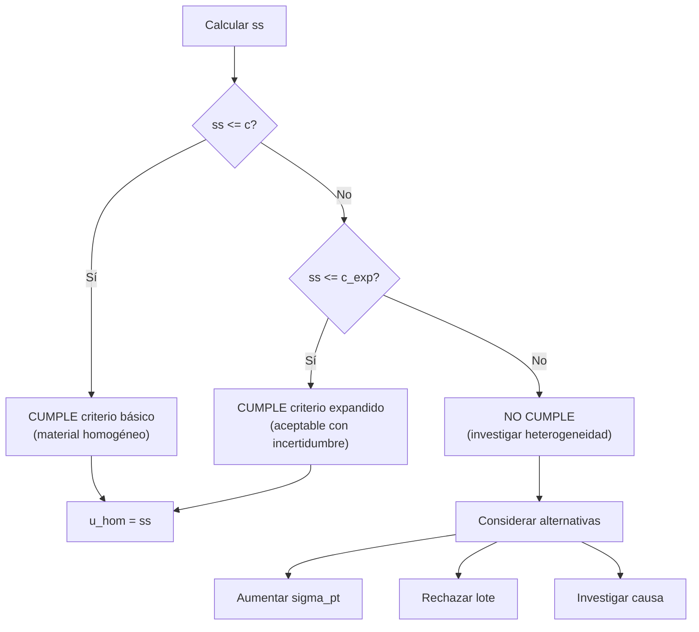
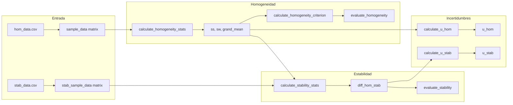

# pt_homogeneity.R: Homogeneidad y Estabilidad

## Descripción
Funciones para evaluar la homogeneidad y estabilidad del ítem de ensayo según ISO 13528:2022 Sección 7.4-7.5. La homogeneidad asegura que todas las unidades del material de referencia son equivalentes, mientras que la estabilidad verifica que el material no cambia durante el período del ensayo.

## Ubicación
| Elemento | Valor |
|----------|-------|
| Archivo | `ptcalc/R/pt_homogeneity.R` |
| Líneas | 1 - 290 |

---

## Funciones de Homogeneidad

### `calculate_homogeneity_stats(sample_data)`
Calcula los estadísticos de homogeneidad a partir de una matriz de muestras.

| Parámetro | Tipo | Descripción |
|-----------|------|-------------|
| `sample_data` | matrix/data.frame | Filas=ítems, Columnas=réplicas |

**Retorna**:
| Campo | Descripción |
|-------|-------------|
| `g` | Número de muestras (grupos) |
| `m` | Número de réplicas por muestra |
| `grand_mean` | Media general ($\bar{\bar{x}}$) |
| `sample_means` | Vector de medias por muestra |
| `s_x_bar_sq` | Varianza de medias de muestra |
| `s_xt` | Desviación estándar de medias |
| `sw` | Desviación intra-muestra |
| `sw_sq` | Varianza intra-muestra |
| `ss_sq` | Varianza entre-muestras |
| `ss` | Desviación entre-muestras |

---

## Derivación Completa de Fórmulas

### Modelo ANOVA de Un Factor

El modelo estadístico para el estudio de homogeneidad es:

$$x_{ij} = \mu + \alpha_i + \epsilon_{ij}$$

Donde:
- $x_{ij}$ = medición j-ésima de la muestra i-ésima
- $\mu$ = media general
- $\alpha_i$ = efecto de la muestra i
- $\epsilon_{ij}$ = error de medición (variabilidad intra-muestra)

### Cálculo de la Varianza Intra-Muestra ($s_w^2$)

Para el caso típico de **2 réplicas por muestra** (m=2):

$$s_w = \sqrt{\frac{\sum_{i=1}^{g} w_i^2}{2g}}$$

Donde $w_i = |x_{i1} - x_{i2}|$ es el rango de la muestra i.

**Caso general** (m > 2):
$$s_w^2 = \frac{1}{g} \sum_{i=1}^{g} s_i^2$$

Donde $s_i^2$ es la varianza de las réplicas de la muestra i.

### Cálculo de la Varianza Entre-Muestras ($s_s^2$)

$$s_s^2 = \max\left(0, s_{\bar{x}}^2 - \frac{s_w^2}{m}\right)$$

Donde:
- $s_{\bar{x}}^2$ = varianza de las medias de muestra
- $m$ = número de réplicas por muestra

La resta de $s_w^2/m$ elimina la contribución de la variabilidad de medición a la varianza observada entre medias.

---

## Construcción de la Tabla ANOVA

| Fuente | SC | gl | CM | F |
|--------|----|----|----|----|
| Entre muestras | $SS_B = m \sum_{i=1}^{g}(\bar{x}_i - \bar{\bar{x}})^2$ | $g-1$ | $MS_B = \frac{SS_B}{g-1}$ | $F = \frac{MS_B}{MS_W}$ |
| Intra-muestras | $SS_W = \sum_{i=1}^{g}\sum_{j=1}^{m}(x_{ij} - \bar{x}_i)^2$ | $g(m-1)$ | $MS_W = \frac{SS_W}{g(m-1)}$ | - |
| Total | $SS_T = SS_B + SS_W$ | $gm-1$ | - | - |

**Relación con los estadísticos ISO**:
- $s_w^2 = MS_W$
- $s_s^2 = \frac{MS_B - MS_W}{m}$ (si $MS_B > MS_W$, sino 0)

---

## Ejemplo Numérico: Estudio de Homogeneidad

### Datos de Entrada
10 muestras con 2 réplicas cada una (concentración de SO2 en ppm):

| Muestra | Rep 1 | Rep 2 | Media | Rango |
|---------|-------|-------|-------|-------|
| 1 | 0.0521 | 0.0525 | 0.0523 | 0.0004 |
| 2 | 0.0530 | 0.0527 | 0.0529 | 0.0003 |
| 3 | 0.0518 | 0.0522 | 0.0520 | 0.0004 |
| 4 | 0.0535 | 0.0532 | 0.0534 | 0.0003 |
| 5 | 0.0524 | 0.0528 | 0.0526 | 0.0004 |
| 6 | 0.0519 | 0.0515 | 0.0517 | 0.0004 |
| 7 | 0.0528 | 0.0531 | 0.0530 | 0.0003 |
| 8 | 0.0522 | 0.0520 | 0.0521 | 0.0002 |
| 9 | 0.0533 | 0.0529 | 0.0531 | 0.0004 |
| 10 | 0.0526 | 0.0523 | 0.0525 | 0.0003 |

### Cálculos Paso a Paso

**Paso 1: Media General**
$$\bar{\bar{x}} = \frac{1}{g}\sum_{i=1}^{g}\bar{x}_i = \frac{0.0523 + 0.0529 + ... + 0.0525}{10} = 0.0526$$

**Paso 2: Varianza Intra-Muestra**
$$s_w = \sqrt{\frac{0.0004^2 + 0.0003^2 + ... + 0.0003^2}{2 \times 10}} = \sqrt{\frac{0.00000012}{20}} = 0.000245$$

**Paso 3: Varianza de Medias**
$$s_{\bar{x}}^2 = \text{var}([0.0523, 0.0529, ..., 0.0525]) = 0.0000000278$$
$$s_{\bar{x}} = 0.000167$$

**Paso 4: Varianza Entre-Muestras**
$$s_s^2 = 0.0000000278 - \frac{0.000245^2}{2} = 0.0000000278 - 0.0000000300$$

Como el resultado sería negativo, se aplica:
$$s_s^2 = \max(0, -0.0000000022) = 0$$
$$s_s = 0$$

**Interpretación**: La variabilidad entre muestras es menor que la esperada por la variabilidad de medición. El material es altamente homogéneo.

---

## Criterios de Homogeneidad

### `calculate_homogeneity_criterion(sigma_pt)`
Criterio básico:
$$c = 0.3 \times \sigma_{pt}$$

### `calculate_homogeneity_criterion_expanded(sigma_pt, sw_sq)`
Criterio expandido (considera incertidumbre):
$$c_{exp} = \sqrt{\sigma_{permitida}^2 \times 1.88 + s_w^2 \times 1.01}$$

Donde $\sigma_{permitida} = 0.3 \times \sigma_{pt}$

Los factores 1.88 y 1.01 provienen de:
- 1.88 = factor de cobertura para la varianza entre-muestras (aproximadamente $\chi^2$ con g-1 grados de libertad)
- 1.01 = factor de cobertura para la varianza intra-muestra

### Ejemplo de Criterio
Si $\sigma_{pt} = 0.005$ ppm:

$$c = 0.3 \times 0.005 = 0.0015 \text{ ppm}$$

Con $s_w^2 = 0.000000060$:
$$c_{exp} = \sqrt{0.0015^2 \times 1.88 + 0.000000060 \times 1.01} = 0.00206 \text{ ppm}$$

---

## Árbol de Decisión: Evaluación de Homogeneidad



### `evaluate_homogeneity(ss, c_criterion, c_expanded)`
| Condición | Resultado |
|-----------|-----------|
| $s_s \leq c$ | CUMPLE criterio |
| $c < s_s \leq c_{exp}$ | CUMPLE expandido |
| $s_s > c_{exp}$ | NO CUMPLE |

---

## Funciones de Estabilidad

### `calculate_stability_stats(stab_sample_data, hom_grand_mean)`
Calcula estadísticos para datos de estabilidad comparando con la media de homogeneidad.

**Retorna** (además de todos los campos de `homogeneity_stats`):
| Campo | Descripción |
|-------|-------------|
| `stab_grand_mean` | Media de muestras de estabilidad |
| `diff_hom_stab` | $|\bar{y}_{hom} - \bar{y}_{stab}|$ |

### Criterio de Estabilidad

$$c_{stab} = 0.3 \times \sigma_{pt}$$

(Mismo criterio que homogeneidad)

### Criterio Expandido de Estabilidad

$$c_{stab,exp} = c + 2 \times \sqrt{u_{\bar{x}_{hom}}^2 + u_{\bar{x}_{stab}}^2}$$

Donde las incertidumbres de las medias son:
$$u_{\bar{x}} = \frac{s_w}{\sqrt{g \times m}}$$

---

## Ejemplo Numérico: Estudio de Estabilidad

### Contexto
- Estudio de homogeneidad: $\bar{\bar{x}}_{hom} = 0.0526$ ppm
- Después de 30 días: se miden muestras de estabilidad

### Datos de Estabilidad
| Muestra | Rep 1 | Rep 2 | Media |
|---------|-------|-------|-------|
| 1 | 0.0524 | 0.0527 | 0.0526 |
| 2 | 0.0529 | 0.0532 | 0.0531 |
| 3 | 0.0521 | 0.0525 | 0.0523 |

### Cálculos
$$\bar{\bar{x}}_{stab} = \frac{0.0526 + 0.0531 + 0.0523}{3} = 0.0527$$

$$D = |\bar{\bar{x}}_{hom} - \bar{\bar{x}}_{stab}| = |0.0526 - 0.0527| = 0.0001$$

Con $\sigma_{pt} = 0.005$:
$$c_{stab} = 0.3 \times 0.005 = 0.0015$$

**Evaluación**: $D = 0.0001 < c_{stab} = 0.0015$ -> **CUMPLE**

---

## Cálculo de Incertidumbres

### `calculate_u_hom(ss)`
Incertidumbre por homogeneidad:
$$u_{hom} = s_s$$

### `calculate_u_stab(diff_hom_stab, c_criterion)`
Incertidumbre por estabilidad:
$$u_{stab} = \begin{cases} 
0 & \text{si } D \leq c \\ 
\frac{D}{\sqrt{3}} & \text{si } D > c 
\end{cases}$$

**Nota**: El factor $\sqrt{3}$ proviene de asumir una distribución rectangular para la deriva por estabilidad.

### Ejemplo de Incertidumbres
Con los datos anteriores:
- $s_s = 0$ -> $u_{hom} = 0$
- $D = 0.0001 < c = 0.0015$ -> $u_{stab} = 0$

### Incertidumbre Combinada del Valor Asignado
La incertidumbre total del valor asignado combina todas las fuentes:

$$u_{xpt,def} = \sqrt{u_{xpt}^2 + u_{hom}^2 + u_{stab}^2}$$

Donde $u_{xpt}$ es la incertidumbre del método de asignación (por ejemplo, del Algoritmo A).

---

## Interpretación del Test t para Estabilidad

Cuando la diferencia no cumple el criterio básico, se puede aplicar un test t:

$$t = \frac{|\bar{x}_{hom} - \bar{x}_{stab}|}{\sqrt{u_{\bar{x}_{hom}}^2 + u_{\bar{x}_{stab}}^2}}$$

| Resultado | Interpretación |
|-----------|----------------|
| $t < 2$ | Diferencia no significativa |
| $2 \leq t < 3$ | Posible deriva, investigar |
| $t \geq 3$ | Deriva significativa |

---

## Flujo de Datos en la Aplicación



---

## Casos Límite

### Menos de 2 muestras
```r
calculate_homogeneity_stats(matrix(c(1,2), nrow=1))
# Error: "At least 2 samples required for homogeneity assessment."
```

### Menos de 2 réplicas
```r
calculate_homogeneity_stats(matrix(c(1,2,3), ncol=1))
# Error: "At least 2 replicates per sample required for homogeneity assessment."
```

### Material perfectamente homogéneo
Cuando $s_s^2$ calculado es negativo (varianza entre-muestras menor que la esperada por el ruido de medición):
- Se establece $s_s = 0$
- $u_{hom} = 0$
- Esto es el mejor caso posible

---

## Referencias
- ISO 13528:2022 Sección 7.4 (Homogeneidad)
- ISO 13528:2022 Sección 7.5 (Estabilidad)
- ISO 13528:2022 Sección 9.5 (Incertidumbres)
- ISO Guide 35:2017 (Materiales de referencia - Principios generales)

---

## Documentos Relacionados
- [01_carga_datos.md](01_carga_datos.md) - Formato de archivos de entrada
- [03_pt_robust_stats.md](03_pt_robust_stats.md) - Estadísticos robustos
- [05_pt_scores.md](05_pt_scores.md) - Uso de u_xpt_def en puntajes
- [06_shiny_homogeneidad.md](06_shiny_homogeneidad.md) - Interfaz de usuario
