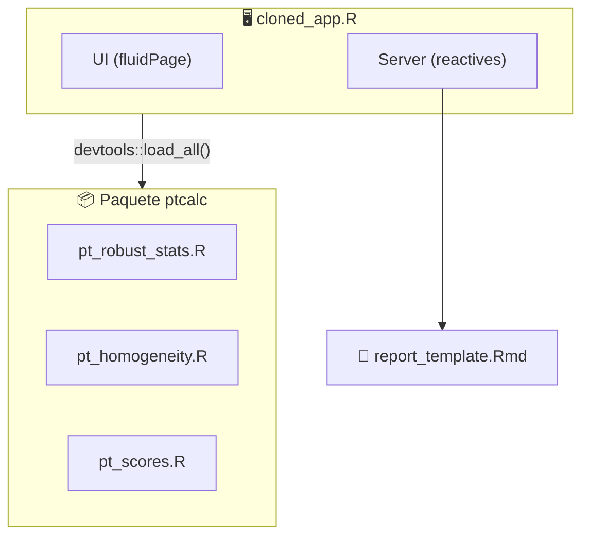
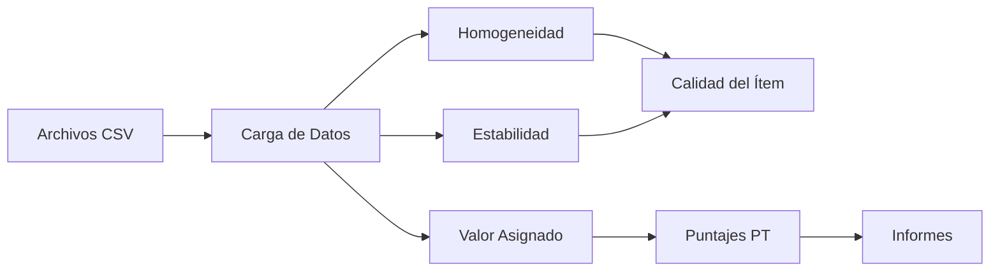

# Documentación: Aplicativo de Ensayos de Aptitud (Versión Refactorizada)

Esta documentación corresponde a la versión refactorizada del aplicativo que implementa una **separación de responsabilidades** entre:
- **`ptcalc/`**: Paquete R con funciones matemáticas puras (ISO 13528).
- **`cloned_app.R`**: Lógica reactiva Shiny para la interfaz de usuario.

## Requisitos de Software

| Librería | Uso |
|----------|-----|
| shiny, bslib | Framework UI |
| tidyverse, vroom | Procesamiento de datos |
| DT, rhandsontable | Tablas interactivas |
| plotly, ggplot2, patchwork | Visualizaciones |
| outliers | Prueba de Grubbs |
| rmarkdown | Generación de informes |
| devtools | Carga del paquete ptcalc |

## Arquitectura del Sistema

## Flujo de Datos

## Índice de Módulos

### Paquete ptcalc
1. [Visión General del Paquete](02_ptcalc_package.md)
2. [Estadísticos Robustos](03_pt_robust_stats.md) - nIQR, MADe, Algoritmo A
3. [Homogeneidad y Estabilidad](04_pt_homogeneity.md)
4. [Cálculo de Puntajes](05_pt_scores.md) - z, z', ζ, En

### Aplicación Shiny
5. [Carga de Datos](01_carga_datos.md)
6. [Módulo de Homogeneidad](06_shiny_homogeneidad.md)
7. [Valor Asignado](07_valor_asignado.md)
8. [Compatibilidad Metrológica](08_compatibilidad.md)
9. [Puntajes PT](09_puntajes_pt.md)
10. [Informe Global](10_informe_global.md)
11. [Detalle por Participante](11_participantes.md)
12. [Generación de Informes](12_generacion_informes.md)
13. [Valores Atípicos](13_valores_atipicos.md)
14. [Template de Reportes](14_report_template.md)

### Temas Avanzados
15. [Arquitectura del Sistema](15_architecture.md) - Grafo de dependencias reactivas, estructura del servidor, optimización
16. [Guía de Personalización](16_customization.md) - Temas, layout, extensión del paquete ptcalc
17. [Solución de Problemas](17_troubleshooting.md) - Errores comunes, formatos de datos, compatibilidad
