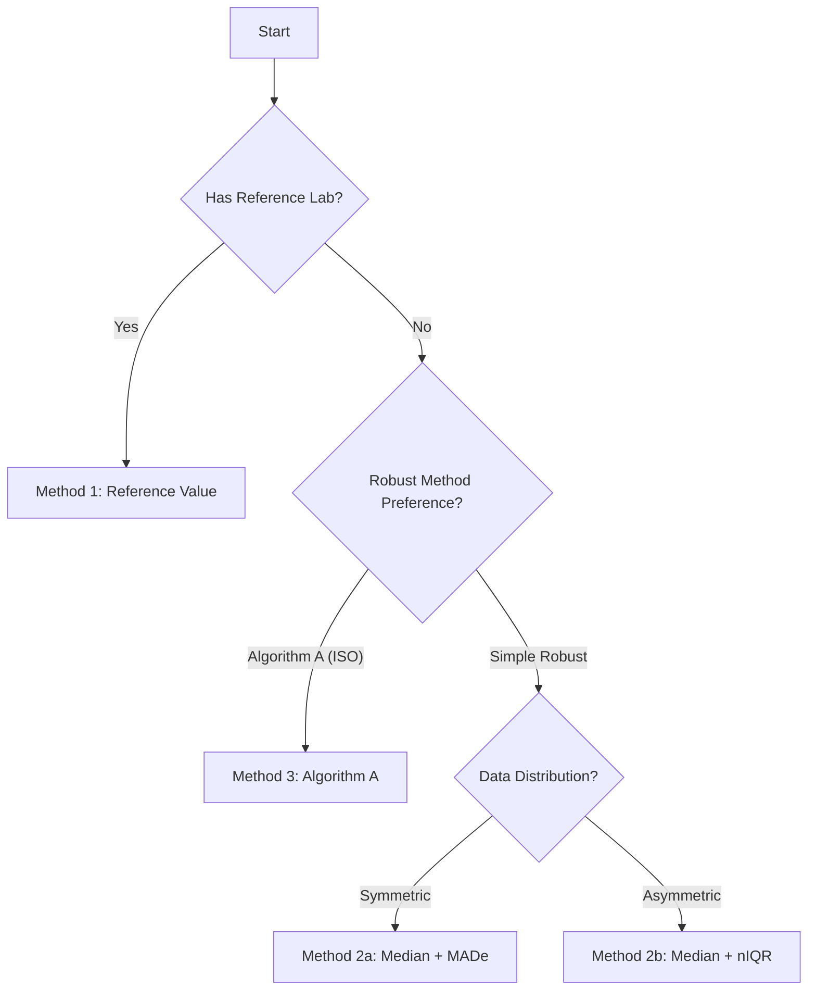

# Shiny Module: Assigned Value ($x_{pt}$)

## 1. Overview
This module calculates the assigned value and its standard uncertainty. It supports multiple methods (Reference, Consensus, Algorithm A) and allows the user to select the most appropriate one for the scheme.

**File Location:** `cloned_app.R` (UI: Accordion in "Valor Asignado")

---

## 2. Method Selection Flowchart



## 3. Implementation Details

### 3.1 Method 1: Reference Laboratory
*   **Logic:** Filters `pt_prep_data` for `participant_id == "ref"`.
*   **Reactive:** `reference_table_data`
*   **Validation:** Checks if "ref" exists in the uploaded summary files.

### 3.2 Method 3: Algorithm A (Interactive)
This is the most complex method as it is iterative and triggered by a specific button.

*   **Button:** `input$algoA_run`
*   **Reactive Chain:**
    1.  `observeEvent(input$algoA_run)`: Sets `algoA_trigger`.
    2.  `algoA_result_data`: Listens to trigger, calls `ptcalc::run_algorithm_a()`.
    3.  `algoA_results_cache`: Stores the result to prevent re-running on minor UI updates.

**Caching Mechanism:**
```r
algoA_results_cache <- reactiveVal(NULL)
observeEvent(input$algoA_run, {
  # ... calculation ...
  algoA_results_cache(result)
})
```

### 3.3 Metrological Traceability Check
The app calculates the compatibility between the Consensus Mean and the Reference Mean (if available).

$$D = \frac{|x_{cons} - x_{ref}|}{\sqrt{u_{cons}^2 + u_{ref}^2}}$$

If $D > 2$, the consensus value may be biased compared to the reference.

---

## 4. Uncertainty Calculation ($u(x_{pt})$)

For consensus methods, the standard uncertainty is calculated as:
$$u(x_{pt}) = 1.25 \times \frac{\sigma_{pt}}{\sqrt{p}}$$
Where $p$ is the number of participants.

*   **Reactive:** `consensus_summary_data`
*   **Output:** Displayed in the summary table alongside $x_{pt}$ and $\sigma_{pt}$.
