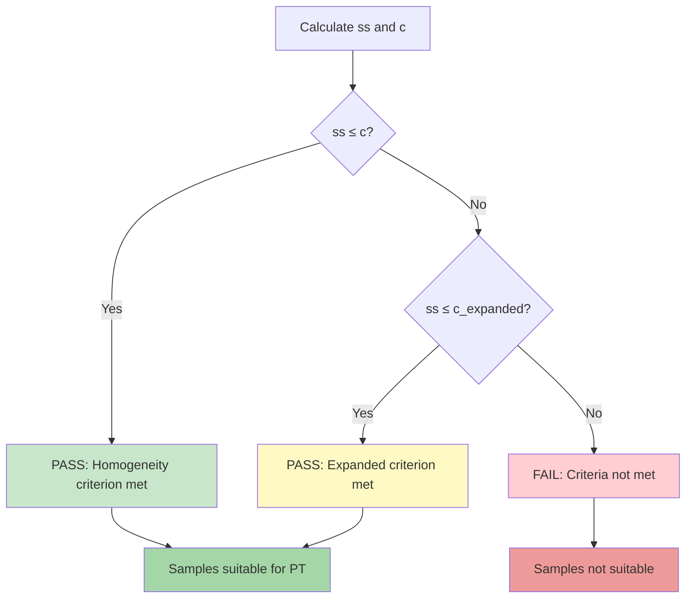

# pt_homogeneity.R: Homogeneity and Stability

Functions for evaluating homogeneity and stability of proficiency test items according to ISO 13528:2022 Sections 7.4-7.5.

---

## Location in Code

| Element | Value |
|----------|-------|
| File | `ptcalc/R/pt_homogeneity.R` |
| Lines | 1 - 290 |

---

## Overview

### Homogeneity

**Homogeneity** refers to the uniformity of samples within a batch. If samples are not homogeneous, different participants receive different test items, making performance evaluation unfair.

### Stability

**Stability** refers to the consistency of samples over time. Samples should remain stable during the testing period to ensure consistent results regardless of when a participant tests them.

---

## Homogeneity Functions

### `calculate_homogeneity_stats(sample_data)`

Calculates homogeneity statistics from a matrix of samples.

| Parameter | Type | Description |
|-----------|------|-------------|
| `sample_data` | matrix/data.frame | Rows = items, Columns = replicates |

**Returns:**
- `g`: Number of samples (items)
- `m`: Number of replicates per sample
- `grand_mean`: Overall mean ($\bar{x}$)
- `sample_means`: Vector of sample means
- `s_x_bar_sq`: Variance of sample means
- `s_xt`: Standard deviation of sample means
- `sw`: Within-sample standard deviation
- `sw_sq`: Within-sample variance
- `ss_sq`: Between-sample variance component
- `ss`: Between-sample standard deviation

**Formulas:**

$$\bar{x}_i = \frac{1}{m}\sum_{j=1}^{m} x_{ij}$$

$$\bar{\bar{x}} = \frac{1}{g}\sum_{i=1}^{g} \bar{x}_i$$

$$s_{\bar{x}}^2 = \frac{1}{g-1}\sum_{i=1}^{g}(\bar{x}_i - \bar{\bar{x}})^2$$

$$s_w = \begin{cases}
\sqrt{\frac{\sum_{i=1}^{g}(x_{i1} - x_{i2})^2}{2g}} & \text{if } m = 2 \\
\sqrt{\frac{1}{g}\sum_{i=1}^{g} s_i^2} & \text{if } m > 2
\end{cases}$$

$$s_s^2 = \max\left(0, s_{\bar{x}}^2 - \frac{s_w^2}{m}\right)$$

**Example:**
```r
# 10 samples, 2 replicates each
sample_data <- matrix(c(
  19.70, 19.72,
  19.68, 19.69,
  19.71, 19.70,
  19.73, 19.71,
  19.69, 19.68,
  19.70, 19.71,
  19.72, 19.70,
  19.71, 19.69,
  19.70, 19.72,
  19.69, 19.70
), nrow = 10, ncol = 2, byrow = TRUE)

stats <- calculate_homogeneity_stats(sample_data)
cat("Between-sample SD (ss):", stats$ss, "\n")
cat("Within-sample SD (sw):", stats$sw, "\n")
cat("Grand mean:", stats$grand_mean, "\n")
```

---

### `calculate_homogeneity_criterion(sigma_pt)`

$$c = 0.3 \times \sigma_{pt}$$

| Parameter | Type | Description |
|-----------|------|-------------|
| `sigma_pt` | numeric | Target standard deviation for PT |

**Returns:** The homogeneity criterion value.

**Interpretation:** The criterion represents 30% of the target standard deviation. Samples are considered homogeneous if between-sample variation (ss) is ≤ c.

**Example:**
```r
sigma_pt <- 0.5
c <- calculate_homogeneity_criterion(sigma_pt)
cat("Homogeneity criterion:", c)  # 0.15
```

---

### `calculate_homogeneity_criterion_expanded(sigma_pt, sw_sq)`

$$c_{expanded} = \sqrt{\sigma_{allowed}^2 \times 1.88 + s_w^2 \times 1.01}$$

Where $\sigma_{allowed} = c = 0.3 \times \sigma_{pt}$

| Parameter | Type | Description |
|-----------|------|-------------|
| `sigma_pt` | numeric | Target standard deviation for PT |
| `sw_sq` | numeric | Within-sample variance |

**Returns:** The expanded homogeneity criterion value.

**Note:** The expanded criterion accounts for statistical uncertainty in the estimation and provides a more lenient threshold.

**Example:**
```r
sigma_pt <- 0.5
sw <- 0.03
c_expanded <- calculate_homogeneity_criterion_expanded(sigma_pt, sw^2)
cat("Expanded criterion:", c_expanded)  # 0.152
```

---

### `evaluate_homogeneity(ss, c_criterion, c_expanded)`

Evaluates whether homogeneity statistics meet the acceptance criteria.

| Parameter | Type | Description |
|-----------|------|-------------|
| `ss` | numeric | Between-sample standard deviation |
| `c_criterion` | numeric | Base homogeneity criterion |
| `c_expanded` | numeric | Optional expanded criterion |

**Returns:**
- `passes_criterion`: TRUE if ss ≤ c_criterion
- `passes_expanded`: TRUE if ss ≤ c_expanded (NA if not provided)
- `conclusion`: Text description of result

**Example:**
```r
ss <- 0.12
c_criterion <- 0.15
c_expanded <- 0.152

result <- evaluate_homogeneity(ss, c_criterion, c_expanded)
cat(result$conclusion)
# ss (0.1200) <= criterion (0.1500): MEETS HOMOGENEITY CRITERION
# ss (0.1200) <= expanded (0.1520): MEETS EXPANDED CRITERION
```

---

## Stability Functions

### `calculate_stability_stats(stab_sample_data, hom_grand_mean)`

Calculates stability statistics comparing stability sample mean to homogeneity grand mean.

| Parameter | Type | Description |
|-----------|------|-------------|
| `stab_sample_data` | matrix/data.frame | Stability sample data |
| `hom_grand_mean` | numeric | Grand mean from homogeneity study |

**Returns:**
- All outputs from `calculate_homogeneity_stats()`
- `stab_grand_mean`: Mean of stability samples
- `diff_hom_stab`: $|\bar{y}_{stab} - \bar{x}_{hom}|$

**Example:**
```r
# Stability data
stab_data <- matrix(c(
  19.71, 19.70,
  19.69, 19.71,
  19.70, 19.69
), nrow = 3, ncol = 2, byrow = TRUE)

# From homogeneity study
hom_grand_mean <- 19.705

stats <- calculate_stability_stats(stab_data, hom_grand_mean)
cat("Stability mean:", stats$stab_grand_mean, "\n")
cat("Difference:", stats$diff_hom_stab, "\n")
```

---

### `calculate_stability_criterion(sigma_pt)`

$$c_{stab} = 0.3 \times \sigma_{pt}$$

Same as homogeneity criterion. Stability criterion is the same value.

**Example:**
```r
sigma_pt <- 0.5
c_stab <- calculate_stability_criterion(sigma_pt)
cat("Stability criterion:", c_stab)  # 0.15
```

---

### `calculate_stability_criterion_expanded(c_criterion, u_hom_mean, u_stab_mean)`

$$c_{stab\_expanded} = c_{criterion} + 2 \times \sqrt{u_{hom\_mean}^2 + u_{stab\_mean}^2}$$

| Parameter | Type | Description |
|-----------|------|-------------|
| `c_criterion` | numeric | Base stability criterion |
| `u_hom_mean` | numeric | Uncertainty of homogeneity mean |
| `u_stab_mean` | numeric | Uncertainty of stability mean |

**Returns:** The expanded stability criterion value.

**Note:** The 2 factor corresponds to k=2 (95% confidence level).

**Example:**
```r
c_criterion <- 0.15
u_hom_mean <- 0.02
u_stab_mean <- 0.03

c_stab_expanded <- calculate_stability_criterion_expanded(
  c_criterion, u_hom_mean, u_stab_mean
)
cat("Expanded stability criterion:", c_stab_expanded)
```

---

### `evaluate_stability(diff_hom_stab, c_criterion, c_expanded)`

Evaluates whether stability statistics meet the acceptance criteria.

| Parameter | Type | Description |
|-----------|------|-------------|
| `diff_hom_stab` | numeric | Difference between stability and homogeneity means |
| `c_criterion` | numeric | Base stability criterion |
| `c_expanded` | numeric | Optional expanded criterion |

**Returns:**
- `passes_criterion`: TRUE if diff ≤ c_criterion
- `passes_expanded`: TRUE if diff ≤ c_expanded (NA if not provided)
- `conclusion`: Text description of result

**Example:**
```r
diff <- 0.08
c_criterion <- 0.15
c_expanded <- 0.18

result <- evaluate_stability(diff, c_criterion, c_expanded)
cat(result$conclusion)
# diff (0.0800) <= criterion (0.1500): MEETS STABILITY CRITERION
# diff (0.0800) <= expanded (0.1800): MEETS EXPANDED CRITERION
```

---

## Complete Formulas and Derivations

### Within-Sample Standard Deviation (sw)

For **m = 2 replicates:**

$$s_w = \sqrt{\frac{\sum_{i=1}^{g} (x_{i1} - x_{i2})^2}{2g}}$$

**Derivation:**
- Range of each pair: $R_i = |x_{i1} - x_{i2}|$
- For normal distribution, SD of range ≈ SD × √2
- Therefore: SD ≈ Range / √2
- For multiple samples: $s_w = \sqrt{\frac{\sum R_i^2}{2g}}$

**Numerical Example:**
```
Sample 1: 19.70, 19.72 → range = 0.02
Sample 2: 19.68, 19.69 → range = 0.01
Sample 3: 19.71, 19.70 → range = 0.01

sw = sqrt((0.02^2 + 0.01^2 + 0.01^2) / (2×3))
sw = sqrt((0.0004 + 0.0001 + 0.0001) / 6)
sw = sqrt(0.0006 / 6)
sw = sqrt(0.0001)
sw = 0.010
```

For **m > 2 replicates:**

$$s_w = \sqrt{\frac{1}{g}\sum_{i=1}^{g} s_i^2}$$

Where $s_i$ is the sample standard deviation of sample i.

### Between-Sample Standard Deviation (ss)

$$s_s^2 = \max\left(0, s_{\bar{x}}^2 - \frac{s_w^2}{m}\right)$$

$$s_s = \sqrt{s_s^2}$$

**Derivation:**
- Total variance = between-sample + within-sample/m
- Rearrange: between-sample variance = total variance - within-sample/m
- $\max(0, \cdot)$ prevents negative values due to sampling error

**Numerical Example:**
```
Sample means: [19.71, 19.685, 19.705]
Grand mean: 19.70
s_x_bar_sq = var([19.71, 19.685, 19.705]) = 0.000306
sw_sq = 0.01^2 = 0.0001
m = 2

ss_sq = max(0, 0.000306 - 0.0001/2)
ss_sq = max(0, 0.000306 - 0.00005)
ss_sq = max(0, 0.000256)
ss_sq = 0.000256

ss = sqrt(0.000256) = 0.016
```

---

## ANOVA Table Construction

### One-Way ANOVA for Homogeneity

| Source | Degrees of Freedom | Sum of Squares | Mean Square | F-Value |
|--------|-------------------|-----------------|-------------|----------|
| Between samples | g - 1 | $SS_B = m \sum_{i}(\bar{x}_i - \bar{\bar{x}})^2$ | $MS_B = \frac{SS_B}{g-1}$ | $F = \frac{MS_B}{MS_W}$ |
| Within samples | g(m - 1) | $SS_W = \sum_{i}\sum_{j}(x_{ij} - \bar{x}_i)^2$ | $MS_W = \frac{SS_W}{g(m-1)}$ | - |
| Total | gm - 1 | $SS_T = \sum_{i}\sum_{j}(x_{ij} - \bar{\bar{x}})^2$ | - | - |

### Connection to ss and sw

$$s_{\bar{x}} = \sqrt{\frac{MS_B}{m}}$$

$$s_w = \sqrt{MS_W}$$

$$s_s^2 = \frac{MS_B}{m} - \frac{MS_W}{m} = \frac{MS_B - MS_W}{m}$$

### Numerical ANOVA Example

**Data:** 3 samples, 2 replicates each

```
Sample 1: 19.70, 19.72 → mean = 19.71
Sample 2: 19.68, 19.69 → mean = 19.685
Sample 3: 19.71, 19.70 → mean = 19.705

Grand mean = (19.71 + 19.685 + 19.705) / 3 = 19.70
```

**SS Between:**
$$SS_B = 2 \times [(19.71-19.70)^2 + (19.685-19.70)^2 + (19.705-19.70)^2]$$
$$SS_B = 2 \times [0.0001 + 0.000225 + 0.000025]$$
$$SS_B = 2 \times 0.00035 = 0.0007$$

**SS Within:**
$$SS_W = (19.70-19.71)^2 + (19.72-19.71)^2 + (19.68-19.685)^2 + (19.69-19.685)^2 + \cdots$$
$$SS_W = 0.0001 + 0.0001 + 0.000025 + 0.000025 + 0.000025 + 0.000025 = 0.0003$$

**ANOVA Table:**

| Source | df | SS | MS | F |
|--------|----|----|----|----|
| Between | 2 | 0.0007 | 0.00035 | 3.5 |
| Within | 3 | 0.0003 | 0.00010 | - |
| Total | 5 | 0.0010 | - | - |

**Extracted Statistics:**
- $s_{\bar{x}} = \sqrt{0.00035/2} = 0.0132$
- $s_w = \sqrt{0.00010} = 0.0100$
- $s_s = \sqrt{0.00035 - 0.00005} = \sqrt{0.00030} = 0.0173$

---

## Decision Tree: PASS/FAIL Logic



---

## Uncertainty Calculations

### `calculate_u_hom(ss)`

$$u_{hom} = s_s$$

| Parameter | Type | Description |
|-----------|------|-------------|
| `ss` | numeric | Between-sample standard deviation |

**Returns:** Uncertainty contribution from homogeneity.

**Interpretation:** The between-sample variance contributes directly to the uncertainty of the assigned value.

**Example:**
```r
ss <- 0.016
u_hom <- calculate_u_hom(ss)
cat("u_hom:", u_hom)  # 0.016
```

### `calculate_u_stab(diff_hom_stab, c_criterion)`

$$u_{stab} = \begin{cases}
0 & \text{if } D \leq c \\
\frac{D}{\sqrt{3}} & \text{if } D > c
\end{cases}$$

Where $D = |\bar{y}_{stab} - \bar{x}_{hom}|$

| Parameter | Type | Description |
|-----------|------|-------------|
| `diff_hom_stab` | numeric | Difference between stability and homogeneity means |
| `c_criterion` | numeric | Stability criterion |

**Returns:** Uncertainty contribution from stability.

**Derivation:**
- If stability criterion met: No additional uncertainty ($u_{stab} = 0$)
- If criterion not met: Treat difference as uniform distribution with width D
- For uniform distribution: $u = \text{width}/\sqrt{3}$

**Example:**
```r
# Criterion met
diff1 <- 0.08
c <- 0.15
u_stab1 <- calculate_u_stab(diff1, c)
cat("u_stab (criterion met):", u_stab1)  # 0

# Criterion not met
diff2 <- 0.20
u_stab2 <- calculate_u_stab(diff2, c)
cat("u_stab (criterion not met):", u_stab2)  # 0.115 = 0.20/sqrt(3)
```

---

## Combined Uncertainty: u_xpt_def

The uncertainty of the assigned value combines homogeneity and stability contributions:

$$u_{xpt\_def} = \sqrt{u_{hom}^2 + u_{stab}^2}$$

This is used in zeta-score calculations.

**Numerical Example:**
```r
# Homogeneity study
u_hom <- 0.016  # ss = 0.016

# Stability study
diff <- 0.20
c_stab <- 0.15
u_stab <- calculate_u_stab(diff, c_stab)  # 0.115

# Combined uncertainty
u_xpt_def <- sqrt(u_hom^2 + u_stab^2)
cat("u_xpt_def:", u_xpt_def)  # 0.116 = sqrt(0.016^2 + 0.115^2)
```

---

## t-Test for Stability

### Purpose

The t-test evaluates whether the stability sample mean is significantly different from the homogeneity grand mean.

### Hypotheses

- $H_0$: Stability mean = Homogeneity mean (samples are stable)
- $H_a$: Stability mean ≠ Homogeneity mean (samples are unstable)

### Test Statistic

$$t = \frac{\bar{y}_{stab} - \bar{x}_{hom}}{\sqrt{\frac{s_{stab}^2}{n_{stab}} + \frac{s_{hom}^2}{n_{hom}}}}$$

### Degrees of Freedom

$$\nu = \frac{(s_{stab}^2/n_{stab} + s_{hom}^2/n_{hom})^2}{\frac{(s_{stab}^2/n_{stab})^2}{n_{stab}-1} + \frac{(s_{hom}^2/n_{hom})^2}{n_{hom}-1}}$$

### Interpretation Guidelines

| |t| vs t-critical | Interpretation |
|----------------|----------------|----------------|
| |t| ≤ t-critical | No significant difference (stable) |
| |t| > t-critical | Significant difference (potentially unstable) |

**Note:** The ISO 13528 stability criterion (0.3 × σ_pt) is typically more lenient than the t-test. Use the criterion for formal acceptance, t-test for additional insight.

**Example:**
```r
# Homogeneity
n_hom <- 10
x_hom_bar <- 19.70
s_hom <- 0.013

# Stability
n_stab <- 3
y_stab_bar <- 19.80
s_stab <- 0.015

# t-statistic
t_stat <- (y_stab_bar - x_hom_bar) / sqrt(s_stab^2/n_stab + s_hom^2/n_hom)
cat("t-statistic:", t_stat)  # 3.58

# Critical value (α = 0.05, df calculated)
# If t_stat > t_critical → significant difference
```

---

## Complete Workflow Example

```r
library(ptcalc)

# Homogeneity data: 10 samples, 2 replicates
hom_data <- matrix(rnorm(20, mean = 19.70, sd = 0.02), nrow = 10, ncol = 2)

# Stability data: 3 samples, 2 replicates
stab_data <- matrix(rnorm(6, mean = 19.71, sd = 0.02), nrow = 3, ncol = 2)

# Calculate homogeneity statistics
hom_stats <- calculate_homogeneity_stats(hom_data)
cat("Homogeneity results:\n")
cat("  ss (between-sample SD):", hom_stats$ss, "\n")
cat("  sw (within-sample SD):", hom_stats$sw, "\n")

# Homogeneity criterion
sigma_pt <- 0.5
c_crit <- calculate_homogeneity_criterion(sigma_pt)
c_exp <- calculate_homogeneity_criterion_expanded(sigma_pt, hom_stats$sw_sq)

# Evaluate homogeneity
hom_eval <- evaluate_homogeneity(hom_stats$ss, c_crit, c_exp)
cat(hom_eval$conclusion, "\n\n")

# Calculate stability statistics
stab_stats <- calculate_stability_stats(stab_data, hom_stats$grand_mean)
cat("Stability results:\n")
cat("  diff (|stab - hom|):", stab_stats$diff_hom_stab, "\n")

# Stability criterion
c_stab_crit <- calculate_stability_criterion(sigma_pt)
c_stab_exp <- calculate_stability_criterion_expanded(
  c_stab_crit,
  hom_stats$sw / sqrt(10),
  stab_stats$sw / sqrt(3)
)

# Evaluate stability
stab_eval <- evaluate_stability(stab_stats$diff_hom_stab, c_stab_crit, c_stab_exp)
cat(stab_eval$conclusion, "\n\n")

# Calculate uncertainties
u_hom <- calculate_u_hom(hom_stats$ss)
u_stab <- calculate_u_stab(stab_stats$diff_hom_stab, c_stab_crit)
u_xpt_def <- sqrt(u_hom^2 + u_stab^2)

cat("Uncertainties:\n")
cat("  u_hom:", u_hom, "\n")
cat("  u_stab:", u_stab, "\n")
cat("  u_xpt_def:", u_xpt_def, "\n")
```

---

## References

- **ISO 13528:2022** Section 9.2 (Homogeneity assessment)
- **ISO 13528:2022** Section 9.3 (Stability assessment)
- **ISO 13528:2022** Section 9.5 (Uncertainty components)

---

## Cross-References

- **Robust Statistics:** [03_pt_robust_stats.md](03_pt_robust_stats.md) - Uses ss for quality metrics
- **PT Scores:** [05_pt_scores.md](05_pt_scores.md) - u_xpt_def in zeta-score calculation
- **Data Loading:** [01_carga_datos.md](01_carga_datos.md) - File formats for homogeneity/stability
- **Package Overview:** [02_ptcalc_package.md](cloned_docs/02_ptcalc_package.md) - General package documentation
