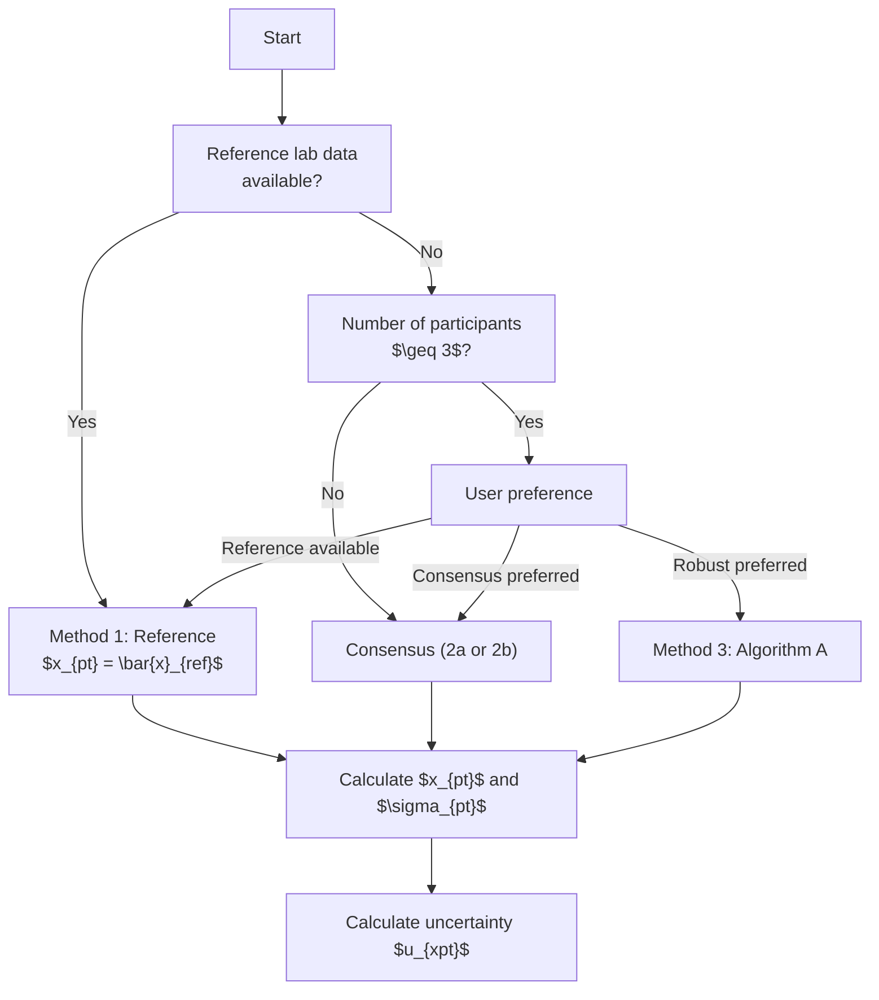
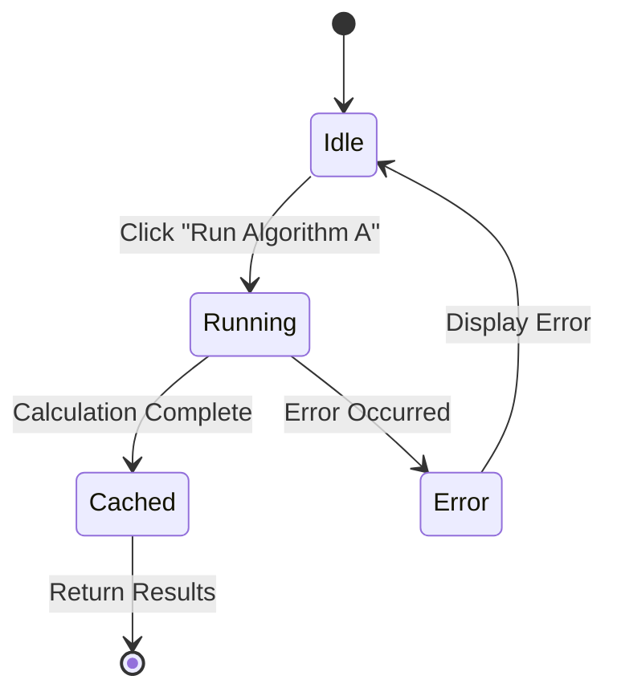
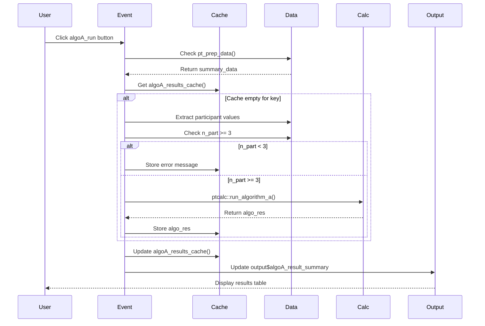
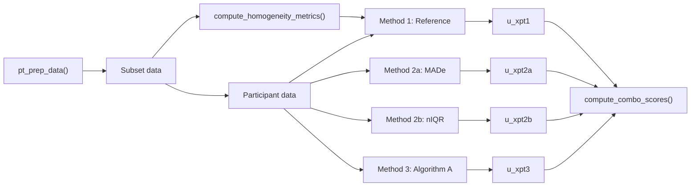

# Module: Assigned Value (Valor Asignado)

This module manages the calculation of the assigned value ($x_{pt}$) using different methods based on data availability and user preferences.

---

## Location in Code

| Element | Value |
|---------|-------|
| File | `cloned_app.R` |
| UI | Accordion within "Valor asignado" tab |
| Lines | Varies across multiple sections |

---

## Available Methods

| Method | Code | Description | Formula for $x_{pt}$ | Formula for $\sigma_{pt}$ |
|--------|------|-------------|----------------------|--------------------------|
| Reference | 1 | Reference laboratory mean | $\bar{x}_{ref}$ | $\text{MADe}$ of first sample |
| Consensus MADe | 2a | Median with MADe | $\text{median}(x_i)$ | $\text{MADe} \times 1.483$ |
| Consensus nIQR | 2b | Median with nIQR | $\text{median}(x_i)$ | $\text{nIQR} \times 0.7413$ |
| Algorithm A | 3 | Robust estimate | $x^*$ | $s^*$ |

---

## UI Component Map

| UI Element | Input ID | Output ID | Reactive |
|------------|----------|-----------|----------|
| Pollutant dropdown | `xpt_pollutant` | - | - |
| Level dropdown | `xpt_level` | - | - |
| n_lab selector | `xpt_n_lab` | - | - |
| Reference table | - | `reference_table` | `pt_prep_data()` |
| Consensus summary | - | `consensus_summary_table` | `pt_prep_data()` |
| Algorithm A max iterations | `algoA_max_iter` | - | `input$algoA_max_iter` |
| Algorithm A button | `algoA_run` | - | `observeEvent(input$algoA_run)` |
| Algorithm A results | - | `algoA_result_summary` | `algoA_results_cache()` |

---

## Method Selection Guidance



### Decision Criteria

| Situation | Recommended Method | Rationale |
|-----------|-------------------|-----------|
| Reference lab available | **Method 1** | Most reliable, uses certified reference |
| No reference lab, n < 3 | **Method 2a or 2b** | Consensus is only option |
| No reference lab, n ≥ 3 | **Method 3 (Algorithm A)** | Robust estimation removes outliers |
| Mixed data quality | **Compare all methods** | Check for consistency |

---

## Method 1: Reference Value

### Implementation

```r
reference_table_data <- reactive({
  pt_prep_data() %>%
    filter(participant_id == "ref") %>%
    group_by(pollutant, level, n_lab) %>%
    summarise(
      x_pt = mean(mean_value, na.rm = TRUE),
      sigma_pt = calculate_mad_e(first_sample_values),
      ...
    )
})
```

### Formulas

**Assigned Value:**
$$x_{pt} = \bar{x}_{ref} = \frac{1}{n_{ref}} \sum_{i=1}^{n_{ref}} x_i$$

**Standard Deviation:**
$$\sigma_{pt} = \text{MADe} \times 1.483$$

Where MADe is the median absolute deviation from the median:
$$\text{MADe} = \text{median}(|x_i - \text{median}(x)|)$$

---

## Method 2a: Consensus MADe

### Implementation

Uses `ptcalc::calculate_mad_e()`.

**Location:** Lines 1995-2000

```r
values <- participant_data$result
median_val <- median(values, na.rm = TRUE)
mad_val <- median(abs(values - median_val), na.rm = TRUE)
sigma_pt_2a <- 1.483 * mad_val
```

### Formulas

**Assigned Value:**
$$x_{pt} = \text{median}(x_i)$$

**Standard Deviation:**
$$\sigma_{pt} = \text{MADe} \times 1.483$$

**Uncertainty:**
$$u_{xpt} = 1.25 \times \frac{\sigma_{pt}}{\sqrt{n}}$$

Where $n$ is the number of participants.

---

## Method 2b: Consensus nIQR

### Implementation

Uses `ptcalc::calculate_niqr()`.

**Location:** Lines 1998-2000

```r
sigma_pt_2b <- calculate_niqr(values)
```

### Formulas

**Assigned Value:**
$$x_{pt} = \text{median}(x_i)$$

**Standard Deviation:**
$$\sigma_{pt} = \text{nIQR} \times 0.7413$$

Where nIQR is the normalized interquartile range:
$$\text{nIQR} = \frac{Q_3 - Q_1}{2}$$

---

## Method 3: Algorithm A

### Implementation

Uses `ptcalc::run_algorithm_a()`.

**Location:** Lines 2002-2006

```r
algo_res <- if (n_part >= 3) {
  ptcalc::run_algorithm_a(
    values = values,
    ids = participant_data$participant_id,
    max_iter = max_iter
  )
} else {
  list(error = "Se requieren al menos tres participantes para calcular el Algoritmo A.")
}
```

### Button Behavior and Cache Mechanism

**Location:** Lines 642-690



**Cache Logic:**
```r
# Cache key format
cache_key <- paste0("algoA_", pollutant_val, "_", level_val)

# Check cache
cached_algo <- algoA_results_cache()
if (is.null(cached_algo[[cache_key]])) {
  # Run calculation
  algo_res <- ptcalc::run_algorithm_a(values, ids, max_iter)
  # Store in cache
  cached_algo[[cache_key]] <- algo_res
  algoA_results_cache(cached_algo)
}
```

**Cache Clearing:**
```r
# Clear when data changes
observe({
  pt_prep_data()
  algoA_results_cache(NULL)
})
```

### `observeEvent(input$algoA_run)` Chain

**Complete Event Chain:**



---

## Metrological Compatibility

### D_2a and D_2b Formulas

**Purpose:** Check if consensus values are metrologically compatible with reference value.

**D_2a (MADe Compatibility):**
$$D_{2a} = \frac{|x_{pt,ref} - x_{pt,consensus}|}{\sqrt{u_{ref}^2 + u_{consensus}^2}}$$

**D_2b (nIQR Compatibility):**
$$D_{2b} = \frac{|x_{pt,ref} - x_{pt,consensus}|}{\sqrt{u_{ref}^2 + u_{consensus}^2}}$$

**Interpretation:**
- $D \leq 1$: Compatible
- $D > 1$: Not compatible, indicates significant bias between methods

---

## `consensus_run` Reactive Documentation

### Location

The consensus calculation is integrated into `compute_scores_for_selection()` function at lines 1926-2098.

### Structure

```r
compute_scores_for_selection <- function(
  target_pollutant,
  target_n_lab,
  target_level,
  summary_data,
  max_iter = 50,
  k_factor = 2
) {
  # Step 1: Filter data for selection
  subset_data <- summary_data %>%
    filter(
      pollutant == target_pollutant,
      n_lab == target_n_lab,
      level == target_level
    )

  # Step 2: Get homogeneity parameters
  hom_res <- compute_homogeneity_metrics(target_pollutant, target_level)

  # Step 3: Calculate participant data
  participant_data <- subset_data %>%
    filter(participant_id != "ref") %>%
    group_by(participant_id) %>%
    summarise(
      result = mean(mean_value, na.rm = TRUE),
      sd_value = mean(sd_value, na.rm = TRUE)
    )

  # Step 4: Calculate reference value (Method 1)
  x_pt1 <- mean(ref_data$mean_value, na.rm = TRUE)

  # Step 5: Calculate consensus MADe (Method 2a)
  median_val <- median(values, na.rm = TRUE)
  sigma_pt_2a <- 1.483 * mad_val
  u_xpt2a <- 1.25 * sigma_pt_2a / sqrt(n_part)

  # Step 6: Calculate consensus nIQR (Method 2b)
  sigma_pt_2b <- calculate_niqr(values)
  u_xpt2b <- 1.25 * sigma_pt_2b / sqrt(n_part)

  # Step 7: Run Algorithm A (Method 3)
  algo_res <- ptcalc::run_algorithm_a(values, ids, max_iter)
}
```

### Reactive Chain



---

## Calculation of Assigned Value Uncertainty

### General Formula

$$u_{xpt\_def} = \sqrt{u_{xpt}^2 + u_{hom}^2 + u_{stab}^2}$$

Where:
- $u_{xpt}$ = Statistical uncertainty of the method (see below)
- $u_{hom}$ = Homogeneity uncertainty ($ss$ from homogeneity analysis)
- $u_{stab}$ = Stability uncertainty ($|y_1 - y_2| / \sqrt{3}$)

### Method-Specific $u_{xpt}$

| Method | $u_{xpt}$ Formula |
|--------|------------------|
| Method 1 (Reference) | $1.25 \times \frac{\sigma_{pt}}{\sqrt{n_{ref}}}$ |
| Method 2a (MADe) | $1.25 \times \frac{\sigma_{pt}}{\sqrt{n_{part}}}$ |
| Method 2b (nIQR) | $1.25 \times \frac{\sigma_{pt}}{\sqrt{n_{part}}}$ |
| Method 3 (Algorithm A) | $1.25 \times \frac{s^*}{\sqrt{n_{part}}}$ |

### Implementation Example

```r
# Get homogeneity uncertainty
u_hom_val <- hom_res$ss

# Get stability uncertainty
u_stab_val <- 0
if (!is.null(stab_res$error)) {
  y1 <- hom_res$general_mean
  y2 <- stab_res$stab_general_mean
  d_max <- abs(y1 - y2)
  u_stab_val <- d_max / sqrt(3)
}

# Calculate combined uncertainty for each method
combos$ref <- compute_combo_scores(
  participant_data,
  x_pt1, sigma_pt1, u_xpt1,
  score_combo_info$ref,
  k = k_factor,
  u_hom = u_hom_val,
  u_stab = u_stab_val
)
```

---

## Output Details

### `output$reference_table`

Displays reference laboratory data:

| Pollutant | Level | n_lab | Mean Value | SD Value |
|-----------|-------|-------|------------|---------|
| so2 | 20-nmol/mol | 4 | 19.738 | 0.045 |

### `output$consensus_summary_table`

Displays consensus statistics:

| Statistic | Value |
|-----------|-------|
| Median | 19.731 |
| MADe | 0.031 |
| nIQR | 0.038 |
| $\sigma_{pt}$ (MADe) | 0.046 |
| $\sigma_{pt}$ (nIQR) | 0.028 |

### `output$algoA_result_summary`

Displays Algorithm A results:

| Statistic | Value |
|-----------|-------|
| Assigned Value ($x^*$) | 19.735 |
| Robust SD ($s^*$) | 0.042 |
| Iterations | 3 |
| Outliers Excluded | 1 (part_4) |
| Final n | 3 |

---

## Cross-References

- **Robust Statistics:** [03_pt_robust_stats.md](03_pt_robust_stats.md)
- **Data Loading:** [01_carga_datos.md](01_carga_datos.md)
- **PT Scores:** [05_pt_scores.md](05_pt_scores.md)
- **Glossary:** [00_glossary.md](00_glossary.md)
