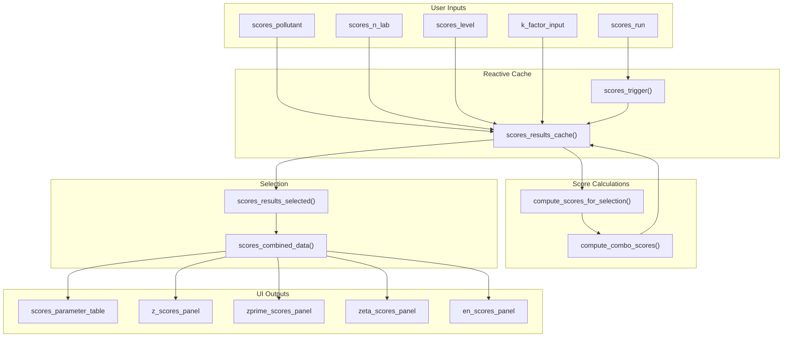
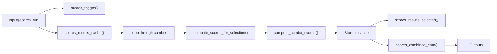

# Shiny Module: PT Scores

Module for calculation and visualization of participant performance scores.

---

## Location in Code

| Element | Value |
|---------|-------|
| File | `cloned_app.R` |
| UI | `tabPanel("Puntajes PT")` |
| Lines | 1806-2270 |

---

## UI Component Map

| UI Element | Input ID | Output ID | Reactive |
|------------|----------|-----------|----------|
| Pollutant dropdown | `scores_pollutant` | - | - |
| n_lab selector | `scores_n_lab` | - | - |
| Level dropdown | `scores_level` | - | - |
| Run button | `scores_run` | - | `scores_trigger()` |
| k-factor input | `k_factor_input` | - | `input$k_factor_input` |
| Parameter table | - | `scores_parameter_table` | `scores_combined_data()` |
| z-scores panel | - | `z_scores_panel` | `scores_combined_data()` |
| z'-scores panel | - | `zprime_scores_panel` | `scores_combined_data()` |
| zeta-scores panel | - | `zeta_scores_panel` | `scores_combined_data()` |
| En-scores panel | - | `en_scores_panel` | `scores_combined_data()` |

---

## Data Flow Overview



---

## Integration with ptcalc

The module uses functions from the `ptcalc` package:

| Function | Purpose |
|----------|---------|
| `ptcalc::calculate_z_score()` | Calculate z-score |
| `ptcalc::calculate_z_prime_score()` | Calculate z'-score |
| `ptcalc::calculate_zeta_score()` | Calculate zeta-score |
| `ptcalc::calculate_en_score()` | Calculate En-score |
| `ptcalc::evaluate_z_score_vec()` | Evaluate z-scores |
| `ptcalc::evaluate_en_score_vec()` | Evaluate En-scores |

---

## Function: `compute_scores_for_selection()`

**Location:** Lines 1926-2098

### Function Signature

```r
compute_scores_for_selection(
  target_pollutant,
  target_n_lab,
  target_level,
  summary_data,
  max_iter = 50,
  k_factor = 2
)
```

### Parameters

| Parameter | Type | Description |
|-----------|------|-------------|
| `target_pollutant` | string | Pollutant name (e.g., "so2") |
| `target_n_lab` | integer | Number of participants |
| `target_level` | string | Concentration level |
| `summary_data` | DataFrame | Aggregated participant data from `pt_prep_data()` |
| `max_iter` | integer | Maximum iterations for Algorithm A (default: 50) |
| `k_factor` | numeric | Coverage factor for uncertainty (default: 2) |

### Return Value

```r
list(
  error = NULL | string,
  combos = list(
    ref = list(...),
    consensus_ma = list(...),
    consensus_niqr = list(...),
    algo = list(...)
  ),
  summary = tibble(),      # x_pt, sigma_pt, u(xpt) per method
  overview = tibble(),     # Scores per participant per method
  k = k_factor
)
```

### Step-by-Step Breakdown

#### Step 1: Filter Data (Lines 1927-1936)

```r
subset_data <- summary_data %>%
  filter(
    pollutant == .env$target_pollutant,
    n_lab == .env$target_n_lab,
    level == .env$target_level
  )

if (nrow(subset_data) == 0) {
  return(list(error = "No se encontraron datos para la combinación seleccionada."))
}
```

#### Step 2: Get Homogeneity Parameters (Lines 1938-1946)

```r
hom_res <- tryCatch(
  compute_homogeneity_metrics(target_pollutant, target_level),
  error = function(e) list(error = conditionMessage(e))
)

if (!is.null(hom_res$error)) {
  return(list(error = paste("Error obteniendo parámetros de homogeneidad:", hom_res$error)))
}

sigma_pt1 <- hom_res$sigma_pt
u_xpt1 <- hom_res$u_xpt
```

#### Step 3: Extract Participant Data (Lines 1948-1965)

```r
participant_data <- subset_data %>%
  filter(participant_id != "ref") %>%
  group_by(participant_id) %>%
  summarise(
    result = mean(mean_value, na.rm = TRUE),
    sd_value = mean(sd_value, na.rm = TRUE),
    .groups = "drop"
  ) %>%
  mutate(
    pollutant = target_pollutant,
    n_lab = target_n_lab,
    level = target_level,
    uncertainty_std = if (!is.null(hom_res$m) && hom_res$m > 0)
      sd_value / sqrt(hom_res$m) else sd_value
  )
```

#### Step 4: Calculate Reference Value (Method 1) (Lines 1967-1971)

```r
ref_data <- subset_data %>% filter(participant_id == "ref")
if (nrow(ref_data) == 0) {
  return(list(error = "No se encontró información del participante de referencia."))
}
x_pt1 <- mean(ref_data$mean_value, na.rm = TRUE)
```

#### Step 5: Calculate u_hom and u_stab (Lines 1975-1990)

```r
# Calculate u_hom
u_hom_val <- hom_res$ss

# Calculate u_stab
stab_res <- tryCatch(
  compute_stability_metrics(target_pollutant, target_level, hom_res),
  error = function(e) list(error = conditionMessage(e))
)

u_stab_val <- 0
if (is.null(stab_res$error)) {
  y1 <- hom_res$general_mean
  y2 <- stab_res$stab_general_mean
  d_max <- abs(y1 - y2)
  u_stab_val <- d_max / sqrt(3)
}
```

#### Step 6: Calculate Consensus MADe (Method 2a) (Lines 1992-2000)

```r
values <- participant_data$result
n_part <- length(values)

median_val <- median(values, na.rm = TRUE)
mad_val <- median(abs(values - median_val), na.rm = TRUE)
sigma_pt_2a <- 1.483 * mad_val
u_xpt2a <- if (is.finite(sigma_pt_2a)) 1.25 * sigma_pt_2a / sqrt(n_part) else NA_real_
```

#### Step 7: Calculate Consensus nIQR (Method 2b) (Lines 1998-2000)

```r
sigma_pt_2b <- calculate_niqr(values)
u_xpt2b <- if (is.finite(sigma_pt_2b)) 1.25 * sigma_pt_2b / sqrt(n_part) else NA_real_
```

#### Step 8: Run Algorithm A (Method 3) (Lines 2002-2018)

```r
algo_res <- if (n_part >= 3) {
  ptcalc::run_algorithm_a(
    values = values,
    ids = participant_data$participant_id,
    max_iter = max_iter
  )
} else {
  list(error = "Se requieren al menos tres participantes para calcular el Algoritmo A.")
}
```

#### Step 9: Compute Scores for All Methods (Lines 2009-2018)

```r
combos <- list()
combos$ref <- compute_combo_scores(
  participant_data, x_pt1, sigma_pt1, u_xpt1,
  score_combo_info$ref, k = k_factor,
  u_hom = u_hom_val, u_stab = u_stab_val
)
combos$consensus_ma <- compute_combo_scores(
  participant_data, median_val, sigma_pt_2a, u_xpt2a,
  score_combo_info$consensus_ma, k = k_factor,
  u_hom = u_hom_val, u_stab = u_stab_val
)
combos$consensus_niqr <- compute_combo_scores(
  participant_data, median_val, sigma_pt_2b, u_xpt2b,
  score_combo_info$consensus_niqr, k = k_factor,
  u_hom = u_hom_val, u_stab = u_stab_val
)

if (is.null(algo_res$error)) {
  u_xpt3 <- 1.25 * algo_res$robust_sd / sqrt(n_part)
  combos$algo <- compute_combo_scores(
    participant_data, algo_res$assigned_value, algo_res$robust_sd, u_xpt3,
    score_combo_info$algo, k = k_factor,
    u_hom = u_hom_val, u_stab = u_stab_val
  )
}
```

#### Step 10: Generate Summary Table (Lines 2020-2049)

```r
summary_table <- map_dfr(names(score_combo_info), function(key) {
  meta <- score_combo_info[[key]]
  combo <- combos[[key]]
  if (!is.null(combo$error)) {
    tibble(
      Combinación = meta$title,
      Etiqueta = meta$label,
      `x_pt` = NA_real_,
      `x_pt_def` = NA_real_,
      `sigma_pt` = NA_real_,
      `u(x_pt)` = NA_real_,
      `u(x_pt)_def` = NA_real_,
      Nota = combo$error
    )
  } else {
    tibble(
      Combinación = combo$title,
      Etiqueta = combo$label,
      `x_pt` = combo$x_pt,
      `x_pt_def` = combo$x_pt_def,
      `sigma_pt` = combo$sigma_pt,
      `u(x_pt)` = combo$u_xpt,
      `u(x_pt)_def` = combo$u_xpt_def,
      Nota = ""
    )
  }
})
```

#### Step 11: Generate Overview Table (Lines 2051-2089)

```r
overview_table <- map_dfr(names(score_combo_info), function(key) {
  meta <- score_combo_info[[key]]
  combo <- combos[[key]]
  if (!is.null(combo$error)) {
    tibble(
      Combinación = meta$title,
      Participante = NA_character_,
      Resultado = NA_real_,
      `u(xi)` = NA_real_,
      `Puntaje z` = NA_real_,
      `Evaluación z` = combo$error,
      ...
    )
  } else {
    combo$data %>%
      transmute(
        Combinación = combo$title,
        Participante = participant_id,
        Resultado = result,
        `u(xi)` = uncertainty_std,
        `Puntaje z` = z_score,
        `Evaluación z` = z_score_eval,
        `Puntaje z'` = z_prime_score,
        `Evaluación z'` = z_prime_score_eval,
        `Puntaje zeta` = zeta_score,
        `Evaluación zeta` = zeta_score_eval,
        `Puntaje En` = En_score,
        `Puntaje En Eval` = En_score_eval
      )
  }
})
```

---

## Function: `compute_combo_scores()`

**Location:** Lines 1806-1925

### Function Signature

```r
compute_combo_scores(
  participants_df,
  x_pt,
  sigma_pt,
  u_xpt,
  combo_meta,
  k = 2,
  u_hom = 0,
  u_stab = 0
)
```

### Parameters

| Parameter | Type | Description |
|-----------|------|-------------|
| `participants_df` | DataFrame | Participant data with result and sd_value |
| `x_pt` | numeric | Assigned value |
| `sigma_pt` | numeric | Standard deviation for score calculation |
| `u_xpt` | numeric | Uncertainty of assigned value |
| `combo_meta` | list | Metadata (title, label, score types) |
| `k` | numeric | Coverage factor (default: 2) |
| `u_hom` | numeric | Homogeneity uncertainty (default: 0) |
| `u_stab` | numeric | Stability uncertainty (default: 0) |

### Implementation

```r
compute_combo_scores <- function(participants_df, x_pt, sigma_pt, u_xpt, combo_meta, k = 2, u_hom = 0, u_stab = 0) {
  # Calculate combined uncertainty
  u_xpt_def <- sqrt(u_xpt^2 + u_hom^2 + u_stab^2)

  # Calculate scores for each participant
  data <- participants_df %>%
    rowwise() %>%
    mutate(
      z_score = ptcalc::calculate_z_score(result, x_pt, sigma_pt),
      z_prime_score = ptcalc::calculate_z_prime_score(result, x_pt, sigma_pt),
      zeta_score = ptcalc::calculate_zeta_score(result, x_pt, u_xpt_def, uncertainty_std),
      En_score = ptcalc::calculate_en_score(result, x_pt, k * uncertainty_std, k * u_xpt_def)
    ) %>%
    ungroup()

  # Evaluate scores
  data <- data %>%
    mutate(
      z_score_eval = ptcalc::evaluate_z_score_vec(z_score),
      z_prime_score_eval = ptcalc::evaluate_z_score_vec(z_prime_score),
      zeta_score_eval = ptcalc::evaluate_z_score_vec(zeta_score),
      En_score_eval = ptcalc::evaluate_en_score_vec(En_score)
    )

  # Return results
  list(
    title = combo_meta$title,
    label = combo_meta$label,
    x_pt = x_pt,
    sigma_pt = sigma_pt,
    u_xpt = u_xpt,
    u_xpt_def = u_xpt_def,
    k = k,
    data = data
  )
}
```

---

## Caching Strategy with `scores_results_cache()`

### Purpose

Store calculated scores to avoid recomputation when switching between tabs or views.

### Implementation

**Location:** Lines 168, 175, 2108, 2134, 3242

```r
# Initialize cache
scores_results_cache <- reactiveVal(NULL)

# Clear cache when data changes
observe({
  pt_prep_data()
  scores_results_cache(NULL)
})

# Store results
scores_results_cache(results)

# Retrieve from cache
cache <- scores_results_cache()
```

### Cache Structure

```r
# Cache is a named list where keys are combinations of pollutant, n_lab, level
cache <- list(
  "so2||4||20-nmol/mol" = list(
    error = NULL,
    combos = list(...),
    summary = tibble(...),
    overview = tibble(...),
    k = 2
  ),
  "co||4||2-μmol/mol" = list(...)
)
```

### Cache Invalidation

| Event | Action |
|-------|--------|
| New file uploaded | `scores_results_cache(NULL)` |
| User clicks "Calcular puntajes" | Invalidates and recalculates |
| Data loading completes | Invalidates to ensure consistency |

---

## Reactive Chain



---

## Tab Switching Behavior

### Score Type Tabs

| Tab | Score Type | Output ID |
|-----|------------|-----------|
| z-scores | z | `output$z_scores_panel` |
| z'-scores | z' | `output$zprime_scores_panel` |
| zeta-scores | ζ (zeta) | `output$zeta_scores_panel` |
| En-scores | En | `output$en_scores_panel` |

### Switching Logic

```r
# All tabs use the same underlying data
data <- scores_combined_data()

# Each tab filters to its score type
output$z_scores_panel <- renderPlotly({
  data <- scores_combined_data()
  plot_scores(data, score_type = "z")
})

output$zprime_scores_panel <- renderPlotly({
  data <- scores_combined_data()
  plot_scores(data, score_type = "zprime")
})
```

### State Preservation

When switching between tabs:
1. Data remains in cache
2. Plot re-renders with new score type
3. No recalculation needed

---

## Reactives

### `scores_results_cache()`

| Property | Value |
|-----------|-------|
| Type | `reactiveVal(NULL)` |
| Purpose | Store all calculated scores |

### `scores_trigger()`

| Property | Value |
|-----------|-------|
| Type | `reactive(Sys.time())` |
| Trigger | `input$scores_run` |
| Purpose | Invalidate cache on manual calculation |

### `scores_results_selected()`

| Property | Value |
|-----------|-------|
| Depends on | `input$scores_pollutant`, `input$scores_n_lab`, `input$scores_level` |
| Returns | Results for selected combination |

**Implementation:**
```r
scores_results_selected <- reactive({
  req(input$scores_pollutant, input$scores_n_lab, input$scores_level)
  get_scores_result(input$scores_pollutant, input$scores_n_lab, input$scores_level)
})
```

### `scores_combined_data()`

| Property | Value |
|-----------|-------|
| Depends on | `scores_results_selected()` |
| Returns | Combined results across all methods |

---

## Plot Generation with `plot_scores()`

### Function Signature

```r
plot_scores(data, score_type = "z")
```

### Score Types

| Score Type | Column Name | Thresholds |
|------------|-------------|------------|
| z | `z_score` | ±2 (questionable), ±3 (unsatisfactory) |
| z' | `z_prime_score` | ±2 (questionable), ±3 (unsatisfactory) |
| zeta | `zeta_score` | ±2 (questionable), ±3 (unsatisfactory) |
| En | `En_score` | ±1 (unsatisfactory) |

### Plot Types

1. **Bar chart**: Scores by participant
2. **Color coding**: Based on evaluation
   - Green: Satisfactory
   - Yellow: Questionable
   - Red: Unsatisfactory
   - Gray: N/A

### Example Implementation

```r
plot_scores <- function(data, score_type = "z") {
  score_col <- paste0(score_type, "_score")
  eval_col <- paste0(score_col, "_eval")

  p <- ggplot(data, aes(x = participant_id, y = !!sym(score_col), fill = !!sym(eval_col))) +
    geom_bar(stat = "identity") +
    scale_fill_manual(values = c(
      "Satisfactorio" = "#00B050",
      "Cuestionable" = "#FFEB3B",
      "No satisfactorio" = "#D32F2F",
      "N/A" = "#BDBDBD"
    )) +
    geom_hline(yintercept = c(-2, 2), linetype = "dashed") +
    geom_hline(yintercept = c(-3, 3), linetype = "dashed") +
    labs(title = paste("Puntajes", toupper(score_type)),
         x = "Participante",
         y = "Puntaje",
         fill = "Evaluación") +
    theme_minimal() +
    theme(axis.text.x = element_text(angle = 45, hjust = 1))

  ggplotly(p)
}
```

---

## Output Details

### `output$scores_parameter_table`

Displays parameters for each method:

| Combinación | Etiqueta | x_pt | x_pt_def | sigma_pt | u(x_pt) | u(x_pt)_def |
|-------------|----------|------|----------|----------|---------|-------------|
| Referencia | 1 | 19.738 | 19.740 | 0.046 | 0.009 | 0.014 |
| Consenso MADe | 2a | 19.731 | 19.733 | 0.046 | 0.009 | 0.014 |
| Algoritmo A | 3 | 19.735 | 19.737 | 0.042 | 0.008 | 0.013 |

### Score Panels

Each panel displays:
- Bar chart of scores by participant
- Color-coded evaluation
- Reference lines at threshold values
- Interactive tooltips (plotly)

---

## Cross-References

- **PT Scores Theory:** [05_pt_scores.md](05_pt_scores.md)
- **Assigned Value:** [07_valor_asignado.md](07_valor_asignado.md)
- **Data Loading:** [01_carga_datos.md](01_carga_datos.md)
- **Glossary:** [00_glossary.md](00_glossary.md)
