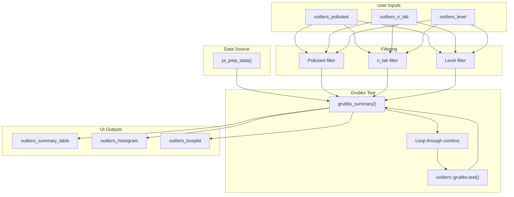
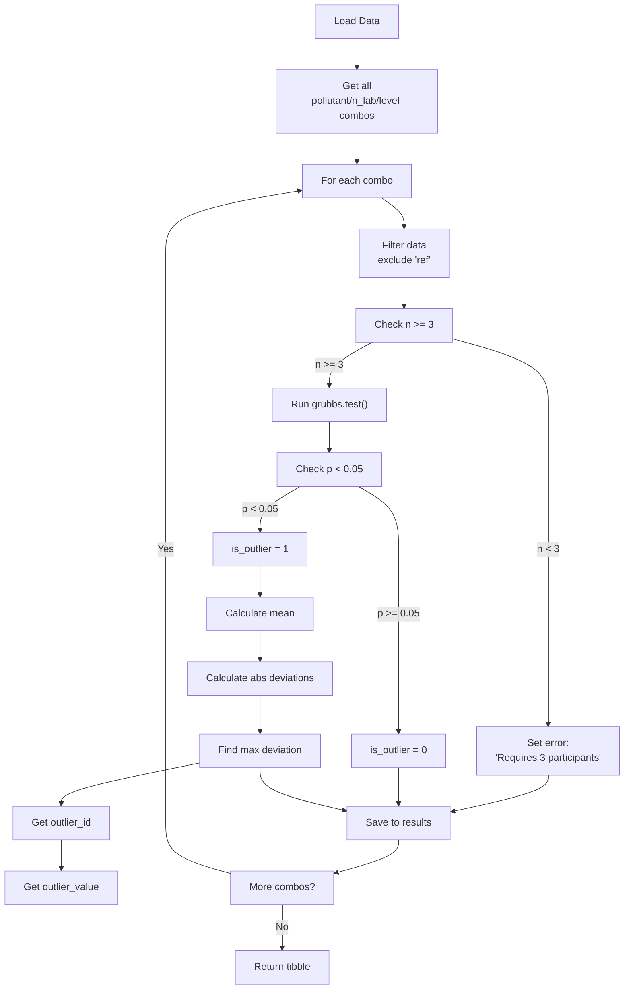

# Module: Outliers (Valores Atípicos)

Detection of anomalous values using Grubbs test.

---

## Location in Code

| Element | Value |
|---------|-------|
| File | `cloned_app.R` |
| Library | `outliers` |
| UI | `tabPanel("Valores Atípicos")` |
| Lines | 3801-3938 |

---

## UI Component Map

| UI Element | Input ID | Output ID | Reactive |
|------------|----------|-----------|----------|
| Pollutant filter | `outliers_pollutant` | - | - |
| n_lab filter | `outliers_n_lab` | - | - |
| Level filter | `outliers_level` | - | - |
| Summary table | - | `outliers_summary_table` | `grubbs_summary()` |
| Histogram | - | `outliers_histogram` | `grubbs_summary()` |
| Boxplot | - | `outliers_boxplot` | `grubbs_summary()` |

---

## Data Flow Overview



---

## Method: Grubbs Test

### Test Description

The Grubbs test identifies outliers in a univariate data set assuming a normal distribution.

**Prerequisite:** $n \geq 3$ participants

**Hypothesis Test:**
- $H_0$: No outliers in data
- $H_1$: One or more outliers

**Test Statistic:**
$$G = \frac{\max|x_i - \bar{x}|}{s}$$

Where:
- $\bar{x}$ = sample mean
- $s$ = sample standard deviation

**Critical Value:**
$$G_{critical} = \frac{(n-1)\sqrt{t^2_{\alpha/(2n), n-2}}}{n\sqrt{n-2+t^2_{\alpha/(2n), n-2}}}$$

**Decision Rule:**
- If $G > G_{critical}$ and $p < 0.05$, reject $H_0$ (outlier detected)

### Function

**Library:** `outliers`

**Function:** `grubbs.test()`

**Usage:**
```r
result <- outliers::grubbs.test(x)
# Returns: htest object with statistic, p.value, method
```

### Criterion

| Condition | Interpretation |
|-----------|---------------|
| $p < 0.05$ | Outlier detected (is_outlier = 1) |
| $p \geq 0.05$ | No outlier detected (is_outlier = 0) |

---

## `grubbs_summary()` Reactive

**Location:** Lines 3801-3938

| Property | Value |
|-----------|-------|
| Depends on | `pt_prep_data()` |
| Returns | Data frame with Grubbs test results |

### Implementation

```r
grubbs_summary <- reactive({
  req(pt_prep_data())
  data <- pt_prep_data()

  if (nrow(data) == 0) {
    return(NULL)
  }

  # Get all combinations
  combos <- data %>%
    distinct(pollutant, n_lab, level)

  results_list <- list()

  for (i in 1:nrow(combos)) {
    pollutant_val <- combos$pollutant[i]
    n_lab_val <- combos$n_lab[i]
    level_val <- combos$level[i]

    # Filter data for combination
    subset_data <- data %>%
      filter(
        pollutant == pollutant_val,
        n_lab == n_lab_val,
        level == level_val
      )

    # Get participant values (excluding ref)
    participant_data <- subset_data %>%
      filter(participant_id != "ref") %>%
      group_by(participant_id) %>%
      summarise(
        result = mean(mean_value, na.rm = TRUE),
        .groups = "drop"
      ) %>%
      pull(result)

    n_part <- length(participant_data)

    # Initialize result row
    result_row <- list(
      pollutant = pollutant_val,
      n_lab = n_lab_val,
      level = level_val,
      n_participants = n_part,
      p_value = NA_real_,
      is_outlier = 0,
      outlier_id = NA_character_,
      outlier_value = NA_real_,
      error = ""
    )

    # Run Grubbs test if n >= 3
    if (n_part >= 3) {
      tryCatch({
        test_result <- outliers::grubbs.test(participant_data)
        result_row$p_value <- test_result$p.value

        if (test_result$p.value < 0.05) {
          result_row$is_outlier <- 1

          # Find outlier (max absolute deviation from mean)
          mean_val <- mean(participant_data)
          abs_diff <- abs(participant_data - mean_val)
          outlier_idx <- which.max(abs_diff)
          result_row$outlier_value <- participant_data[outlier_idx]

          # Get outlier ID
          outlier_data <- subset_data %>%
            filter(participant_id != "ref") %>%
            group_by(participant_id) %>%
            summarise(
              result = mean(mean_value, na.rm = TRUE),
              .groups = "drop"
            )

          result_row$outlier_id <- outlier_data$participant_id[outlier_idx]
        }
      }, error = function(e) {
        result_row$error <- conditionMessage(e)
      })
    } else {
      result_row$error <- "Se requieren al menos 3 participantes"
    }

    results_list[[length(results_list) + 1]] <- result_row
  }

  bind_rows(results_list)
})
```

### Return Structure

```r
tibble(
  pollutant,         # Pollutant name
  n_lab,            # Number of participants
  level,             # Concentration level
  n_participants,    # Number of non-ref participants
  p_value,           # Grubbs test p-value
  is_outlier,        # 1 = outlier, 0 = no outlier
  outlier_id,        # ID of outlier participant (if any)
  outlier_value,     # Value of outlier (if any)
  error              # Error message (if any)
)
```

---

## Visualizations

### Histogram with Density Curve

**Location:** Lines 3905-3920

**Purpose:** Show distribution of participant values with outlier highlighted.

**Features:**
- Histogram of participant values
- Normal density curve overlay
- Red fill for outlier values
- Gray fill for non-outlier values

**Implementation:**
```r
output$outliers_histogram <- renderPlotly({
  data <- grubbs_summary()
  if (is.null(data) || nrow(data) == 0) {
    return(NULL)
  }

  # Get filtered data
  if (!is.null(input$outliers_pollutant)) {
    data <- data %>% filter(pollutant == input$outliers_pollutant)
  }
  if (!is.null(input$outliers_n_lab)) {
    data <- data %>% filter(n_lab == input$outliers_n_lab)
  }
  if (!is.null(input$outliers_level)) {
    data <- data %>% filter(level == input$outliers_level)
  }

  if (nrow(data) == 0) {
    return(NULL)
  }

  # Get first row for visualization
  row <- data[1, ]

  # Get participant values
  pt_data <- pt_prep_data() %>%
    filter(
      pollutant == row$pollutant,
      n_lab == row$n_lab,
      level == row$level,
      participant_id != "ref"
    ) %>%
    group_by(participant_id) %>%
    summarise(
      result = mean(mean_value, na.rm = TRUE),
      .groups = "drop"
    )

  # Identify outlier
  pt_data$is_outlier <- pt_data$participant_id == row$outlier_id

  # Create histogram
  p <- ggplot(pt_data, aes(x = result)) +
    geom_histogram(aes(fill = as.character(is_outlier)),
                 bins = min(10, nrow(pt_data)),
                 alpha = 0.7) +
    geom_density(color = "blue", fill = NA, size = 1) +
    scale_fill_manual(values = c("0" = "gray", "1" = "red"),
                    labels = c("0" = "Normal", "1" = "Outlier"),
                    name = "") +
    labs(
      title = paste("Distribución -", row$pollutant, row$level),
      subtitle = paste("n =", row$n_participants,
                     ifelse(row$is_outlier == 1,
                            paste0(", Outlier: ", row$outlier_id, " (", round(row$outlier_value, 3), ")"),
                            ", No outliers detected")),
      x = "Valor",
      y = "Frecuencia"
    ) +
    theme_minimal()

  plotly::ggplotly(p)
})
```

### Boxplot with Outliers Highlighted

**Location:** Lines 3922-3938

**Purpose:** Show quartiles and highlight outliers.

**Features:**
- Box showing quartiles (Q1, median, Q3)
- Whiskers showing range
- Red points for outliers
- Gray points for normal values

**Implementation:**
```r
output$outliers_boxplot <- renderPlotly({
  # Get filtered data (same as histogram)
  data <- grubbs_summary()
  if (is.null(data) || nrow(data) == 0) {
    return(NULL)
  }

  # Get first row for visualization
  row <- data[1, ]

  # Get participant values (same as histogram)
  pt_data <- pt_prep_data() %>%
    filter(
      pollutant == row$pollutant,
      n_lab == row$n_lab,
      level == row$level,
      participant_id != "ref"
    ) %>%
    group_by(participant_id) %>%
    summarise(
      result = mean(mean_value, na.rm = TRUE),
      .groups = "drop"
    )

  # Identify outlier
  pt_data$is_outlier <- pt_data$participant_id == row$outlier_id

  # Create boxplot
  p <- ggplot(pt_data, aes(x = "Todos", y = result)) +
    geom_boxplot(outlier.shape = NA) +  # Hide default outliers
    geom_jitter(aes(color = as.character(is_outlier)),
                width = 0.2, size = 3) +
    scale_color_manual(values = c("0" = "gray", "1" = "red"),
                    labels = c("0" = "Normal", "1" = "Outlier"),
                    name = "") +
    labs(
      title = paste("Boxplot -", row$pollutant, row$level),
      x = "",
      y = "Valor"
    ) +
    theme_minimal() +
    theme(legend.position = "bottom")

  plotly::ggplotly(p)
})
```

### Visual Indicators

| Indicator | Meaning | Visualization |
|-----------|-----------|----------------|
| Normal value | Within expected distribution | Gray in histogram, gray in boxplot |
| Outlier | Significantly different from distribution | Red in histogram, red in boxplot |
| Density curve | Theoretical normal distribution | Blue line in histogram |
| Box quartiles | Q1 (25%), median, Q3 (75%) | Box in boxplot |
| Whiskers | Range excluding outliers | Lines extending from box |

---

## Multi-Level Outlier Detection Workflow



---

## Integration with Score Calculations

### Are Outliers Excluded?

**Short answer:** **NO**, outliers detected by Grubbs test are **NOT** automatically excluded from score calculations.

**Reasoning:**

1. **Algorithm A** has its own outlier removal mechanism
2. **Grubbs test** is for informational purposes only
3. **Methods 1, 2a, 2b** use all participant data

### Score Calculation vs Grubbs Test

| Method | Uses Grubbs Outliers? | Outlier Removal Strategy |
|--------|----------------------|------------------------|
| Method 1 (Reference) | No | N/A (uses ref lab only) |
| Method 2a (MADe) | No | MADe is inherently robust |
| Method 2b (nIQR) | No | nIQR is inherently robust |
| Method 3 (Algorithm A) | No | Uses own iterative outlier detection |

### When to Use Grubbs Results

**Use cases:**
1. **Identify suspicious laboratories** for further investigation
2. **Compare with Algorithm A results** for consistency
3. **Quality control review** before publishing PT results
4. **Laboratory feedback** to explain extreme values

**Not used for:**
1. Automatic score adjustment
2. PT scheme pass/fail determination
3. Statistical parameter calculation

---

## Error State Documentation

### "Se requieren al menos 3 participantes"

**Cause:** Number of non-ref participants < 3.

**Visual:** Error column contains this message, p_value = NA

**Solution:**
- Add more participants to the PT scheme
- Or note that Grubbs test cannot be run with fewer than 3 participants

### Grubbs test error messages

**Cause:** Statistical error in test (e.g., all identical values).

**Visual:** Error column contains specific error message

**Solution:**
- Check data quality
- Verify participants have sufficient variation
- Review source data

---

## ISO Standard References

- **ISO 13528:2022** Section 7.3 - Detection of outliers
- **Grubbs, F. E.** (1969) "Procedures for detecting outlying observations in samples"
- **ISO 17043** - Proficiency testing

---

## Cross-References

- **Global Report:** [10_informe_global.md](10_informe_global.md)
- **PT Scores:** [09_puntajes_pt.md](09_puntajes_pt.md)
- **Algorithm A:** [03_pt_robust_stats.md](03_pt_robust_stats.md)
- **Data Loading:** [01_carga_datos.md](01_carga_datos.md)
- **Glossary:** [00_glossary.md](00_glossary.md)
