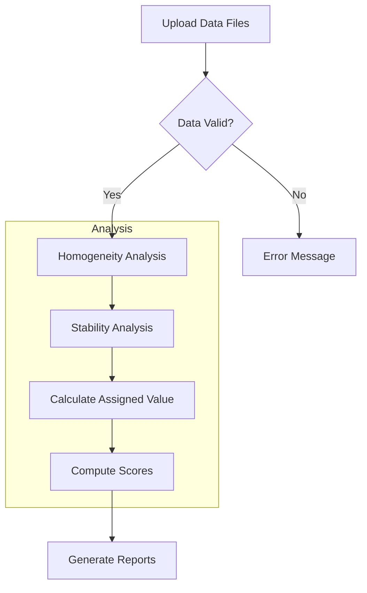

# Quick Start Guide: Proficiency Testing (PT) Data Analysis Application

This guide will get you running the Proficiency Testing Application in under 5 minutes. This application implements a comprehensive toolkit for PT analysis for criterion pollutant gases (CO, SO2, NO, NO2, O3) following **ISO 17043:2024** and **ISO 13528:2022** standards.

Developed by Laboratorio CALAIRE (Universidad Nacional de Colombia) in partnership with the Instituto Nacional de Metrologia (INM).

---

## 1. System Requirements

| Requirement | Minimum Version | Recommended |
|-------------|-----------------|-------------|
| **R** | 4.1.0 | 4.4.0 or later |
| **RStudio** | 2023.06 | 2024.04 or later |
| **Operating System** | Windows 10+, macOS 11+, Linux | Any modern OS |
| **RAM** | 4 GB | 8 GB+ |
| **Web Browser** | Modern browser (Chrome, Firefox, Edge, Safari) | |

---

## 2. Installation

### Step 1: Install Required R Packages
Open R or RStudio and run the following command to install all necessary dependencies:

```r
install.packages(c(
  "shiny", "bslib", "tidyverse", "vroom", "DT", 
  "rhandsontable", "plotly", "ggplot2", "patchwork",
  "outliers", "rmarkdown", "devtools", "shinythemes", 
  "bsplus", "dplyr", "stats"
))
```

**Package Purpose Reference:**

| Package | Purpose |
|---------|---------|
| shiny | Web framework |
| bslib | Bootstrap 5 theming |
| tidyverse | Data manipulation (dplyr, ggplot2, etc.) |
| vroom | Fast CSV reading |
| DT | Interactive tables |
| rhandsontable | Editable tables |
| plotly | Interactive plots |
| ggplot2 | Static plots |
| patchwork | Plot composition |
| outliers | Grubbs test |
| rmarkdown | Report generation |
| devtools | Package development |

### Step 2: Install the ptcalc Package
The application relies on the local `ptcalc` package for ISO 13528/17043 calculations.

**For development/loading:**
```r
# Run this from the project root directory
devtools::load_all("ptcalc")
```

**For production installation:**
```r
# Run this from the project root directory
devtools::install("ptcalc")
```

---

## 3. Launching the Application

### Method A: From R/RStudio Console (Recommended)
1. Set your working directory to the project root.
2. Run the application file.

```r
setwd("/path/to/pt_app")
shiny::runApp("cloned_app.R")
```

### Method B: Command Line
```bash
# Option 1: Using Rscript
Rscript cloned_app.R

# Option 2: Using R execute
R -e "shiny::runApp('cloned_app.R')"
```
*Note: The application will typically be accessible in your browser at `http://127.0.0.1:3838` or the port displayed in the console.*

---

## 4. Application Workflow



---

## 5. Your First Analysis in 5 Minutes

### Step 1: Prepare Your Data Files
The application requires specific CSV formats. Sample data files are included in the `data/` folder:

- `homogeneity.csv`: Homogeneity test data
- `stability.csv`: Stability test data
- `summary_n4.csv`: 4-participant scenario
- `participants_data4.csv`: Instrumentation data

#### 1. Homogeneity & Stability Data
```csv
"pollutant","level","replicate","sample_id","value"
"co","0-umol/mol",1,1,0.00670
"co","0-umol/mol",1,2,0.00479
```
| Column | Type | Description |
|--------|------|-------------|
| pollutant | text | Gas identifier (e.g., "co", "so2", "no") |
| level | text | Concentration level (e.g., "0-umol/mol") |
| replicate | integer | Replicate number (1, 2, ...) |
| sample_id | integer | Sample/item identifier |
| value | numeric | Measured concentration |

#### 2. Participant Summary Files (`summary_n*.csv`)
```csv
"pollutant","level","participant_id","replicate","sample_group","mean_value","sd_value"
"co","0-umol/mol","part_1",2,"1-10",-0.0271,0.0278
```

#### 3. Participant Instrumentation (`participants_data.csv`)
```csv
Codigo_Lab,Analizador_SO2,Analizador_CO,Analizador_O3,Analizador_NO_NO2
REFERENCIA,HORIBA APSA-370,Teledyne T300,Thermo 49i,HORIBA APSA-370
```

### Step 2: Load Data Files
1. Navigate to the **"Carga de datos"** (Data Loading) tab.
2. Click **Browse** to upload your files from the `data/` folder.
3. Verify that the app shows "File uploaded successfully" in green.

### Step 3: Run Homogeneity & Stability Analysis
1. Go to the **"Homogeneidad"** (Homogeneity) tab.
2. Select **Pollutant** (e.g., `SO2`) and **Level** (e.g., `low`).
3. Click **"Ejecutar análisis"** (Run Analysis).
4. Review the ANOVA table and the conclusion box (PASS/FAIL based on $s_s \leq 0.3\sigma_{pt}$).
5. Use the **"Estabilidad"** (Stability) tab to compare homogeneity vs. stability results.

### Step 4: Calculate Assigned Value
1. Navigate to the **"Valor Asignado"** tab.
2. Choose a method: **Algorithm A** (Robust consensus), **Reference value**, or **Consensus** (Median).
3. Click **"Calcular Valor Asignado"**.

### Step 5: Compute Performance Scores
1. Go to the **"Puntajes PT"** tab.
2. Select score types: **z**, **z'**, **zeta (ζ)**, or **En**.
3. Click **"Calcular puntajes"** to view the performance metrics for all laboratories.

### Step 6: Generate Reports
1. Navigate to the **"Generación de Informes"** tab.
2. Fill in metadata (PT ID, date, coordinator).
3. Select output format (**Word** or **HTML**) and click **"Generar Informe"**.

---

## 6. Troubleshooting

### "Column not found" Error
Ensure your CSV files contain all required columns with exact names (case-sensitive).

### "Insufficient data" Error
- Homogeneity/stability require at least 2 items and 2 replicates.
- Algorithm A requires at least 3 participants.

### Application Won't Start
- **Check dependencies:**
  ```r
  required_packages <- c("shiny", "bslib", "tidyverse", "vroom", "DT", "rhandsontable",
                         "shinythemes", "outliers", "patchwork", "bsplus", "plotly",
                         "rmarkdown", "devtools", "dplyr", "stats")
  missing <- setdiff(required_packages, rownames(installed.packages()))
  if (length(missing) > 0) install.packages(missing)
  ```
- **Verify Directory:** Ensure you are in the project root where `cloned_app.R` is located.

### ptcalc package not found
Run `devtools::load_all("ptcalc")` from the project root before running the app.

---

## 7. Next Steps & Support
- [Glossary of Terms](01_00_glossary.md) - Spanish/English terminology
- [Data Formats Reference](01_carga_datos.md) - Complete CSV specifications
- [Package API](02_ptcalc_package.md) - Mathematical functions reference
- **Support**: Contact Laboratorio CALAIRE, Universidad Nacional de Colombia.
