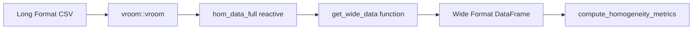
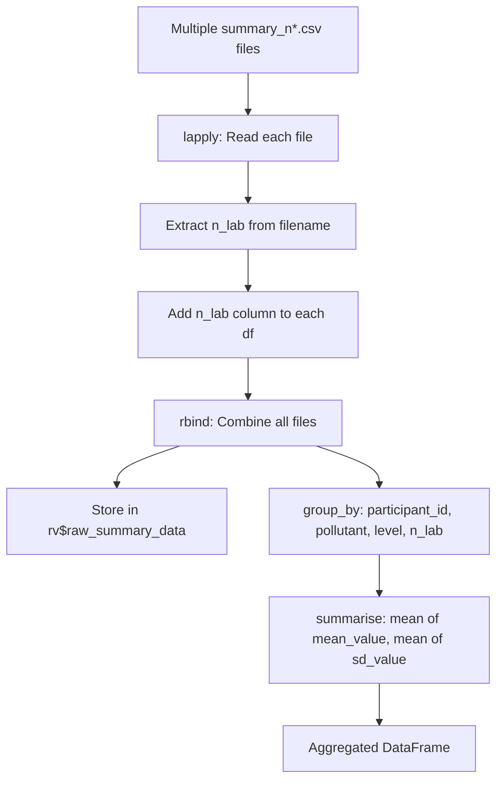

# Data Formats & Transformation Reference

This document provides a complete specification for all data formats accepted by the application and explains the internal transformation logic used to prepare data for ISO 13528/17043 statistical analysis.

---

## 1. Overview

The application uses three primary types of CSV files to conduct proficiency testing analysis:

1.  **Homogeneity file** (`homogeneity.csv`) - Used to test sample uniformity within a batch.
2.  **Stability file** (`stability.csv`) - Used to test sample consistency over time.
3.  **Summary files** (`summary_n*.csv`) - Contains aggregated measurement results from PT participants.

All files must use **UTF-8 encoding** and the **comma-separated values (CSV)** format.

### 1.1 File Format Summary

| File Type | Format | Required Columns | Optional/Contextual Columns |
|-----------|--------|------------------|------------------|
| Homogeneity | Long | `pollutant`, `level`, `value` | `replicate`, `sample_id`, `date` |
| Stability | Long | `pollutant`, `level`, `value` | `replicate`, `sample_id`, `date` |
| Summary | Aggregated | `pollutant`, `level`, `participant_id`, `mean_value`, `sd_value` | `replicate`, `sample_group` |

---

## 2. Complete CSV Schema Reference

### 2.1 Homogeneity & Stability Data

Used for `homogeneity.csv` and `stability.csv`. This format represents **Long Format** data where each row is a single measurement.

| Column | Required | Type | Description | Example Values |
|:-------|:--------:|:-----|:------------|:---------------|
| `pollutant` | **Yes** | String | Analyte identifier (case-sensitive, lowercase) | `co`, `no`, `so2`, `o3`, `no2` |
| `level` | **Yes** | String | Concentration level with units | `0-umol/mol`, `20-nmol/mol`, `121-nmol/mol` |
| `replicate` | No* | Integer | Replicate number (typically 1 or 2) | `1`, `2` |
| `sample_id` | No | Integer | Item/sample identifier | `1`, `2`, `3`, ... `10` |
| `value` | **Yes** | Float | Measured concentration value | `0.00670`, `2.01153`, `-0.04928` |
| `date` | No | Date | Measurement date (if tracked) | `2023-10-01` |

> **\*Note on `replicate`:** While the validator does not strictly enforce the presence of the `replicate` column, it is **essential** for the `pivot_wider` transformation in `get_wide_data()`. Without it, the conversion to wide format (required for ANOVA) will fail or produce unexpected results.

#### Actual Data Example
```csv
"pollutant","level","replicate","sample_id","value"
"so2","20-nmol/mol",1,1,19.70235
"so2","20-nmol/mol",1,2,19.72471
"so2","20-nmol/mol",2,1,19.67882
"so2","20-nmol/mol",2,2,19.67765
"co","2-umol/mol",1,1,2.01154
"co","2-umol/mol",1,2,2.01617
```

---

### 2.2 Participant Summary Data

Used for `summary_n*.csv` files. Contains aggregated results from PT participants.

| Column | Required | Type | Description | Example Values |
|:-------|:--------:|:-----|:------------|:---------------|
| `pollutant` | **Yes** | String | Analyte identifier | `co`, `no`, `so2` |
| `level` | **Yes** | String | Concentration level | `0-umol/mol`, `20-nmol/mol` |
| `participant_id` | **Yes** | String | Unique laboratory identifier | `part_1`, `LAB_01`, `ref` |
| `mean_value` | **Yes** | Float | Participant's reported mean | `2.0121508274` |
| `sd_value` | **Yes** | Float | Participant's reported standard deviation | `0.0035971898` |
| `replicate` | No | Integer | Number of replicates used by the lab | `2`, `3`, `4` |
| `sample_group` | No | String | Sample grouping identifier | `1-10`, `11-20`, `21-30` |

#### Special Participant IDs

| ID | Meaning |
|:---|:---|
| `ref` | **Reference Laboratory**. Used as the assigned value ($x_{pt}$) if the Reference Lab method is selected. Automatically excluded from some PT score calculations but included in consensus. |
| `part_N` | Standard participant identifier (e.g., `part_1`, `part_2`). |

#### Filename Convention

Summary files follow a specific naming convention to allow the application to identify the PT scheme/round automatically:

| Pattern | Regex | Example | Extracted `n_lab` |
|:---|:---|:---|:---|
| `summary_n[Number].csv` | `\d+` | `summary_n4.csv` | `4` |
| `summary_[Number]_[Suffix].csv` | `\d+` | `summary_123_final.csv` | `123` |

---

## 3. Pollutant & Level Specifications

### 3.1 Supported Pollutants

| Code | English Name | Chemical Formula | Typical Units |
|:---|:---|:---|:---|
| `so2` | Sulfur dioxide | SO₂ | nmol/mol, μmol/mol |
| `co` | Carbon monoxide | CO | μmol/mol |
| `o3` | Ozone | O₃ | nmol/mol |
| `no` | Nitric oxide | NO | nmol/mol |
| `no2` | Nitrogen dioxide | NO₂ | nmol/mol |

**Critical:** Use **lowercase** codes only. The application is case-sensitive for pollutant filtering and data matching.

### 3.2 Typical Level Formats

| Pollutant | Example Format | Typical Ranges |
|:---|:---|:---|
| SO2 | `20-nmol/mol` | 0, 20, 60, 61, 100, 140, 180 |
| CO | `2-umol/mol` | 0, 2, 4, 6, 8 |
| O3 | `120-nmol/mol` | 0, 40, 80, 120, 180 |
| NO | `121-nmol/mol` | 0, 42, 81, 82, 121, 122, 180, 181, 182 |
| NO2 | `90-nmol/mol` | 0, 30, 60, 90, 120 |

---

## 4. Data Transformation Pipeline

The application stores uploaded data in **Long Format** but requires **Wide Format** for ANOVA-based homogeneity and stability calculations (ISO 13528).

### 4.1 Transformation Flow (Homogeneity/Stability)



### 4.2 The `get_wide_data()` Function

**Source Location:** `app.R` (lines 227-238)

This function filters data by pollutant and pivots from long to wide format.

```r
get_wide_data <- function(df, target_pollutant) {
  # Step 1: Filter by pollutant
  filtered <- df %>% filter(pollutant == target_pollutant)
  
  # Step 2: Return NULL if no data found
  if (is.null(filtered) || nrow(filtered) == 0) {
    return(NULL)
  }
  
  # Step 3: Return NULL if critical column missing
  if (!"value" %in% names(filtered)) {
    return(NULL)
  }
  
  # Step 4: Pivot to Wide Format
  filtered %>%
    select(-pollutant) %>%
    pivot_wider(
      names_from = replicate, 
      values_from = value, 
      names_prefix = "sample_"
    )
}
```

#### Step-by-Step Example

**Input Data (`df`):**
```r
df <- tribble(
  ~pollutant, ~level,           ~replicate, ~value,
  "so2",      "20-nmol/mol",    1,          19.70,
  "so2",      "20-nmol/mol",    2,          19.68,
  "so2",      "20-nmol/mol",    1,          19.72,
  "so2",      "20-nmol/mol",    2,          19.69,
  "co",       "2-umol/mol",     1,          2.01
)
```

**Operation:** `get_wide_data(df, "so2")`

**Output (Wide Format):**
| level | sample_1 | sample_2 |
|:---|:---|:---|
| 20-nmol/mol | 19.70 | 19.68 |
| 20-nmol/mol | 19.72 | 19.69 |

---

### 4.3 `pt_prep_data()` Aggregation Pipeline

Participant summary data from multiple files is combined and aggregated before use in score calculations.

#### Aggregation Flow


#### Implementation Code
```r
pt_prep_data <- reactive({
  req(input$summary_files)

  # Read each file and add n_lab
  data_list <- lapply(seq_len(nrow(input$summary_files)), function(i) {
    df <- vroom::vroom(input$summary_files$datapath[i], show_col_types = FALSE)
    n <- as.integer(stringr::str_extract(input$summary_files$name[i], "\\d+"))
    df$n_lab <- n
    return(df)
  })

  raw_data <- do.call(rbind, data_list)
  
  # Store raw data for other calculations
  rv$raw_summary_data <- raw_data

  # Aggregate: one value per participant/pollutant/level/n_lab
  raw_data %>%
    group_by(participant_id, pollutant, level, n_lab) %>%
    summarise(
      mean_value = mean(mean_value, na.rm = TRUE),
      sd_value = mean(sd_value, na.rm = TRUE),
      .groups = "drop"
    )
})
```

---

## 5. Sample Data Generator Script

Use this R script to generate valid synthetic data for testing all aspects of the application.

```r
# ============================================================================
# Sample Data Generator for PT Application
# ============================================================================
library(tidyverse)

set.seed(42)

# Configuration
n_samples <- 10          # Number of samples per replicate
n_replicates <- 2       # Number of replicates
n_participants <- 4     # Total participants (including ref)
n_groups <- 3           # Sample groups for summary file

pollutants <- list(
  so2 = list(levels = c("0-nmol/mol", "20-nmol/mol", "180-nmol/mol"), target = c(0, 20, 180), noise = 0.05),
  co  = list(levels = c("0-umol/mol", "2-umol/mol", "8-umol/mol"),   target = c(0, 2, 8),     noise = 0.005),
  o3  = list(levels = c("0-nmol/mol", "120-nmol/mol", "180-nmol/mol"), target = c(0, 120, 180), noise = 0.06)
)

# 1. Generate Homogeneity/Stability Data
generate_homogeneity <- function(pols) {
  map_df(names(pols), ~{
    pol_name <- .x
    p <- pols[[pol_name]]
    expand.grid(
      pollutant = pol_name, 
      level = p$levels, 
      replicate = 1:n_replicates, 
      sample_id = 1:n_samples
    ) %>%
      mutate(value = map_dbl(level, ~{
        target <- p$target[which(p$levels == .x)]
        target + rnorm(1, 0, p$noise * (target + 0.1))
      }))
  })
}

hom_data <- generate_homogeneity(pollutants)
write_csv(hom_data, "homogeneity_test.csv")

# 2. Generate Participant Summary Data
generate_summary <- function(pols, n_parts) {
  parts <- c("ref", paste0("part_", 1:(n_parts-1)))
  map_df(names(pols), ~{
    pol_name <- .x
    p <- pols[[pol_name]]
    expand.grid(
      pollutant = pol_name, 
      level = p$levels, 
      participant_id = parts, 
      group = 1:n_groups
    ) %>%
      mutate(
        replicate = sample(1:4, n(), replace = TRUE),
        sample_group = case_when(group == 1 ~ "1-10", group == 2 ~ "11-20", TRUE ~ "21-30"),
        mean_value = map_dbl(level, ~{
          target <- p$target[which(p$levels == .x)]
          target + rnorm(1, 0, p$noise * 2 * (target + 0.1))
        }),
        sd_value = p$noise * 0.5 * (target_values_lookup[.x, .y] + 0.1) # simplified
      ) %>%
      select(-group)
  })
}
# Note: Above script is for illustrative purposes. 
# See todo_docs/03_01a_data_formats.md for full production script.
```

---

## 6. Data Validation Checklist

### Homogeneity & Stability Files
- [ ] **Encoding:** Saved as UTF-8 CSV.
- [ ] **Headers:** Columns exactly match `pollutant`, `level`, `value`, `replicate`.
- [ ] **Case Sensitivity:** Pollutant codes are lowercase (`so2`, not `SO2`).
- [ ] **Level Format:** Matches `value-unit` pattern (e.g., `2-umol/mol`).
- [ ] **Data Type:** `value` column is purely numeric.
- [ ] **Structure:** At least 2 replicates and 2 samples per level.

### Participant Summary Files
- [ ] **Filename:** Contains a number (e.g., `summary_n4.csv`) to identify scheme size.
- [ ] **Required Columns:** `participant_id`, `pollutant`, `level`, `mean_value`, `sd_value`.
- [ ] **Reference Lab:** Contains at least one row with `participant_id == "ref"`.
- [ ] **Numeric Safety:** `sd_value` is non-negative.
- [ ] **Consistency:** Pollutant and level names match those in homogeneity files.

---

## 7. Common Data Format Issues

| Issue | Symptom | Fix |
|:---|:---|:---|
| **Column name mismatch** | "must contain columns..." error | Use exact lowercase names. |
| **Missing `replicate`** | Wide format has wrong structure | Add replicate column (1, 2). |
| **Extra whitespace** | Filters don't match values | Trim whitespace in CSV/Excel. |
| **Mixed case pollutants** | "No data found for pollutant" | Standardize to lowercase. |
| **No `ref` participant** | Score calculation fails | Add reference lab with ID `ref`. |
| **Non-numeric `value`** | `vroom` parsing errors | Remove text entries/units from value column. |
| **UTF-8 encoding** | Special characters (μ, ²) corrupted | Re-save file with UTF-8 encoding. |

---

## 8. Cross-References

- **Data Loading Module:** [01_carga_datos.md](01_carga_datos.md)
- **Homogeneity Calculations:** [04_pt_homogeneity.md](../cloned_docs/04_pt_homogeneity.md)
- **Quick Start Guide:** [00_quickstart.md](00_quickstart.md)
- **Glossary of Terms:** [00_glossary.md](00_glossary.md)
- **Example Data Files:** Located in `data/` directory
