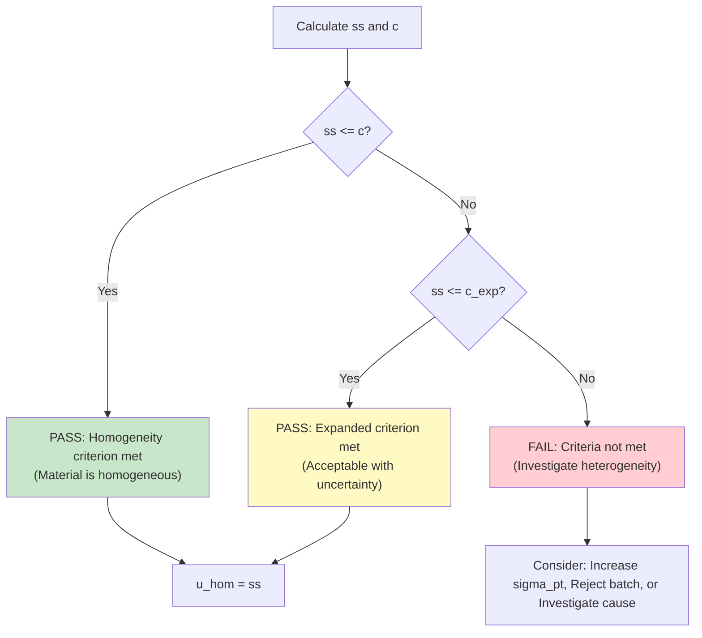
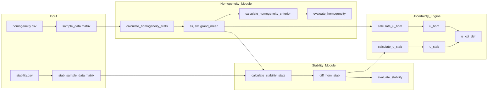

# Homogeneity and Stability Assessment (ISO 13528:2022)

## 1. Overview
This module implements the statistical methods described in **ISO 13528:2022 Sections 7.4 and 7.5** to evaluate whether proficiency test (PT) items are sufficiently homogeneous and stable.

*   **Homogeneity**: Ensures that every participant receives an equivalent test item. Lack of homogeneity makes performance evaluation unfair.
*   **Stability**: Verifies that the material properties do not change significantly during the PT period, ensuring consistency regardless of when the participant performs the test.

---

## 2. Technical Specifications

| Element | Value |
|:---|:---|
| **File** | `ptcalc/R/pt_homogeneity.R` |
| **Lines** | 1 - 290 |
| **Standard** | ISO 13528:2022, ISO Guide 35:2017 |

---

## 3. Statistical Model: One-Way ANOVA
The assessment is based on a one-way Analysis of Variance (ANOVA) model:

$$x_{ij} = \mu + \alpha_i + \epsilon_{ij}$$

Where:
- $x_{ij}$ = $j$-th measurement of the $i$-th sample.
- $\mu$ = General mean.
- $\alpha_i$ = Effect of sample $i$ (between-sample variation).
- $\epsilon_{ij}$ = Measurement error (within-sample variation).

---

## 4. Homogeneity Assessment

### 4.1 Functions
The primary function for homogeneity calculation is:
`calculate_homogeneity_stats(sample_data)`

**Input:**
- `sample_data`: A matrix or data frame where rows represent items (samples) and columns represent replicates.

**Returns:**
- `g`: Number of samples.
- `m`: Number of replicates per sample.
- `grand_mean`: Overall mean ($\bar{\bar{x}}$).
- `sample_means`: Vector of means for each sample.
- `sw`: Within-sample standard deviation.
- `ss`: Between-sample standard deviation.
- `sw_sq`, `ss_sq`: Respective variances.

### 4.2 Statistical Calculations

#### Within-Sample Standard Deviation ($s_w$)
For the typical case of **$m = 2$ replicates**:
$$s_w = \sqrt{\frac{\sum_{i=1}^{g} (x_{i1} - x_{i2})^2}{2g}}$$
*Note: This can also be expressed using the range $w_i = |x_{i1} - x_{i2}|$ as $s_w = \sqrt{\sum w_i^2 / 2g}$.*

For **$m > 2$ replicates**:
$$s_w^2 = \frac{1}{g} \sum_{i=1}^{g} s_i^2$$
Where $s_i^2$ is the variance of replicates for sample $i$.

#### Between-Sample Standard Deviation ($s_s$)
$$s_s^2 = \max\left(0, s_{\bar{x}}^2 - \frac{s_w^2}{m}\right)$$
Where $s_{\bar{x}}^2$ is the variance of the sample means. The subtraction of $s_w^2/m$ removes the contribution of measurement noise from the observed variation between samples.

### 4.3 ANOVA Table Construction

| Source | Degrees of Freedom | Sum of Squares (SS) | Mean Square (MS) |
|:---|:---|:---|:---|
| **Between Samples** | $g - 1$ | $SS_B = m \sum_{i=1}^{g}(\bar{x}_i - \bar{\bar{x}})^2$ | $MS_B = SS_B / (g-1)$ |
| **Within Samples** | $g(m - 1)$ | $SS_W = \sum_{i=1}^{g}\sum_{j=1}^{m}(x_{ij} - \bar{x}_i)^2$ | $MS_W = SS_W / (g(m-1))$ |
| **Total** | $gm - 1$ | $SS_T = SS_B + SS_W$ | |

**Relationship to ISO statistics:**
- $s_w^2 = MS_W$
- $s_s^2 = \max(0, \frac{MS_B - MS_W}{m})$

---

## 5. Acceptance Criteria

### 5.1 Basic Criterion ($c$)
The material is considered sufficiently homogeneous if:
$$s_s \leq 0.3 \times \sigma_{pt}$$
Where $\sigma_{pt}$ is the standard deviation for proficiency assessment.

### 5.2 Expanded Criterion ($c_{exp}$)
If the basic criterion is not met, an expanded criterion can be used to account for the uncertainty in the estimates of $s_s$ and $s_w$:
$$c_{exp} = \sqrt{(0.3 \times \sigma_{pt})^2 \times 1.88 + s_w^2 \times 1.01}$$

*Technical Note: The factors 1.88 and 1.01 are coverage factors derived from the $\chi^2$ distribution (for $g=10, m=2$). 1.88 relates to the between-sample variance and 1.01 to the within-sample variance.*

### 5.3 Decision Tree



---

## 6. Stability Assessment

### 6.1 Functions
`calculate_stability_stats(stab_sample_data, hom_grand_mean)`

This function compares the stability study results against the baseline from the homogeneity study.

### 6.2 Stability Difference ($D$)
The primary metric is the absolute difference between the homogeneity grand mean ($\bar{\bar{x}}_{hom}$) and the stability grand mean ($\bar{\bar{x}}_{stab}$):
$$D = |\bar{\bar{x}}_{hom} - \bar{\bar{x}}_{stab}|$$

### 6.3 Stability Criteria
- **Basic**: $D \leq 0.3 \times \sigma_{pt}$
- **Expanded**: $D \leq (0.3 \times \sigma_{pt}) + 2 \times \sqrt{u_{\bar{x}_{hom}}^2 + u_{\bar{x}_{stab}}^2}$
  Where $u_{\bar{x}} = s_w / \sqrt{g \cdot m}$ is the standard uncertainty of the mean.

### 6.4 t-Test for Stability
To determine if the difference is statistically significant (even if it passes the 0.3 criterion):
$$t = \frac{|\bar{\bar{x}}_{hom} - \bar{\bar{x}}_{stab}|}{\sqrt{u_{\bar{x}_{hom}}^2 + u_{\bar{x}_{stab}}^2}}$$

| Result | Interpretation |
|:---|:---|
| $|t| < 2$ | Difference not significant (stable) |
| $2 \leq |t| < 3$ | Possible drift, investigation recommended |
| $|t| \geq 3$ | Significant drift |

---

## 7. Uncertainty Contributions

The uncertainty components from homogeneity and stability are combined into the definitive uncertainty of the assigned value ($u_{xpt,def}$).

### 7.1 Uncertainty of Homogeneity ($u_{hom}$)
$$u_{hom} = s_s$$
*Note: If $s_s^2 < 0$ and was set to 0, $u_{hom} = 0$.*

### 7.2 Uncertainty of Stability ($u_{stab}$)
Assumes a rectangular distribution if the difference is larger than the criterion:
$$u_{stab} = \begin{cases} 
0 & \text{if } D \leq 0.3 \times \sigma_{pt} \\ 
\frac{D}{\sqrt{3}} & \text{if } D > 0.3 \times \sigma_{pt} 
\end{cases}$$

### 7.3 Combined Uncertainty
$$u_{xpt,def} = \sqrt{u_{xpt}^2 + u_{hom}^2 + u_{stab}^2}$$
Where $u_{xpt}$ is the uncertainty from the characterization method (e.g., Algorithm A).

---

## 8. Data Flow in the Application



---

## 9. Numerical Example: SO2 in ppm

### 9.1 Homogeneity Data (10 samples, 2 reps)
| Sample | Rep 1 | Rep 2 | Mean | Range ($w_i$) |
|:---|:---|:---|:---|:---|
| 1 | 0.0521 | 0.0525 | 0.0523 | 0.0004 |
| ... | ... | ... | ... | ... |
| 10 | 0.0526 | 0.0523 | 0.0525 | 0.0003 |

**Calculations:**
1.  **Grand Mean**: $\bar{\bar{x}} = 0.0526$
2.  **Within-sample SD**: $s_w = \sqrt{\frac{\sum w_i^2}{20}} = 0.000245$
3.  **Variance of Means**: $s_{\bar{x}}^2 = 0.0000000278$
4.  **Between-sample SD**: $s_s^2 = 0.0000000278 - \frac{0.000245^2}{2} = -0.0000000022$
    Since negative, **$s_s = 0$**.

**Evaluation ($\sigma_{pt} = 0.005$):**
- $c = 0.3 \times 0.005 = 0.0015$
- $0 \leq 0.0015 \implies$ **PASS** (Homogeneous).

### 9.2 Stability Data (3 samples after 30 days)
- $\bar{\bar{x}}_{hom} = 0.0526$
- $\bar{\bar{x}}_{stab} = 0.0527$
- $D = |0.0526 - 0.0527| = 0.0001$

**Evaluation:**
- $0.0001 \leq 0.0015 \implies$ **PASS** (Stable).
- $u_{stab} = 0$.

---

## 10. Code Implementation (R)

```r
library(ptcalc)

# Load data
hom_data <- matrix(c(19.70, 19.72, 19.68, 19.69, ...), ncol=2, byrow=TRUE)

# 1. Homogeneity
stats <- calculate_homogeneity_stats(hom_data)
c_crit <- calculate_homogeneity_criterion(sigma_pt = 0.5)
eval <- evaluate_homogeneity(stats$ss, c_crit)

# 2. Stability
stab_stats <- calculate_stability_stats(stab_data, stats$grand_mean)
stab_eval <- evaluate_stability(stab_stats$diff_hom_stab, c_crit)

# 3. Uncertainty
u_hom <- calculate_u_hom(stats$ss)
u_stab <- calculate_u_stab(stab_stats$diff_hom_stab, c_crit)
```

---

## 11. Edge Cases and Errors

| Case | Handling |
|:---|:---|
| **< 2 Samples** | `calculate_homogeneity_stats` throws error: "At least 2 samples required". |
| **< 2 Replicates** | `calculate_homogeneity_stats` throws error: "At least 2 replicates required". |
| **$s_s^2$ is negative** | This occurs when observed variation between means is less than expected from measurement noise. The app sets $s_s = 0$ per ISO 13528 guidelines. |

---

## 12. References
- **ISO 13528:2022**: Statistical methods for use in proficiency testing by interlaboratory comparison.
- **ISO Guide 35:2017**: Reference materials — Guidance for characterization and assessment of homogeneity and stability.
- **ISO/IEC 17043:2023**: Conformity assessment — General requirements for proficiency testing.
