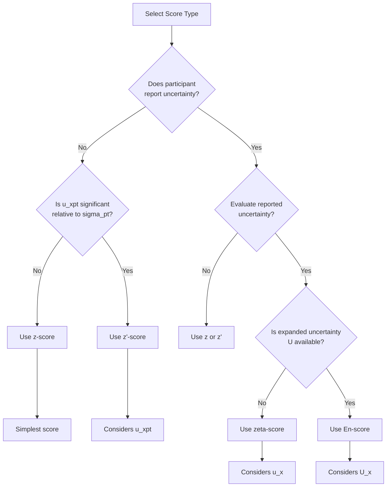
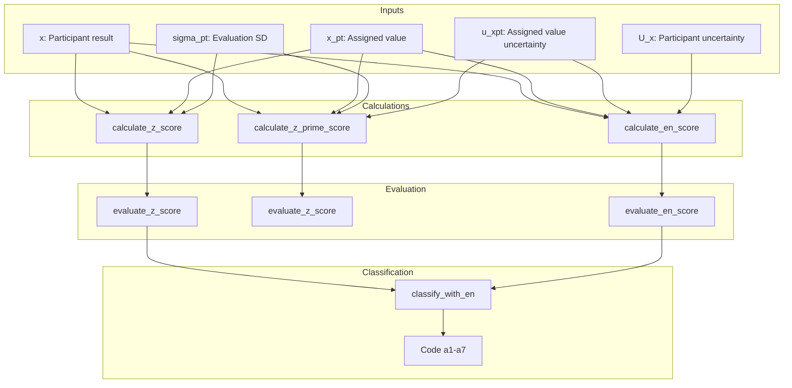

# Performance Scoring & Evaluation (pt_scores.R)

## 1. Overview
Functions for calculating and evaluating participant performance scores ($z$, $z'$, $\zeta$, $E_n$) according to ISO 13528:2022 Section 10. These scores quantify how well a participant's result aligns with the assigned value and allow for the assessment of laboratory competence in proficiency testing (PT) schemes.

Score selection depends on:
1.  Available information (assigned value, $\sigma_{pt}$, uncertainties).
2.  Purpose (screening vs. detailed evaluation).
3.  Measurement characteristics.

## 2. Location in Code
| Element | Value |
| :--- | :--- |
| **File** | `ptcalc/R/pt_scores.R` |
| **Lines** | 1 - 275 |

---

## 3. Score Selection Guide

### 3.1 Selection Flowchart


### 3.2 Alternative Decision Tree
```mermaid
flowchart TD
    START[Calculate PT score] --> UNC_X{Participant<br/>uncertainty known?}
    
    UNC_X -- Yes --> UNC_XPT{Assigned value<br/>uncertainty known?}
    UNC_XPT -- Yes --> ZETA[Use zeta-score<br/>ζ = (x - x_pt) / sqrt(u_x² + u_xpt²)]
    UNC_XPT -- No --> ZPRIME[Use z'-score<br/>z' = (x - x_pt) / sqrt(σ_pt² + u_xpt²)]
    
    UNC_X -- No --> SIGMA_PT{σ_pt specified?}
    SIGMA_PT -- Yes --> Z[Use z-score<br/>z = (x - x_pt) / σ_pt]
    SIGMA_PT -- No --> CALIBRATION{Calibration<br/>comparison?}
    
    CALIBRATION -- Yes --> EN[Use En-score<br/>En = (x - x_pt) / sqrt(U_x² + U_xpt²)]
    CALIBRATION -- No --> CONSENSUS{Use consensus<br/>for x_pt?}
    
    CONSENSUS -- Yes --> ZPRIME
    CONSENSUS -- No --> NO_INFO[Insufficient information]
    
    style Z fill:#c8e6c9
    style ZPRIME fill:#fff9c4
    style ZETA fill:#c5e1a5
    style EN fill:#b39ddb
```

### 3.3 Score Summary Table
| Score | Formula | Uses $u_{xpt}$ | Uses $u_x/U_x$ | Case of Use |
| :--- | :--- | :---: | :---: | :--- |
| **z** | $(x - x_{pt}) / \sigma_{pt}$ | No | No | Basic evaluation, $\sigma_{pt}$ specified. |
| **z'** | $(x - x_{pt}) / \sqrt{\sigma_{pt}^2 + u_{xpt}^2}$ | Yes | No | $u_{xpt}$ is significant ($> 0.3 \sigma_{pt}$). |
| **ζ (zeta)** | $(x - x_{pt}) / \sqrt{u_x^2 + u_{xpt}^2}$ | Yes | $u_x$ (std) | Evaluate reported standard uncertainty. |
| **En** | $(x - x_{pt}) / \sqrt{U_x^2 + U_{xpt}^2}$ | Yes | $U_x$ (exp) | Metrological compatibility (k=2). |

---

## 4. Score Calculation Functions

### 4.1 `calculate_z_score(x, x_pt, sigma_pt)`
Standard performance metric. Used when the uncertainty of the assigned value is negligible ($u(x_{pt}) \le 0.3 \sigma_{pt}$).
**Reference:** ISO 13528:2022 Section 10.2

| Parameter | Type | Description |
| :--- | :--- | :--- |
| `x` | numeric | Participant result |
| `x_pt` | numeric | Assigned value |
| `sigma_pt` | numeric | Target standard deviation for evaluation |

**Returns:** z-score value (or `NA_real_` if `sigma_pt` ≤ 0).

**Example:**
```r
z <- calculate_z_score(x = 10.5, x_pt = 10.0, sigma_pt = 0.5)
# z = (10.5 - 10.0) / 0.5 = 1.0
```

### 4.2 `calculate_z_prime_score(x, x_pt, sigma_pt, u_xpt)`
Used when the uncertainty of the assigned value is significant ($u(x_{pt}) > 0.3 \sigma_{pt}$). It widens the acceptance limits to account for this uncertainty.
**Reference:** ISO 13528:2022 Section 10.3

| Parameter | Type | Description |
| :--- | :--- | :--- |
| `x` | numeric | Participant result |
| `x_pt` | numeric | Assigned value |
| `sigma_pt` | numeric | Target standard deviation |
| `u_xpt` | numeric | Standard uncertainty of assigned value |

**Example:**
```r
zprime <- calculate_z_prime_score(x = 10.5, x_pt = 10.0, sigma_pt = 0.5, u_xpt = 0.1)
# denominator = sqrt(0.5^2 + 0.1^2) = 0.51
# z' = 0.5 / 0.51 = 0.98
```

### 4.3 `calculate_zeta_score(x, x_pt, u_x, u_xpt)`
Evaluates the agreement between the participant's result and the assigned value, considering **both** uncertainties ($u_x$ and $u_{xpt}$).
**Reference:** ISO 13528:2022 Section 10.4

| Parameter | Type | Description |
| :--- | :--- | :--- |
| `x` | numeric | Participant result |
| `x_pt` | numeric | Assigned value |
| `u_x` | numeric | Standard uncertainty of participant's result |
| `u_xpt` | numeric | Standard uncertainty of assigned value |

**Example:**
```r
zeta <- calculate_zeta_score(x = 10.5, x_pt = 10.0, u_x = 0.2, u_xpt = 0.1)
# zeta = 0.5 / sqrt(0.2^2 + 0.1^2) = 2.24
```

### 4.4 `calculate_en_score(x, x_pt, U_x, U_xpt)`
Normalized Error. Similar to zeta-score but uses Expanded Uncertainties (usually $k=2$).
**Reference:** ISO 13528:2022 Section 10.5

| Parameter | Type | Description |
| :--- | :--- | :--- |
| `x` | numeric | Participant result |
| `x_pt` | numeric | Assigned value |
| `U_x` | numeric | Expanded uncertainty of participant's result |
| `U_xpt` | numeric | Expanded uncertainty of assigned value |

**Example:**
```r
en <- calculate_en_score(x = 10.5, x_pt = 10.0, U_x = 0.4, U_xpt = 0.2)
# En = 0.5 / sqrt(0.4^2 + 0.2^2) = 1.12
```

---

## 5. Performance Evaluation

### 5.1 z, z', and ζ scores Classification
Criteria for standard performance scores:

| Result | Criterion | Color |
| :--- | :--- | :--- |
| **Satisfactory** | $|z| \leq 2$ | Green (`#4CAF50`) |
| **Questionable** | $2 < |z| < 3$ | Yellow (`#FFC107`) |
| **Unsatisfactory** | $|z| \geq 3$ | Red (`#F44336`) |

### 5.2 En-score Classification
Criteria for $E_n$ score:

| Result | Criterion | Color |
| :--- | :--- | :--- |
| **Satisfactory** | $|E_n| \leq 1$ | Green (`#4CAF50`) |
| **Unsatisfactory** | $|E_n| > 1$ | Red (`#F44336`) |

**Note:** $E_n$ score does not have a "Questionable" category because it uses expanded uncertainties ($k=2$) which already incorporate a confidence interval of approximately 95%.

---

## 6. Uncertainty Propagation ($u_{xpt,def}$)

The definitive standard uncertainty of the assigned value ($u_{xpt,def}$) combines multiple sources, including characterization, homogeneity, and stability.

$$u_{xpt,def} = \sqrt{u_{xpt}^2 + u_{hom}^2 + u_{stab}^2}$$

| Component | Origin | Typical Calculation |
| :--- | :--- | :--- |
| $u_{xpt}$ | Assignment method | Alg. A: $1.25 \cdot s^* / \sqrt{n}$ |
| $u_{hom}$ | Homogeneity study | $s_s$ (between-sample SD) |
| $u_{stab}$ | Stability study | $0$ if stable, $D/\sqrt{3}$ if not |

### Impact on Scores
Higher $u_{xpt}$ leads to lower absolute score values (more lenient evaluation), as it increases the denominator.

**Example:**
```r
u_hom <- 0.016
u_stab <- 0.000  # Stable
u_xpt_def <- sqrt(0.016^2 + 0.000^2)  # 0.016

# u_stab issue
u_stab_bad <- 0.115
u_xpt_def_bad <- sqrt(0.016^2 + 0.115^2)  # 0.116
```

---

## 7. Combined Classification (a1-a7)

The function `classify_with_en()` combines performance scores (z/z') with $E_n$ for a more comprehensive evaluation of laboratory performance.

### 7.1 Classification Table
| Code | Label | z-score | En-score | $U_x$ vs $\sigma_{pt}$ | Meaning |
| :--- | :--- | :---: | :---: | :---: | :--- |
| **a1** | Totalmente satisfactorio | $\le 2$ | $\le 1$ | $U_x < 2\sigma_{pt}$ | Result and uncertainty are both correct. |
| **a2** | Satisfactorio pero conservador | $\le 2$ | $\le 1$ | $U_x \ge 2\sigma_{pt}$ | Correct result, but uncertainty is overestimated. |
| **a3** | Satisfactorio con MU subestimada | $\le 2$ | $> 1$ | - | Correct result, but uncertainty is underestimated. |
| **a4** | Cuestionable pero aceptable | 2 - 3 | $\le 1$ | - | Questionable result, but covered by reported MU. |
| **a5** | Cuestionable e inconsistente | 2 - 3 | $> 1$ | - | Result and uncertainty are both problematic. |
| **a6** | No satisfactorio pero MU cubre | $\ge 3$ | $\le 1$ | - | Poor result, but covered by very large MU. |
| **a7** | No satisfactorio (crítico) | $\ge 3$ | $> 1$ | - | Critical failure in both result and uncertainty. |

### 7.2 Special Codes
| Code | Label | Condition |
| :--- | :---: | :--- |
| `mu_missing_z` | MU ausente - solo z: [performance] | No uncertainty provided, used z-score. |
| `mu_missing_zprime` | MU ausente - solo z': [performance] | No uncertainty provided, used z'-score. |

### 7.3 Visual Interpretation Matrix
```
                    |En| <= 1             |En| > 1
           ┌─────────────────────┬─────────────────────┐
           │                     │                     │
  |z| <= 2 │   a1 (or a2 if U    │        a3           │
           │   conservative)     │   MU underestimated │
           │     [DARK GREEN]    │   [LIGHT GREEN]     │
           ├─────────────────────┼─────────────────────┤
           │                     │                     │
  2<|z|<3  │        a4           │        a5           │
           │   Questionable OK   │   Questionable bad  │
           │    [YELLOW]         │   [ORANGE]          │
           ├─────────────────────┼─────────────────────┤
           │                     │                     │
  |z| >= 3 │        a6           │        a7           │
           │   MU covers error   │     CRITICAL        │
           │   [PINK]            │     [RED]           │
           └─────────────────────┴─────────────────────┘
```

### 7.4 Color Palette (PT_EN_CLASS_COLORS)
| Code | Hex Color | Description |
| :--- | :--- | :--- |
| **a1** | `#2E7D32` | Dark Green (Excellent) |
| **a2** | `#66BB6A` | Medium Green (Conservative) |
| **a3** | `#9CCC65` | Light Green (MU Underestimated) |
| **a4** | `#FFF59D` | Light Yellow (Questionable OK) |
| **a5** | `#FBC02D` | Orange (Questionable Bad) |
| **a6** | `#EF9A9A` | Pink (Unsatisfactory Covered) |
| **a7** | `#C62828` | Dark Red (Critical) |
| `mu_missing_z` | `#90A4AE` | Gray-Blue (Missing MU - z) |
| `mu_missing_zprime` | `#78909C` | Dark Gray (Missing MU - z') |

---

## 8. Practical Scenarios

### Scenario 1: Good Result and Reliable Uncertainty
- $x = 10.05, x_{pt} = 10.00, \sigma_{pt} = 0.5, U_x = 0.20$
- $z = 0.10$ (Satisfactory)
- $E_n = 0.25$ (Satisfactory)
- **Classification:** **a1** (Totally satisfactory)

### Scenario 2: Underestimated Uncertainty
- $x = 10.80, x_{pt} = 10.00, \sigma_{pt} = 0.5, U_x = 0.10$
- $z = 1.60$ (Satisfactory)
- $E_n = 7.69$ (Unsatisfactory)
- **Classification:** **a3** (Satisfactory result, but MU too small)

### Scenario 3: Poor Result covered by Large Uncertainty
- $x = 12.00, x_{pt} = 10.00, \sigma_{pt} = 0.5, U_x = 2.50$
- $z = 4.00$ (Unsatisfactory)
- $E_n = 0.80$ (Satisfactory)
- **Classification:** **a6** (Unsatisfactory, but MU covers the error)

---

## 9. Workflow in the Application



---

## 10. Statistical Considerations

### 10.1 Distribution of z-scores
In a population of competent laboratories, z-scores should:
- Approximately follow a standard normal distribution $N(0,1)$.
- ~95% of results should fall within $\pm 2$.
- ~99.7% of results should fall within $\pm 3$.

### 10.2 Pattern Analysis
| Observed Pattern | Possible Cause |
| :--- | :--- |
| Mean $z \neq 0$ | Systematic bias in $x_{pt}$ or participant group. |
| $SD(z) >> 1$ | $\sigma_{pt}$ is underestimated (limits are too tight). |
| $SD(z) << 1$ | $\sigma_{pt}$ is overestimated (limits are too loose). |
| Asymmetry | Bias present in a subset of laboratories. |

---

## 11. References
- **ISO 13528:2022** Statistical methods for use in proficiency testing by interlaboratory comparison.
- **ILAC-G13:08/2007** Guidelines for the Requirements for the Competence of Providers of Proficiency Testing Schemes.
- **EURACHEM Guide (2000)** Quantifying Uncertainty in Analytical Measurement.

---

## 12. Related Documents
- [03_pt_robust_stats.md](03_pt_robust_stats.md) - Robust mean and SD for assigned values.
- [04_pt_homogeneity.md](04_pt_homogeneity.md) - Homogeneity and stability contributions to $u_{xpt}$.
- [09_puntajes_pt.md](09_puntajes_pt.md) - User interface for performance scores.
- [10_informe_global.md](10_informe_global.md) - Heatmap visualizations of results.
