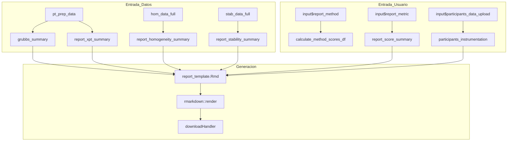

# Módulo: Generación de Informes (Report Generation)

## 1. Descripción General

El módulo de **Generación de Informes** es el componente final del sistema que permite la exportación de los resultados consolidados del análisis de Ensayos de Aptitud (PT) a documentos formales en formatos Word (.docx) e HTML. Utiliza la tecnología de **RMarkdown** para combinar código R, texto narrativo y visualizaciones dinámicas en un solo reporte profesional.

| Propiedad | Valor |
|-----------|-------|
| **Archivo** | `cloned_app.R` |
| **Pestaña UI** | `tabPanel("Generación de informes")` |
| **Líneas UI** | 1102-1163 |
| **Líneas Lógica** | 3748-4500+ (reactivos de reporte, downloadHandler) |
| **Template Principal** | `reports/report_template.Rmd` |
| **Dependencias** | `pt_prep_data()`, `scores_results_cache()`, `grubbs_summary()` |
| **Normas ISO de Referencia** | ISO 13528:2022 Sección 10, ISO 17043:2024 Sección 7 |

---

## 2. Mapa de Componentes de la Interfaz (UI)

La interfaz se organiza en pestañas para facilitar la configuración del informe:

### 2.1 Selectores y Entradas de Datos

| Elemento UI | Input ID | Tipo | Descripción |
|-------------|----------|------|-------------|
| **Esquema PT** | `report_n_lab` | selectInput | Selecciona el esquema (n) a reportar |
| **Nivel de Concentración** | `report_level` | selectInput | Filtra por nivel (ej. 20-nmol/mol) |
| **Métrica Principal** | `report_metric` | selectInput | z, z', ζ, En |
| **Método Valor Asignado** | `report_method` | selectInput | 1 (Ref), 2a (MADe), 2b (nIQR), 3 (Alg A) |
| **Factor k** | `report_k` | numericInput | Factor de cobertura (por defecto 2) |
| **ID del Esquema** | `report_scheme_id` | textInput | Identificador único del ensayo |
| **ID del Informe** | `report_id` | textInput | Código del documento final |
| **Fecha de Emisión** | `report_date` | dateInput | Fecha que aparecerá en el reporte |
| **Instrumentación** | `participants_data_upload` | fileInput | Carga de CSV con marcas de analizadores |

### 2.2 Botones de Acción y Salida

| Elemento UI | ID | Tipo | Descripción |
|-------------|----|------|-------------|
| **Descargar Word** | `download_word` | downloadButton | Genera y descarga archivo .docx |
| **Descargar HTML** | `download_html` | downloadButton | Genera y descarga archivo .html |
| **Estado de Datos** | `report_status` | uiOutput | Validación de prerrequisitos |
| **Vista Previa** | `report_preview_summary` | verbatimTextOutput | Resumen técnico de los datos a exportar |

---

## 3. Flujo de Trabajo y Datos

El proceso de generación sigue un flujo reactivo donde la aplicación Shiny prepara "paquetes" de datos que luego son inyectados como parámetros en la plantilla RMarkdown.

### 3.1 Diagrama de Flujo Reactivo



### 3.2 Proceso de Compilación (`downloadHandler`)

1. **Configuración**: El usuario ajusta los parámetros en la UI.
2. **Preparación**: Al hacer clic en descargar, se crea un directorio temporal.
3. **Copiado**: Se copia el template `report_template.Rmd` (y otros activos necesarios) al directorio temporal para evitar conflictos de escritura.
4. **Parametrización**: Se crea una lista de R (`params`) que contiene todos los resúmenes estadísticos y metadatos.
5. **Renderizado**: Se invoca `rmarkdown::render()` con el formato de salida solicitado.
6. **Entrega**: El servidor envía el archivo resultante al navegador del usuario.

---

## 4. Reactivos de Soporte Técnico

Estos reactivos consolidan la información de diferentes módulos para que el reporte sea coherente:

### 4.1 `grubbs_summary()`
Detecta valores atípicos para cada contaminante y nivel seleccionado.
*   **Retorno**: Data frame con columnas: `Contaminante`, `Nivel`, `Participantes_Evaluados`, `Valor_p`, `Atipicos_detectados`, `Participante_ID`, `Valor_Atipico`.

### 4.2 `report_xpt_summary()`
Consolida la información del valor asignado ($x_{pt}$), incertidumbre ($u_{xpt}$) y desviación estándar ($σ_{pt}$).
*   **Retorno**: Resumen del método seleccionado (Referencia, Consenso o Algoritmo A).

### 4.3 `report_homogeneity_summary()` / `report_stability_summary()`
Extrae los estadísticos de varianza ($s_s$, $s_w$), criterios críticos y conclusiones de cumplimiento.
*   **Campos**: `Items`, `Replicas`, `ss`, `sw`, `c_criterio`, `Cumple_Criterio`.

### 4.4 `report_heatmaps()`
Genera objetos ggplot2 que visualizan el desempeño de todos los participantes mediante mapas de calor (Satisfactorio, Cuestionable, No Satisfactorio).

---

## 5. Integración con RMarkdown (Template)

El archivo `reports/report_template.Rmd` es el corazón del informe. Está diseñado para ser totalmente paramétrico.

### 5.1 Estructura del YAML
```yaml
params:
  report_id: "PT-001"
  report_date: "2025-01-10"
  coordinator: "Dr. Juan Pérez"
  n_lab: 4
  level: "20-nmol/mol"
  method: "1"
  metric: "z"
  k_factor: 2
  grubbs_data: !r data.frame()
  x_pt_data: !r data.frame()
  hom_data: !r data.frame()
  stab_data: !r data.frame()
```

### 5.2 Secciones del Informe
1.  **Encabezado**: Datos institucionales, ID del informe y fecha.
2.  **Resumen Ejecutivo**: Descripción del esquema PT y número de laboratorios.
3.  **Análisis de Homogeneidad y Estabilidad**: Tablas de varianza y conclusiones de validez del material.
4.  **Valor Asignado**: Detalle del método utilizado y parámetros calculados ($x_{pt}$, $u_{xpt}$, $\sigma_{pt}$).
5.  **Detección de Atípicos**: Resultados del test de Grubbs.
6.  **Puntajes de Desempeño**: Tabla completa de resultados (z, z', ζ, En) y estadísticas de grupo.
7.  **Visualizaciones**: Mapas de calor y gráficos individuales de desempeño.
8.  **Conclusiones y Firmas**: Bloque para firmas de coordinación y gestión.

---

## 6. Formatos de Salida

| Formato | Ventajas | Uso Recomendado |
|---------|----------|-----------------|
| **Word (.docx)** | Altamente editable, permite ajustes manuales post-generación, compatible con flujos de firma tradicionales. | Informes finales oficiales. |
| **HTML** | Interactividad, gráficos dinámicos (plotly), visualización rápida en navegadores. | Revisión interna o dashboards de resultados. |

---

## 7. Personalización y Configuración

### 7.1 Carga de Instrumentación
Para que el informe incluya el tipo de analizador por participante, se debe cargar un CSV con la siguiente estructura:
```csv
Codigo_Lab,Analizador_SO2,Analizador_CO,Analizador_O3,Analizador_NO_NO2
LAB01,Thermo 43i,Thermo 48i,Thermo 49i,Thermo 42i
LAB02,Teledyne T100,Teledyne T300,Teledyne T400,Teledyne T200
```

### 7.2 Opciones de Firma
La UI permite ingresar los nombres para el bloque de firmas final:
*   Coordinador EA.
*   Profesional Calidad Aire.
*   Ingeniero Operativo.
*   Profesional Gestión de Calidad.

---

## 8. Solución de Problemas (Troubleshooting)

| Error | Causa Probable | Solución |
|-------|----------------|----------|
| "Sin datos PT" | No se han cargado los archivos `summary_n*.csv` | Ver módulo de **Carga de Datos**. |
| "Puntajes no calculados" | Se intenta generar informe antes de ejecutar el cálculo. | Ir a la pestaña **PT Scores** y hacer clic en "Calcular Puntajes". |
| Error al renderizar Word | El template `report_template.Rmd` está abierto o corrupto. | Verificar integridad del archivo en la carpeta `reports/`. |
| Gráficos en blanco | Las visualizaciones no han sido generadas por falta de datos. | Verificar que existan niveles comunes entre homogeneidad y el esquema PT. |

---

## 9. Referencias Cruzadas
*   [01_carga_datos.md](01_carga_datos.md): Formatos de entrada.
*   [09_puntajes_pt.md](09_puntajes_pt.md): Lógica de cálculo de scores.
*   [13_valores_atipicos.md](13_valores_atipicos.md): Detalles del test de Grubbs.
*   [00_glossary.md](00_glossary.md): Definiciones de términos estadísticos.
