# Proficiency Testing Application for Criterion Pollutant Gases

This Shiny application provides a comprehensive toolkit for analyzing data from proficiency testing (PT) schemes. It implements the statistical methods described in ISO 13528:2022 and ISO 17043:2024 for assessing the homogeneity and stability of PT items and for calculating participant performance scores.

The application is refactored to implement a **separation of concerns**:
- **`ptcalc/`**: R package with pure mathematical functions (ISO 13528).
- **`cloned_app.R`**: Shiny reactive logic for the user interface.


*Figure 1: Overview of the PT Data Analysis Application Dashboard*

```
┌─────────────────────────────────────────────────────────────────┐
│  Aplicativo para Evaluación de Ensayos de Aptitud             │
│  Gases Contaminantes Criterio                                 │
│  Laboratorio Calaire                                           │
├─────────────────────────────────────────────────────────────────┤
│  [☰ Carga de Datos] [Homogeneidad] [Estabilidad] [Valor Asig.] │
│  [Puntajes PT] [Informe Global] [Participantes] [Informes]    │
├─────────────────────────────────────────────────────────────────┤
│  Sidebar                                                        │
│  ├── Homogeneity file upload                                   │
│  ├── Stability file upload                                     │
│  └── Participant data upload                                   │
├─────────────────────────────────────────────────────────────────┤
│  Main Content Area                                              │
│  ├── Data tables                                                │
│  ├── Interactive plots                                         │
│  └── Analysis results                                           │
└─────────────────────────────────────────────────────────────────┘
```

## Quick Start

```r
# 1. Set working directory
setwd("/path/to/pt_app")

# 2. Launch the application
shiny::runApp("cloned_app.R")
```

The application will open at `http://127.0.0.1:3838` in your default browser. For a complete 5-minute walkthrough, see [00_quickstart.md](00_quickstart.md).

---

## Installation & Prerequisites

### R Environment

| Requirement | Version | Notes |
|-------------|---------|-------|
| R | ≥ 4.3.0 | [Download from CRAN](https://cran.r-project.org/) |
| RStudio | ≥ 2023.06 | Optional but recommended |
| Operating System | Windows 10+, macOS 11+, or Linux | Any modern OS |

### Required R Packages

```r
# Install all dependencies
install.packages(c(
  "shiny", "bslib", "tidyverse", "vroom", "DT",
  "rhandsontable", "plotly", "patchwork", "outliers",
  "rmarkdown", "devtools", "shinythemes", "bsplus"
))
```

### Installing the ptcalc Package

The `ptcalc` package contains all ISO 13528/17043 calculation functions.

**For development:**

```r
devtools::load_all("ptcalc")
```

**For production deployment:**

```r
devtools::install("ptcalc")
library(ptcalc)
```

---

## System Architecture

```mermaid
flowchart TB
    subgraph ptcalc["📦 ptcalc Package"]
        ROBUST["pt_robust_stats.R<br/>Algorithm A, nIQR, MADe"]
        HOM["pt_homogeneity.R<br/>ANOVA, criteria"]
        SCORES["pt_scores.R<br/>z, z', ζ, En"]
    end

    subgraph APP["🖥️ cloned_app.R"]
        UI["UI (fluidPage)<br/>Bootstrap 5"]
        SERVER["Server (reactives)<br/>Data processing"]
    end

    subgraph DATA["📊 Data Files"]
        HOMCSV["homogeneity.csv"]
        STABCSV["stability.csv"]
        PARTCSV["participants_data*.csv"]
    end

    subgraph OUTPUT["📄 Output"]
        REPORTS["RMarkdown reports"]
        PLOTS["Interactive plots"]
        TABLES["Data tables"]
    end

    APP -->|"devtools::load_all()"| ptcalc
    DATA --> UPLOAD["File Upload UI"]
    UPLOAD --> SERVER
    SERVER --> ptcalc
    ptcalc --> SERVER
    SERVER --> OUTPUT
```



---

## Data Flow

```mermaid
flowchart LR
    CSV["CSV Files"] --> LOAD["Data Loading<br/>vroom::vroom()"]
    LOAD --> HOM["Homogeneity Analysis<br/>pt_homogeneity()"]
    LOAD --> STAB["Stability Analysis<br/>t-test"]
    LOAD --> VA["Assigned Value<br/>Algorithm A"]
    HOM --> QUAL["Item Quality<br/>u_hom, u_stab"]
    STAB --> QUAL
    VA --> SCORES["PT Scores<br/>z, z', ζ, En"]
    QUAL --> SCORES
    SCORES --> REPORT["Report Generation<br/>RMarkdown"]
```



---

## Application Modules

### 1. Carga de datos
This module handles the initial loading of CSV files for analysis.
*   **Inputs:** `homogeneity.csv`, `stability.csv`, and `summary_n*.csv` files.
*   **Validation:** Checks for required columns (`value`, `pollutant`, `level`).

### 2. Homogeneity & Stability Analysis
Assess whether the proficiency test items are sufficiently homogeneous and stable.
*   **Inputs:** Pollutant choice, concentration level.
*   **Outputs:** Data preview, ANOVA summary, homogeneity and stability assessments ($s_s$, $s_w$, ISO criteria check).

### 3. PT Preparation
Analyzes participant results from different rounds.
*   **Functionality:** Dynamically creates tabs for each pollutant.
*   **Outputs:** Bar charts, distributions, and Grubbs' test for outliers.

### 4. Valor Asignado / PT Scores
Calculates reference values and participant performance scores.
*   **Functionality:** Supports Algorithm A, Consensus (MADe/nIQR), or Reference laboratory.
*   **Scoring:** Calculates z, z', zeta, and En scores using robust statistics.
*   **Uncertainty:** Incorporates standard uncertainty of the assigned value ($u(x_{pt})$).

### 5. Informe Global & Generación de Informes
*   **Informe Global:** Heatmap visualization of results across all levels and pollutants.
*   **Generación de informes:** Interface to configure and download the RMarkdown final report.

---

## Example Data

Sample data files are provided in the `data/` directory:

| File | Description |
|------|-------------|
| `homogeneity.csv` | Homogeneity test measurements |
| `stability.csv` | Stability test measurements |
| `summary_n4.csv` | Participant results (n=4 scenario) |
| `summary_n7.csv` | Participant results (n=7 scenario) |
| `summary_n10.csv` | Participant results (n=10 scenario) |
| `summary_n13.csv` | Participant results (n=13 scenario) |

---

## Module Index

### Getting Started
- [Quick Start Guide](00_quickstart.md) - 5-minute tutorial
- [Glossary](00_glossary.md) - Spanish/English terminology reference

### ptcalc Package Documentation
1. [Package Overview](02_ptcalc_package.md) - Architecture and exports
2. [API Reference](02a_ptcalc_api.md) - Complete function reference
3. [Robust Statistics](03_pt_robust_stats.md) - nIQR, MADe, Algorithm A
4. [Homogeneity & Stability](04_pt_homogeneity.md) - ISO 13528 criteria
5. [Score Calculations](05_pt_scores.md) - z, z', zeta, En formulas

### Shiny Application Documentation
6. [Data Loading](01_carga_datos.md) - File upload and validation
7. [Data Formats](01a_data_formats.md) - Complete CSV schema reference
8. [Homogeneity Module](06_shiny_homogeneidad.md) - UI components
9. [Assigned Value](07_valor_asignado.md) - Consensus and reference methods
10. [PT Scores Module](09_puntajes_pt.md) - Score computation and display
11. [Global Report](10_informe_global.md) - Summary heatmaps
12. [Participant Detail](11_participantes.md) - Individual results
13. [Report Generation](12_generacion_informes.md) - RMarkdown export
14. [Outlier Detection](13_valores_atipicos.md) - Grubbs test
15. [Report Template](14_report_template.md) - RMarkdown structure

### Advanced Topics
16. [System Architecture](15_architecture.md) - Reactive dependency graph, performance optimization
17. [Customization Guide](16_customization.md) - Theme, layout, extending ptcalc
18. [Troubleshooting & FAQ](17_troubleshooting.md) - Common errors, data format issues

---

## Troubleshooting

### Common Errors

| Error | Cause | Solution |
|-------|-------|----------|
| `Error: could not find function "xxx"` | `ptcalc` not loaded | Run `devtools::load_all("ptcalc")` |
| `Error: El archivo debe contener las columnas...` | Incorrect CSV headers | Ensure headers: `pollutant`, `level`, `value` |
| `disconnected from the server` | R session crash | Check console for error logs. Restart app. |
| `package 'outliers' not found` | Missing dependency | Run `install.packages("outliers")` |
| `Insufficient data for Algorithm A` | < 3 participants | Check data/selection has enough valid numeric values. |

### Data Format Issues
Summary files must follow the pattern `summary_n{N}.csv` where `{N}` is an integer.

### Performance Problems
For large datasets (>100 participants), consider using `data.table` or reducing simultaneous pollutant analysis.

---

## Developer Documentation

### `app.R` Deep Dive
The server function contains the logic for data processing:
1. **Data Loading**: Reads `homogeneity.csv`, `stability.csv`, and `summary_n*.csv`.
2. **Reactive Expressions**:
    - `homogeneity_run`: ANOVA and ISO calculations.
    - `scores_run`: z-scores and other metrics.
3. **Dynamic UI**: Uses `renderUI` and `navlistPanel` for flexible layout.

### Running Syntax Checks
```bash
./Rscript -e "source('cloned_app.R')"
```
*Note: The project-root `Rscript` stub performs structural validation only.*

---

## Contribution Guidelines
- Follow [tidyverse style guide](https://style.tidyverse.org/).
- Document functions with roxygen2 comments.
- Write unit tests for new calculations (`devtools::test()`).
- Use mermaid diagrams for data flow in documentation updates.

---

## Standards & References

| Standard | Title | Status |
|----------|-------|--------|
| ISO 13528:2022 | Statistical methods for use in proficiency testing | Implemented |
| ISO 17043:2024 | Conformity assessment — General requirements for proficiency testing | Implemented |

---

## Version History

| Version | Date | Changes |
|---------|------|---------|
| 0.1.0 | 2024 | Initial refactored release with ptcalc package separation |
| - | 2025 | Documentation upgrade (Phase 1) |

---

## License & Contact
Developed under contract OSE-282-3065-2025 by:
- **Laboratorio CALAIRE** - Universidad Nacional de Colombia
- **Instituto Nacional de Metrología (INM)**

Author: Wilson Rafael Salas Chavez (wrsalasc@unal.edu.co)
License: MIT
